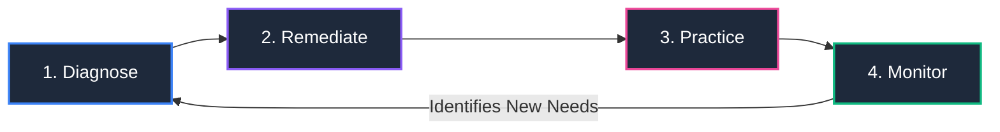

<div align="center">

# 🧮 MathSmart
### AI-Powered Interactive Learning System for Enhancing Mathematics Skills Among Elementary Learners

[](https://nextjs.org/)
[](https://react.dev/)
[](https://tailwindcss.com/)
[](https://ui.shadcn.com/)
[](https://fastapi.tiangolo.com/)
[](https://supabase.com/)
[](#-aral-pedagogical-framework)

<p align="center">
  <b>A research-backed, adaptive web application providing personalized diagnostics, targeted remediation, interactive practice, and teacher intervention analytics for Grade 7 learners.</b>
</p>

[Explore Documentation](./docs/SOURCE_OF_TRUTH.md) · [API Reference](./docs/API_ROUTES.md) · [System Diagrams](./docs/DIAGRAMS.md) · [Implementation Plan](./docs/IMPLEMENTATION_PLAN.md)

</div>

---

## 📖 Table of Contents

- [About The Project](#-about-the-project)
- [ARAL Pedagogical Framework](#-aral-pedagogical-framework)
- [Core Features](#-core-features)
- [Technology Stack](#-technology-stack)
- [System Architecture & Directory Structure](#-system-architecture--directory-structure)
- [Getting Started & Installation](#-getting-started--installation)
  - [Prerequisites](#prerequisites)
  - [1. Clone Repository](#1-clone-repository)
  - [2. Frontend Setup](#2-frontend-setup)
  - [3. Environment Variables](#3-environment-variables)
  - [4. Run the Dev Server](#4-run-the-dev-server)
  - [5. Python Backend Setup](#5-python-backend-setup-optional--in-development)
- [Working with shadcn/ui](#-working-with-shadcnui)
- [Project Documentation](#-project-documentation)
- [Git Workflow & Collaboration Guidelines](#-git-workflow--collaboration-guidelines)
- [Team & Organization](#-team--organization)

---

## 🎯 About The Project

**MathSmart** is an intelligent, web-based mathematics learning platform designed to address foundational mathematics gaps among Grade 7 learners. 

Rather than a one-size-fits-all curriculum, MathSmart assesses individual student competencies, pinpoints exact conceptual misunderstandings using AI-assisted diagnostic evaluation, and delivers targeted remediation modules and interactive practice exercises. Teachers and administrators receive real-time mastery heatmaps and intervention suggestions to support in-class learning.

---

## 🔄 ARAL Pedagogical Framework

MathSmart follows the **DepEd ARAL (Assist, Remediate, Accelerate, Learn)** recovery model operating in a continuous 4-phase cycle:



1. **Diagnose**: Adaptive diagnostic tests assess competency baseline across Grade 7 domains (Numbers, Algebra, Geometry, Statistics).
2. **Remediate**: The system maps learning gaps directly to ARAL modules (Assist, Remediate, Accelerate).
3. **Practice**: Students reinforce concepts through interactive math activities with instant feedback.
4. **Monitor**: Continuous evaluation updates mastery records and surfaces intervention alerts to teachers.

---

## ✨ Core Features

| # | Feature | Target User | Description |
|---|---|---|---|
| **1** | **Student Profiling** | Students / Teachers | Records learner academic background, grade level, and competency baselines for individualized monitoring. |
| **2** | **Mathematics Diagnostic Assessment** | Students | Administers adaptive pre-tests, analyzes error patterns, and generates comprehensive student gap profiles. |
| **3** | **ARAL-Based Learning Modules** | Students | Targeted, bite-sized instructional modules categorized by ARAL tier (*Assist*, *Remediate*, *Accelerate*). |
| **4** | **Interactive Mathematics Activities** | Students | Interactive question types (multiple choice, numeric inputs, step-by-step math solver) with immediate hints. |
| **5** | **Progress Monitoring Dashboard** | Students | Visual tracking of completed modules, skill mastery levels, streak counts, and learning badges. |
| **6** | **Teacher Intervention Dashboard** | Teachers / Admins | Class-wide competency heatmaps, at-risk student identification, and actionable remediation recommendations. |

---

## 🛠 Technology Stack

### Frontend Application
- **Framework:** [Next.js 16.3 (App Router)](https://nextjs.org/)
- **UI Library:** [React 19](https://react.dev/)
- **Styling:** [Tailwind CSS v4](https://tailwindcss.com/)
- **Design System:** [shadcn/ui (New York Style)](https://ui.shadcn.com/)
- **Icons:** [Lucide React](https://lucide.dev/)
- **State & Hooks:** Custom React Hooks (`useAuth`, `useStudent`, `useModules`, `useProgress`)

### Backend API & Math Engine
- **Framework:** [FastAPI (Python 3.11)](https://fastapi.tiangolo.com/)
- **Computation / AI Logic:** NumPy, SymPy (symbolic math evaluation), Scikit-learn
- **Data Validation:** Pydantic v2

### Database, Auth & Media
- **Database:** [Supabase (PostgreSQL)](https://supabase.com/)
- **Authentication:** Supabase Auth (Role-based: `student`, `teacher`, `admin`)
- **Media Storage:** Cloudinary & Supabase Storage

---

## 📂 System Architecture & Directory Structure

```text
MathSmart/
├── .github/                      # CI/CD workflows and issue templates
├── backend/                      # FastAPI Python Backend
│   ├── db/                       # Supabase client & SQL queries
│   ├── middleware/               # Auth & security middleware
│   ├── models/                   # Pydantic schemas
│   ├── routers/                  # API route handlers
│   └── services/                 # AI gap analysis, scoring, mastery calculation
│
├── docs/                         # Comprehensive Project Specifications
│   ├── API_ROUTES.md             # Complete REST API specification (30+ endpoints)
│   ├── DIAGRAMS.md               # Flowcharts, Sequence Diagrams & ERD
│   ├── IMPLEMENTATION_PLAN.md    # Milestones & 60-day roadmap
│   ├── PROJECT.md                # System overview & tech stack decisions
│   └── SOURCE_OF_TRUTH.md        # Authoritative master reference
│
├── public/                       # Static public assets
│   ├── fonts/
│   └── images/
│
├── src/                          # Next.js Frontend Application
│   ├── app/                      # App Router (Role-Grouped Routing)
│   │   ├── (admin)/              # Admin routes (users, content, competencies)
│   │   ├── (auth)/               # Auth routes (login, register)
│   │   ├── (student)/            # Student portal (dashboard, diagnostic, modules, progress)
│   │   ├── (teacher)/            # Teacher portal (class, heatmap, interventions)
│   │   ├── globals.css           # Tailwind v4 theme tokens & CSS variables
│   │   ├── layout.jsx            # Root application layout
│   │   └── page.jsx              # Landing & overview page
│   │
│   ├── components/               # Component hierarchy
│   │   ├── charts/               # Progress rings, class heatmaps
│   │   ├── common/               # General UI components
│   │   ├── forms/                # Form fields, inputs, selectors
│   │   ├── layout/               # Header, Sidebar, Navigation
│   │   ├── modules/              # Module cards, lesson viewers
│   │   └── ui/                   # shadcn/ui components (New York style)
│   │
│   ├── config/                   # App & client configuration
│   ├── constants/                # Thresholds, domain keys, roles
│   ├── enums/                    # MasteryLevel, ARALLevel, StudentStatus
│   ├── hooks/                    # Reusable React hooks
│   ├── lib/                      # Utilities & helpers (cn function)
│   ├── models/                   # Frontend data contracts
│   ├── services/                 # Frontend API client services
│   ├── styles/                   # Custom component styles
│   └── utils/                    # Formatters, calculations, validators
│
├── tests/                        # Automated tests
│   ├── backend/
│   └── frontend/
│
├── components.json               # shadcn/ui configuration (New York style)
├── jsconfig.json                 # Path aliases configuration (@/* -> ./src/*)
├── next.config.mjs               # Next.js runtime configuration
├── package.json                  # Frontend dependencies & scripts
├── postcss.config.mjs            # PostCSS configuration
└── README.md                     # Project overview (this file)
```

---

## 🚀 Getting Started & Installation

Follow these steps to get a local development environment up and running.

### Prerequisites

Make sure you have the following installed on your machine:
- **Node.js**: `v20.x` or `v22.x` (Recommended: `v22.23.1`)
- **npm**: `v10.x` or higher
- **Git**
- **Python**: `v3.10+` *(required when working on backend services)*

---

### 1. Clone Repository

```bash
git clone https://github.com/MathSmart-Systems/MathSmart-AI-Powered-Interactice-Learning-System.git
cd "MathSmart-AI-Powered-Interactice-Learning-System"
```

---

### 2. Frontend Setup

Install the required npm packages:

```bash
npm install
```

---

### 3. Environment Variables

Create a `.env.local` file in the project root:

```bash
cp .env.example .env.local 2>/dev/null || touch .env.local
```

Add your local configuration (obtain active keys from team leads):

```env
# Supabase
NEXT_PUBLIC_SUPABASE_URL=your_supabase_project_url
NEXT_PUBLIC_SUPABASE_ANON_KEY=your_supabase_anon_key

# Backend API
NEXT_PUBLIC_API_BASE_URL=http://localhost:8000/api/v1
```

---

### 4. Run the Dev Server

Start the local development server:

```bash
npm run dev
```

Open [http://localhost:3000](http://localhost:3000) in your browser to see the application.

#### Available Scripts:
- `npm run dev` — Starts local Next.js dev server with Turbopack.
- `npm run build` — Compiles optimized production bundle.
- `npm run start` — Starts production build locally.
- `npm run lint` — Runs ESLint checks.

---

### 5. Python Backend Setup *(Optional / In Development)*

When developing backend API endpoints and math gap evaluation services:

```bash
cd backend

# Create virtual environment
python3 -m venv venv
source venv/bin/activate  # On Windows: venv\Scripts\activate

# Install dependencies
pip install -r requirements.txt

# Run FastAPI with live reload
uvicorn main:app --reload --port 8000
```

FastAPI interactive documentation will be available at [http://localhost:8000/docs](http://localhost:8000/docs).

---

## 🎨 Working with shadcn/ui

MathSmart uses **shadcn/ui** with the **New York style** and **Slate** color palette.

To add new UI components into `src/components/ui/`, use the shadcn CLI:

```bash
# Example: Adding dialog, tabs, dropdown menu, avatar
npx shadcn@latest add dialog tabs dropdown-menu avatar -y
```

Components will be automatically generated in [src/components/ui/](file:///src/components/ui/) and can be imported across the project:

```jsx
import { Button } from "@/components/ui/button";
import { Card, CardHeader, CardTitle } from "@/components/ui/card";
import { Badge } from "@/components/ui/badge";
```

---

## 📚 Project Documentation

Detailed system documentation is available in the [`docs/`](./docs/) directory:

- 📋 [**PROJECT.md**](./docs/PROJECT.md) — Product vision, stakeholder roles, and architectural rationale.
- 📐 [**SOURCE_OF_TRUTH.md**](./docs/SOURCE_OF_TRUTH.md) — The single authoritative technical reference document.
- 🌐 [**API_ROUTES.md**](./docs/API_ROUTES.md) — Full REST API contract (30+ endpoints, status codes, payload structures).
- 📊 [**DIAGRAMS.md**](./docs/DIAGRAMS.md) — 6 feature flowcharts, master workflow, sequence diagrams, and Database ERD.
- 🗺️ [**IMPLEMENTATION_PLAN.md**](./docs/IMPLEMENTATION_PLAN.md) — 60-day development milestones, deliverables, and MVP scope.

---

## 🌿 Git Workflow & Collaboration Guidelines

To maintain code quality across our 5-member development team:

1. **Branching Strategy**:
   - `main`: Production-ready, stable releases.
   - `develop`: Integration branch for active sprint features.
   - `feature/<feature-name>`: Feature branch created from `develop` (e.g., `feature/diagnostic-test`, `feature/teacher-heatmap`).
   - `fix/<issue-name>`: Bug fixes.

2. **Commit Conventions**:
   Follow [Conventional Commits](https://www.conventionalcommits.org/):
   - `feat: add adaptive diagnostic scoring algorithm`
   - `fix: resolve mobile layout overflow on module viewer`
   - `docs: update API documentation for student progress`
   - `style: format button and card variants with shadcn`

3. **Pull Request Protocol**:
   - Never commit directly to `main`.
   - Ensure `npm run build` succeeds locally before creating a PR.
   - Require at least 1 peer review approval before merging into `develop`.

---

## 👥 Team & Organization

**Organization:** [MathSmart Systems](https://github.com/MathSmart-Systems)  
**Project:** MathSmart AI-Powered Interactive Learning System  
**Framework Alignment:** DepEd Grade 7 Mathematics · ARAL Program  

---

<div align="center">
  <sub>Built with ❤️ by the MathSmart Development Team.</sub>
</div>
