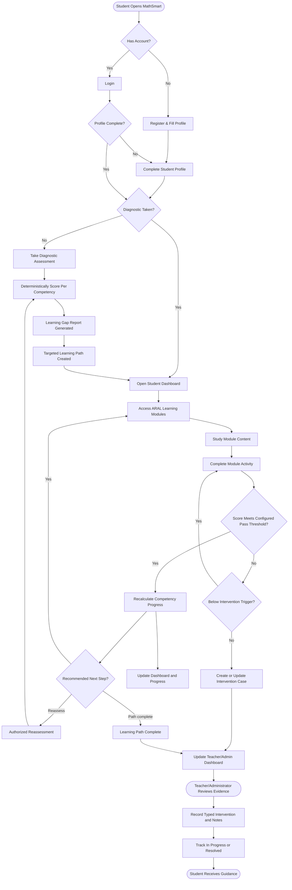
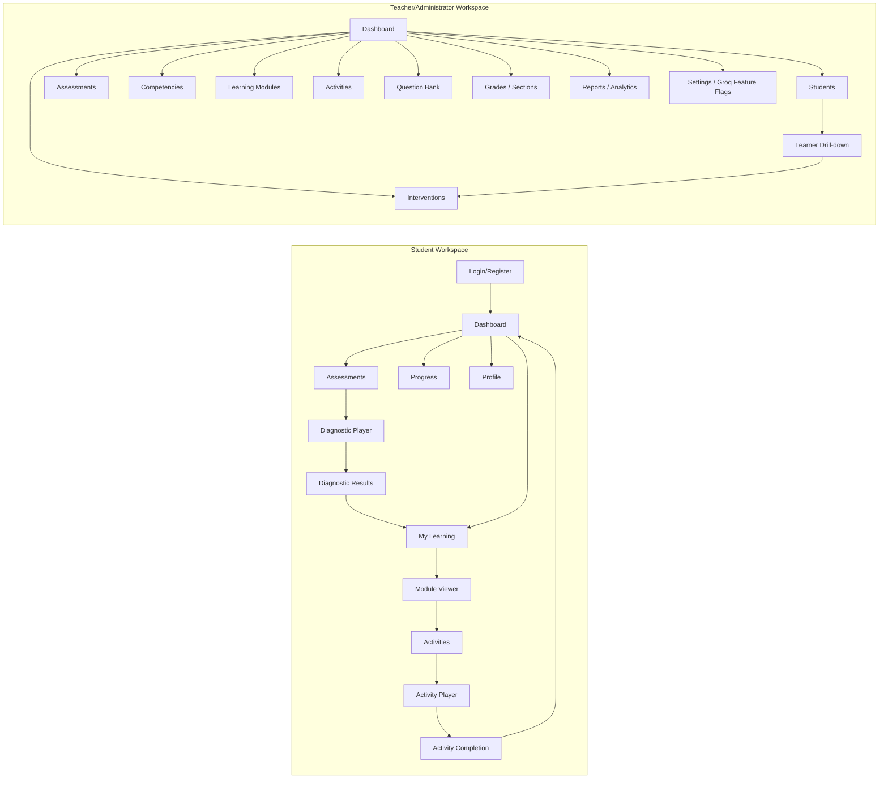
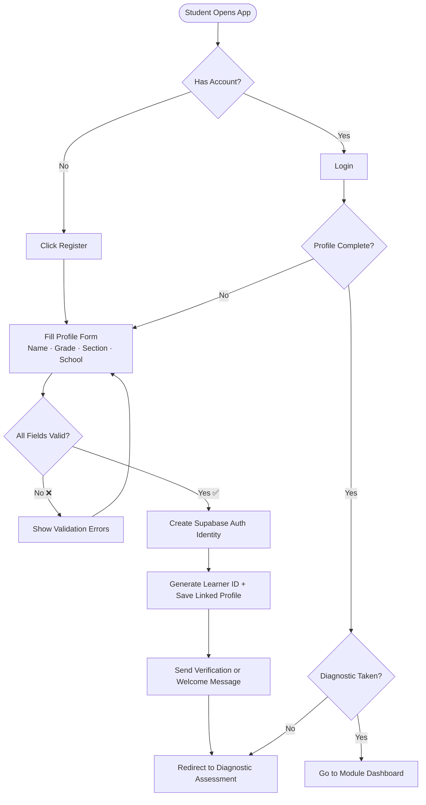
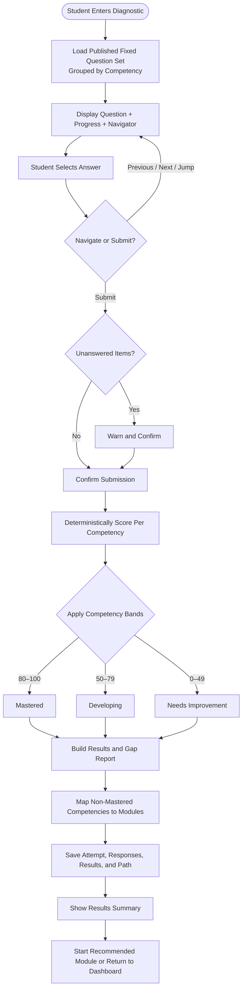
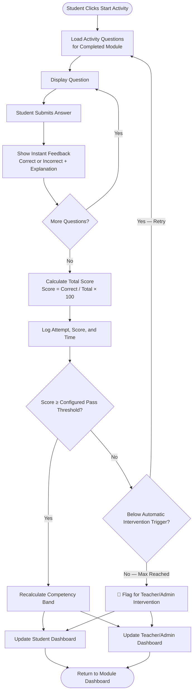
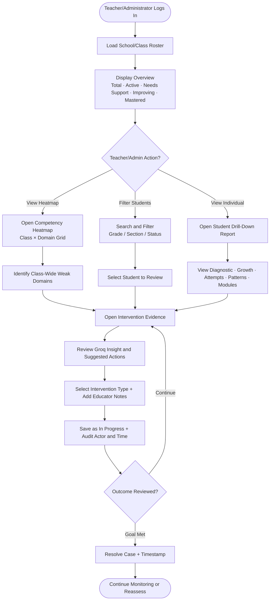
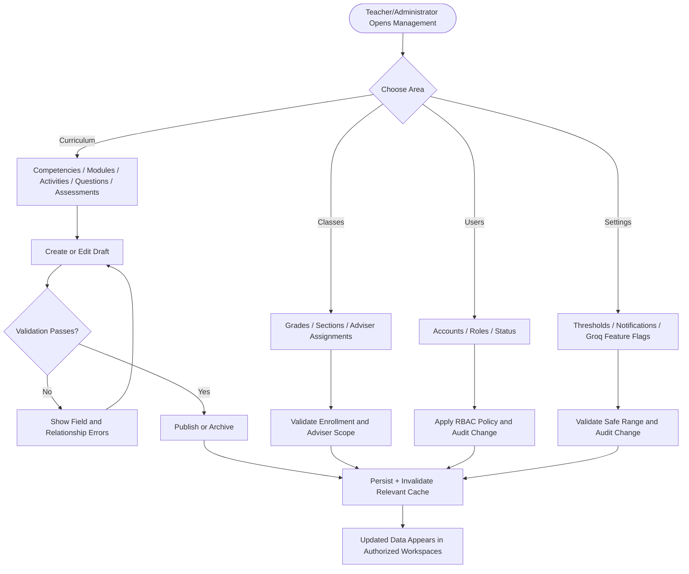
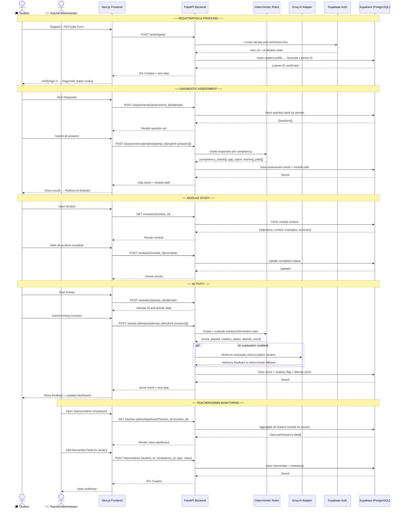
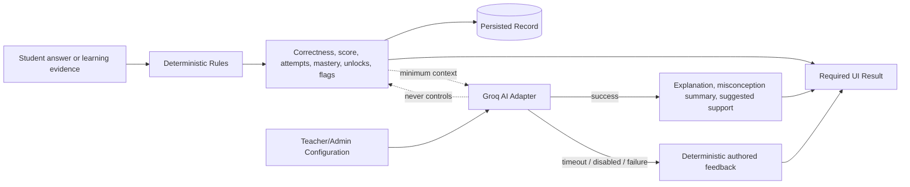
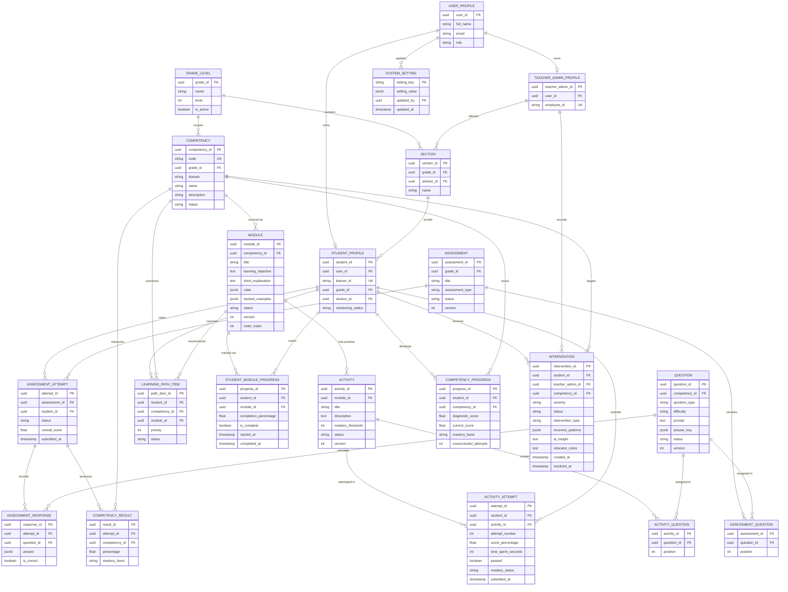

# MathSmart: Diagrams Reference
## Flowcharts, Sequence Diagram & Entity Relationship Diagram

> **Version:** 1.2 | **Last Updated:** September 8, 2026
> **Curriculum:** DepEd Grade 6 Mathematics
> **AI Provider:** Groq; server-side API credential and model are loaded from `.env`
> **UI/UX Workflow Baseline:** `../../ui-ux-workflow-reference/`

---

## Table of Contents

1. [Master End-to-End Flowchart](#1-master-end-to-end-flowchart)
2. [Experience Navigation Map](#2-experience-navigation-map)
3. [Feature Flowcharts](#3-feature-flowcharts)
   - [F1 — Student Profiling](#f1--student-profiling)
   - [F2 — Diagnostic Assessment](#f2--diagnostic-assessment)
   - [F3 — ARAL Learning Modules](#f3--aral-learning-modules)
   - [F4 — Interactive Activities](#f4--interactive-activities)
   - [F5 — Student Progress Dashboard](#f5--student-progress-dashboard)
   - [F6 — Teacher/Administrator Intervention Dashboard](#f6--teacheradministrator-intervention-dashboard)
   - [F7 — Teacher/Administrator Curriculum and Class Administration](#f7--teacheradministrator-curriculum-and-class-administration)
4. [System Sequence Diagram](#4-system-sequence-diagram)
5. [AI Responsibility Boundary](#5-ai-responsibility-boundary)
6. [Entity Relationship Diagram (ERD)](#6-entity-relationship-diagram-erd)
   - [ERD Diagram](#erd-diagram)
   - [Entity Descriptions](#entity-descriptions)
   - [Relationships Summary](#relationships-summary)

---

## 1. Master End-to-End Flowchart

---

## 2. Experience Navigation Map

The reference's combined Teacher/Admin workspace matches the production role model. Production replaces the prototype state machine with authenticated Next.js routes and persisted server data while enforcing the two canonical claims: `student` and `teacher_admin`.

---

## 3. Feature Flowcharts

### F1 — Student Profiling

---

### F2 — Diagnostic Assessment

---

### F3 — ARAL Learning Modules

---

### F4 — Interactive Activities

---

### F5 — Student Progress Dashboard

---

### F6 — Teacher/Administrator Intervention Dashboard

---

### F7 — Teacher/Administrator Curriculum and Class Administration

---

## 4. System Sequence Diagram

---

## 5. AI Responsibility Boundary

Groq never determines correctness, grades, mastery bands, authorization, or intervention triggers. All Groq calls are server-side, redacted, and rate-limited; the API credential and selected model come from `.env`. A timeout, feature-policy disablement, or Groq failure falls back to deterministic authored feedback.

---

## 6. Entity Relationship Diagram (ERD)

### ERD Diagram

---

### Entity Descriptions

| Entity | Description |
|---|---|
| **USER_PROFILE** | Application identity linked to Supabase Auth; credentials remain in the auth provider. |
| **STUDENT_PROFILE / TEACHER_ADMIN_PROFILE** | Role-specific school and learner/educator-administrator data. |
| **GRADE_LEVEL / SECTION** | Enrollment and adviser structure. |
| **COMPETENCY** | Curriculum skill with code, domain, grade, and publication state. |
| **MODULE** | Structured targeted content tied to a competency. |
| **QUESTION** | Reusable question-bank item with a server-only answer key. |
| **ASSESSMENT / ASSESSMENT_QUESTION** | Assessment definition and ordered question membership. |
| **ASSESSMENT_ATTEMPT / ASSESSMENT_RESPONSE / COMPETENCY_RESULT** | Learner submission, individual answers, and deterministic result breakdown. |
| **LEARNING_PATH_ITEM** | Ordered learner-to-competency/module recommendation with an explicit state. |
| **STUDENT_MODULE_PROGRESS** | Tracks completion percentage and status for each student-module pair. |
| **ACTIVITY / ACTIVITY_QUESTION** | Practice definition and ordered question membership. |
| **ACTIVITY_ATTEMPT** | Learner attempt, duration, score, pass result, and resulting mastery state. |
| **COMPETENCY_PROGRESS** | Diagnostic baseline, current score, mastery band, and unsuccessful-attempt count. |
| **INTERVENTION** | Auditable evidence, priority, optional Groq advice, educator action/notes, and lifecycle state. |
| **SYSTEM_SETTING** | Audited Teacher/Administrator configuration for thresholds, notifications, and Groq feature flags; never credentials or model selection. |

---

### Relationships Summary

| Relationship | Type | Description |
|---|---|---|
| Auth user → Role profile | One-to-Zero-or-One per role profile | Authentication and application profile data stay separated |
| Grade → Section → Student | One-to-Many | Models school enrollment and class organization |
| Student → Assessment Attempt | One-to-Many | Preserves diagnostic, reassessment, and quiz history |
| Assessment/Activity → Question | Many-to-Many | Reuses question-bank items with explicit ordering |
| Assessment Attempt → Competency Result | One-to-Many | Produces the per-competency gap analysis |
| Assessment Attempt → Response | One-to-Many | Retains submitted answers and deterministic correctness |
| Competency → Module | One-to-Many | A competency can have multiple ARAL modules |
| Student → Learning Path Item | One-to-Many | Stores the reason, priority, target module, and state |
| Module → Activity | One-to-Many | Allows targeted practice and later extension activities |
| Student → Activity Attempt | One-to-Many | Retains attempt history; escalation is a configurable rule, not a storage limit |
| Student + Competency → Progress | One-to-One pair | Supplies current dashboard/mastery state |
| Teacher/Administrator → Intervention | One-to-Many | Records authorized, auditable intervention actions |
| Teacher/Administrator User → System Setting | One-to-Many updates | Audits changes to thresholds, notifications, and Groq feature flags; deployment owns credential/model configuration |

---

*End of Diagrams Reference*

---
> 📌 **Document Owner:** MathSmart Development Team  
> 🔄 **Review Cycle:** Per sprint / major feature release  
> 📁 **Related Docs:** `SOURCE_OF_TRUTH.md` · `PROJECT.md` · `IMPLEMENTATION_PLAN.md` · `API_ROUTES.md` · `../../ui-ux-workflow-reference/guide.md`
