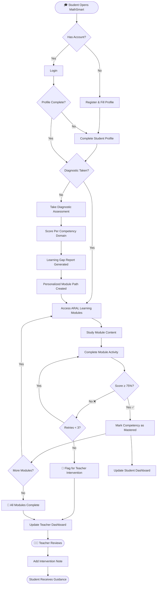
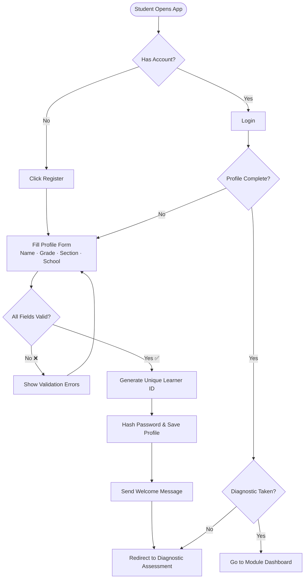
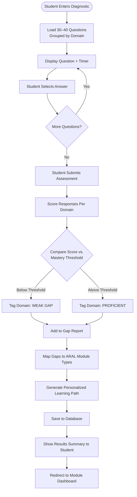
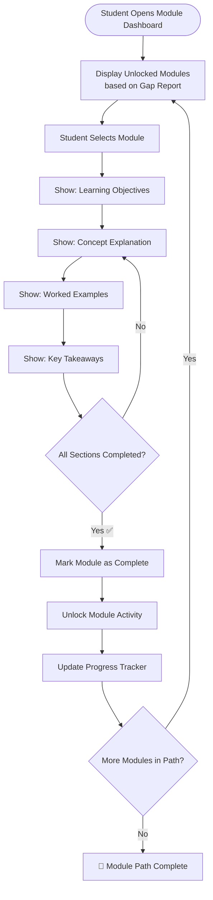
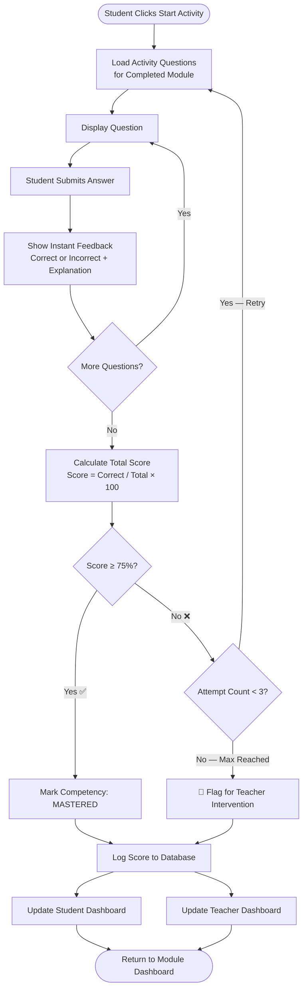
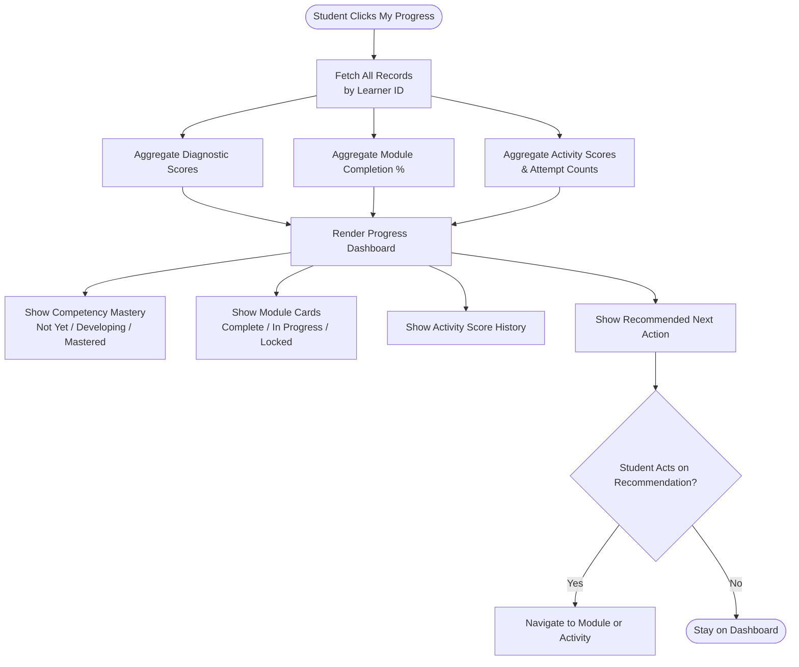
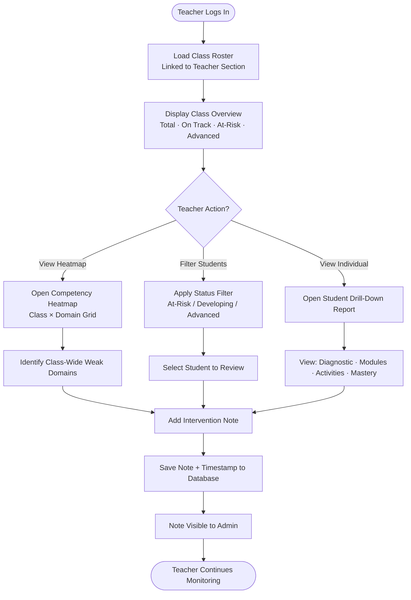
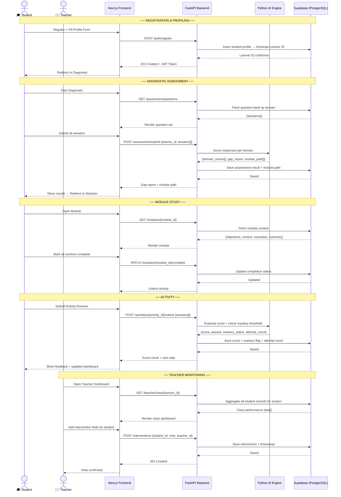
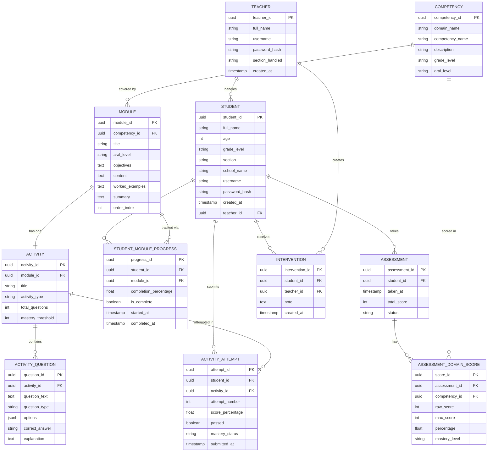

# MathSmart: Diagrams Reference
## Flowcharts, Sequence Diagram & Entity Relationship Diagram

> **Version:** 1.0 | **Last Updated:** September 2026

---

## Table of Contents

1. [Master End-to-End Flowchart](#1-master-end-to-end-flowchart)
2. [Feature Flowcharts](#2-feature-flowcharts)
   - [F1 — Student Profiling](#f1--student-profiling)
   - [F2 — Diagnostic Assessment](#f2--diagnostic-assessment)
   - [F3 — ARAL Learning Modules](#f3--aral-learning-modules)
   - [F4 — Interactive Activities](#f4--interactive-activities)
   - [F5 — Student Progress Dashboard](#f5--student-progress-dashboard)
   - [F6 — Teacher Intervention Dashboard](#f6--teacher-intervention-dashboard)
3. [System Sequence Diagram](#3-system-sequence-diagram)
4. [Entity Relationship Diagram (ERD)](#4-entity-relationship-diagram-erd)
   - [ERD Diagram](#erd-diagram)
   - [Entity Descriptions](#entity-descriptions)
   - [Relationships Summary](#relationships-summary)

---

## 1. Master End-to-End Flowchart

---

## 2. Feature Flowcharts

### F1 — Student Profiling

---

### F2 — Diagnostic Assessment

---

### F3 — ARAL Learning Modules

---

### F4 — Interactive Activities

---

### F5 — Student Progress Dashboard

---

### F6 — Teacher Intervention Dashboard

---

## 3. System Sequence Diagram

---

## 4. Entity Relationship Diagram (ERD)

### ERD Diagram

---

### Entity Descriptions

| Entity | Description |
|---|---|
| **STUDENT** | Core learner profile. Linked to a teacher via `teacher_id`. |
| **TEACHER** | Educator account. Manages a section of students. |
| **ASSESSMENT** | One diagnostic assessment per student. Records overall score and status. |
| **ASSESSMENT_DOMAIN_SCORE** | Per-domain breakdown of a student's diagnostic result. Links to competency. |
| **COMPETENCY** | A specific Grade 7 Math competency (e.g., "Adding Fractions"). Has a domain and ARAL level. |
| **MODULE** | A learning module tied to one competency. Has an ARAL level and ordered content sections. |
| **STUDENT_MODULE_PROGRESS** | Tracks completion percentage and status for each student-module pair. |
| **ACTIVITY** | One activity per module. Has a type (MCQ, fill-in) and mastery threshold. |
| **ACTIVITY_QUESTION** | Individual question in an activity. Stores options and correct answer as JSON. |
| **ACTIVITY_ATTEMPT** | One attempt record per student per activity. Stores score, pass/fail, mastery status. |
| **INTERVENTION** | Teacher's note for a specific student. Timestamped and auditable. |

---

### Relationships Summary

| Relationship | Type | Description |
|---|---|---|
| Student → Assessment | One-to-Many | A student takes one diagnostic but can have attempt history |
| Assessment → Domain Score | One-to-Many | Each assessment breaks down into multiple domain scores |
| Competency → Module | One-to-Many | A competency can have multiple ARAL modules |
| Module → Activity | One-to-One | Each module has exactly one associated activity |
| Activity → Questions | One-to-Many | An activity contains multiple questions |
| Student → Activity Attempt | One-to-Many | A student can attempt an activity up to 3 times |
| Teacher → Student | One-to-Many | A teacher handles an entire section |
| Teacher → Intervention | One-to-Many | A teacher can log multiple intervention notes |

---

*End of Diagrams Reference*

---
> 📌 **Document Owner:** MathSmart Development Team  
> 🔄 **Review Cycle:** Per sprint / major feature release  
> 📁 **Related Docs:** `PROJECT.md` · `IMPLEMENTATION_PLAN.md` · `SYSTEM_WORKFLOW.md`
