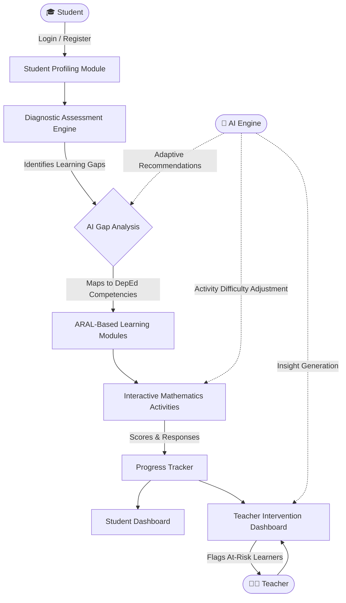
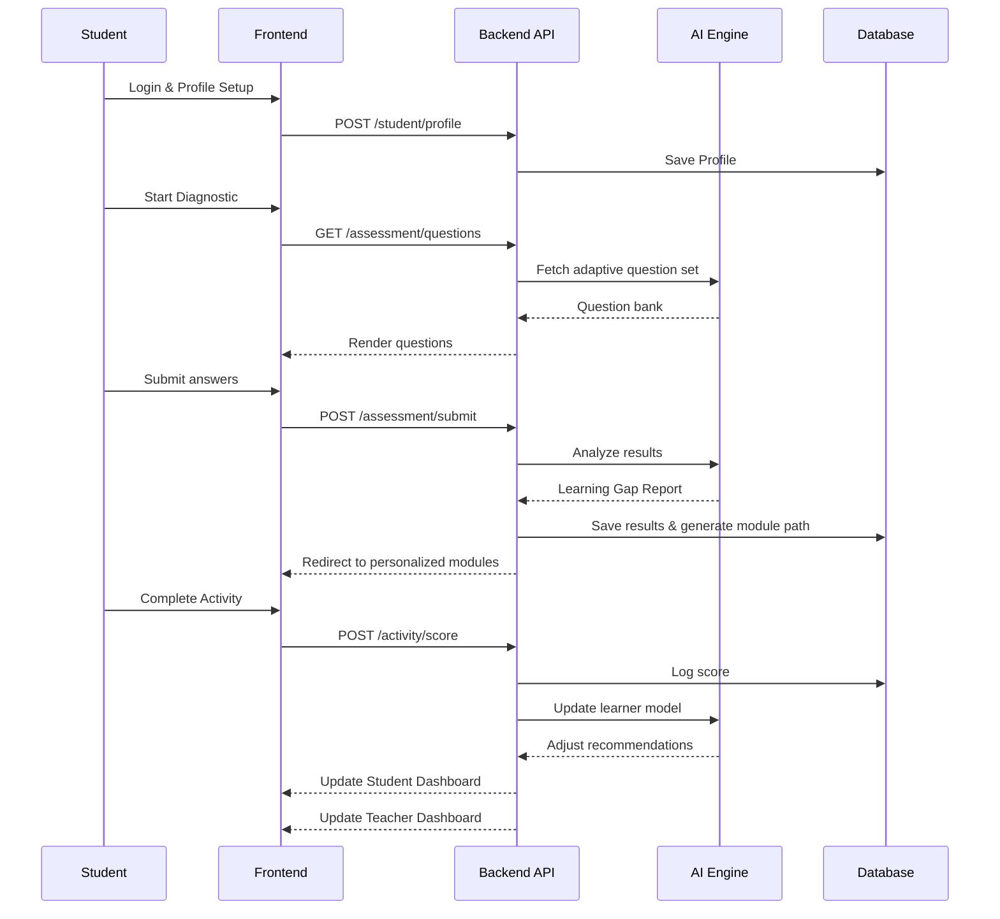
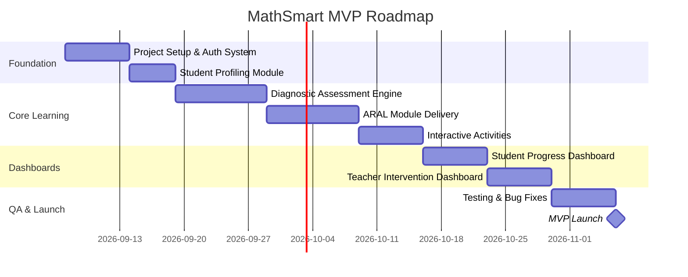

# MathSmart: AI-Powered Interactive Learning System
## Implementation Plan & Architecture Overview

> **Version:** 1.0  
> **Last Updated:** September 2026  
> **Audience:** Developers, Designers, Educators, Stakeholders

---

## Table of Contents

1. [System Overview](#system-overview)
2. [Architecture Overview](#architecture-overview)
   - [High-Level System Workflow](#high-level-system-workflow)
   - [Layered Architecture](#layered-architecture)
   - [Feature-by-Feature Workflow](#feature-by-feature-workflow)
   - [Data Flow Diagram](#data-flow-diagram)
3. [Technology Stack](#technology-stack-recommended)
4. [User Roles](#user-roles)
5. [MVP Definition](#mvp-definition)
   - [MVP Scope — Included](#-mvp-scope--included)
   - [MVP Scope — Excluded](#-mvp-scope--excluded-post-mvp)
   - [MVP Success Criteria](#mvp-success-criteria)
   - [MVP Timeline](#estimated-mvp-timeline)
6. [Post-MVP Roadmap](#post-mvp-roadmap-v2--beyond)

---

## System Overview

MathSmart is a web-based adaptive learning platform designed to elevate Mathematics skills among elementary learners (with a focus on Grade 7 competencies) through AI-driven diagnostics, personalized module delivery, and real-time monitoring for both students and teachers.

The system is built on a **Diagnose → Remediate → Practice → Monitor** cycle driven by the **ARAL (Assist, Remediate, Accelerate, Learn)** framework, fully aligned with DepEd Grade 7 Mathematics competencies.

---

## Architecture Overview

### High-Level System Workflow



---

### Layered Architecture

```mermaid
graph TD
    subgraph Presentation Layer
        UI1[Student Portal]
        UI2[Teacher Dashboard]
        UI3[Admin Panel]
    end

    subgraph Application Layer
        AP1[Auth & Profiling Service]
        AP2[Diagnostic Assessment Service]
        AP3[Module Delivery Engine]
        AP4[Activity Engine]
        AP5[Progress Monitoring Service]
        AP6[AI Recommendation Engine]
        AP7[Teacher Intervention Service]
    end

    subgraph Data Layer
        DB1[(Student Profiles DB)]
        DB2[(Assessment Results DB)]
        DB3[(Module & Content DB)]
        DB4[(Activity Logs DB)]
        DB5[(Competency Mapping DB)]
    end

    Presentation Layer --> Application Layer
    Application Layer --> Data Layer
```

---

### Feature-by-Feature Workflow

#### 1. Student Profiling
```
Student registers → Fills profile form (name, grade, section, school)
→ Profile saved → Unique learner ID assigned
→ Redirected to Diagnostic Assessment
```

#### 2. Mathematics Diagnostic Assessment
```
Student takes pre-test (timed, adaptive questions)
→ Responses captured per competency domain
→ AI Engine scores and maps results to DepEd Grade 7 competency matrix
→ Learning Gap Report generated
→ Prioritized remediation path created
```

#### 3. ARAL-Based Learning Modules
```
Gap Report → AI maps gaps to ARAL modules
→ Modules unlocked per learner's identified weak areas
→ Content delivered (readings + worked examples + visuals)
→ Module completion tracked
```

#### 4. Interactive Mathematics Activities
```
Post-module activity unlocked → Student engages (MCQ, fill-in, step-by-step)
→ Adaptive difficulty adjusts based on performance
→ Score + time-on-task logged
→ Mastery threshold checked → Module marked complete or repeat suggested
```

#### 5. Progress Monitoring Dashboard (Student-facing)
```
Student views:
  - Modules completed / remaining
  - Assessment scores per competency
  - Mastery level indicators (Not Yet / Developing / Mastered)
  - Recommended next steps
```

#### 6. Teacher Intervention Dashboard
```
Teacher logs in → Views class-level and individual performance
→ Flags: At-Risk | On Track | Advanced
→ Competency heatmap across class
→ Generates downloadable progress reports
→ Sets custom interventions / notes per student
```

---

### Data Flow Diagram



---

## Technology Stack (Recommended)

| Layer | Technology |
|---|---|
| **Frontend** | Next.js (React) + Tailwind CSS |
| **Backend API** | Node.js (Express) or Python (FastAPI) |
| **AI Engine** | Python (scikit-learn / OpenAI API for NLP-based hints) |
| **Database** | PostgreSQL (relational) + Redis (session/cache) |
| **File Storage** | Cloudinary / AWS S3 (module media) |
| **Authentication** | JWT + Role-Based Access (Student / Teacher / Admin) |
| **Hosting** | Vercel (frontend) + Railway / Render (backend) |
| **Analytics** | Chart.js / Recharts (dashboards) |

---

## User Roles

| Role | Capabilities |
|---|---|
| **Student** | Profile setup, take assessments, access modules, do activities, view own progress |
| **Teacher** | View class/individual dashboards, set interventions, download reports |
| **Admin** | Manage users, upload content, configure competency mappings |

---

## MVP Definition

> The **Minimum Viable Product** is the smallest working version of MathSmart that delivers real value to learners and teachers without over-engineering.

---

### ✅ MVP Scope — Included

| # | Feature | MVP Details |
|---|---|---|
| 1 | **Student Profiling** | Registration form, basic profile (name, grade, section, school), login/logout |
| 2 | **Diagnostic Assessment** | Fixed 30–40 item pre-test mapped to Grade 7 competency domains; auto-scoring; gap report generation |
| 3 | **ARAL-Based Modules** | At least 3–5 remediation modules per identified gap domain; text + image content delivery |
| 4 | **Interactive Activities** | MCQ-based and fill-in-the-blank activities per module; scoring and retry logic |
| 5 | **Student Progress Dashboard** | Module completion status, assessment scores, basic competency tracker |
| 6 | **Teacher Dashboard** | Class roster view, per-student progress summary, at-risk flagging |

---

### ❌ MVP Scope — Excluded (Post-MVP)

| Feature | Rationale |
|---|---|
| Adaptive question difficulty (real-time AI) | Requires ML model training; deferred to v2 |
| Gamification (badges, streaks, leaderboards) | Enhancement; not core to learning effectiveness |
| Video-based module content | Infrastructure cost; use text/image first |
| Parent portal | Out of primary user scope for MVP |
| Offline mode / PWA | Adds complexity; assume internet access |
| Report export (PDF) | Nice-to-have; deferred to v1.1 |
| Natural language hint system (AI chatbot) | Complex AI integration; post-MVP |
| Multi-subject expansion | MathSmart is Math-only in MVP |

---

### MVP Success Criteria

- [ ] A student can register, take a diagnostic, and receive a personalized module path
- [ ] A student can complete at least one ARAL module and its activity
- [ ] A teacher can log in and view their class's performance and identify at-risk learners
- [ ] Assessment results are stored and reflected in both student and teacher dashboards
- [ ] System is accessible via browser (desktop-first, mobile-responsive)

---

### Estimated MVP Timeline



> **Total Estimated Duration: ~60 days** (with a small dev team of 2–3 developers)

---

## Post-MVP Roadmap (v2 & Beyond)

| Version | Feature Additions |
|---|---|
| **v1.1** | PDF report export, gamification (badges/streaks) |
| **v2.0** | Adaptive AI difficulty engine, video modules, parent portal |
| **v3.0** | Multi-grade support, NLP-based hint chatbot, analytics export |

---

*End of Implementation Plan*

---
> 📌 **Document Owner:** MathSmart Development Team  
> 🔄 **Review Cycle:** Per sprint / major feature release  
> 📁 **Related Docs:** System Workflow, Competency Mapping Guide
