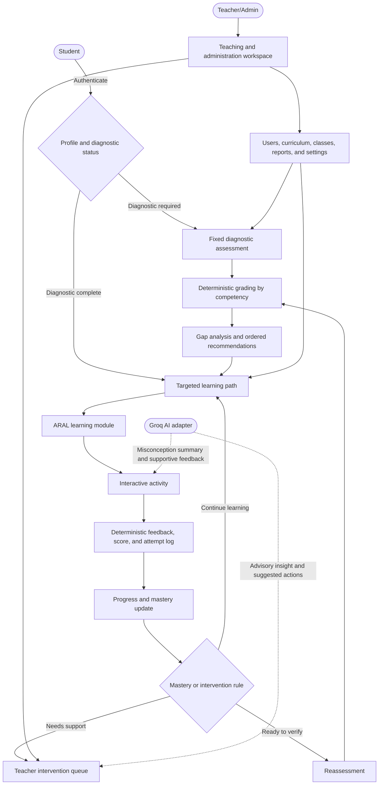
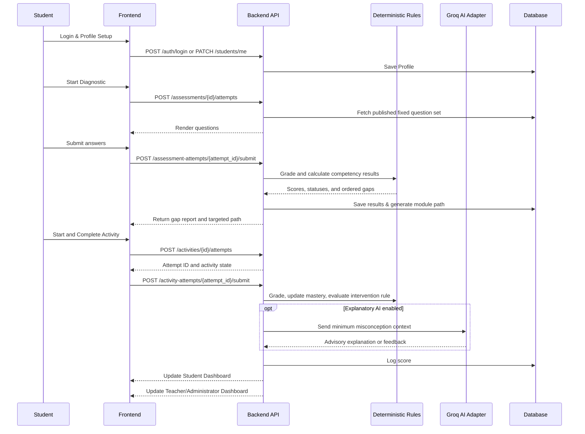
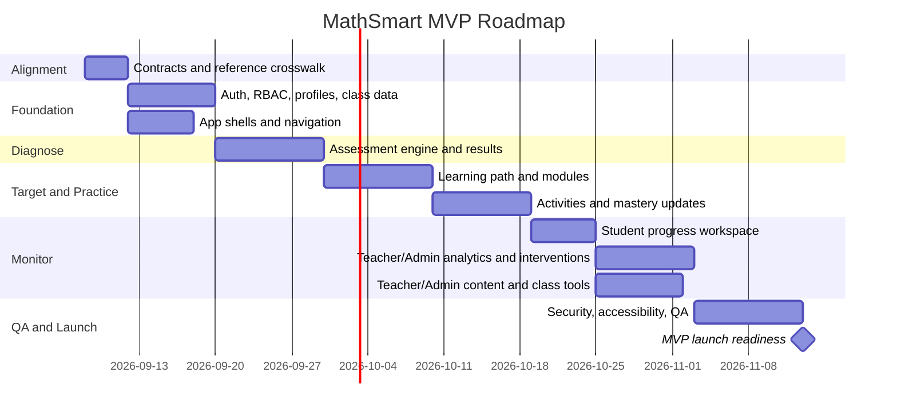

# MathSmart: AI-Powered Interactive Learning System
## Implementation Plan & Architecture Overview

> **Version:** 1.2
> **Last Updated:** September 8, 2026
> **Audience:** Developers, Designers, Educators, Stakeholders
> **Curriculum:** DepEd Grade 6 Mathematics
> **AI Provider:** Groq; server-side API credential and model are loaded from `.env`
> **UI/UX Workflow Baseline:** `../../ui-ux-workflow-reference/`

---

## Table of Contents

1. [System Overview](#system-overview)
2. [Architecture Overview](#architecture-overview)
   - [High-Level System Workflow](#high-level-system-workflow)
   - [Layered Architecture](#layered-architecture)
   - [Feature-by-Feature Workflow](#feature-by-feature-workflow)
   - [Data Flow Diagram](#data-flow-diagram)
3. [Reference Porting Strategy](#reference-porting-strategy)
4. [Target Screen and Route Map](#target-screen-and-route-map)
5. [Technology Stack](#technology-stack)
6. [User Roles](#user-roles)
7. [Implementation Phases](#implementation-phases)
8. [MVP Definition](#mvp-definition)
   - [MVP Scope — Included](#-mvp-scope--included)
   - [MVP Scope — Excluded](#-mvp-scope--excluded-post-mvp)
   - [MVP Success Criteria](#mvp-success-criteria)
   - [MVP Timeline](#estimated-mvp-timeline)
9. [Quality Gates and Definition of Done](#quality-gates-and-definition-of-done)
10. [Post-MVP Roadmap](#post-mvp-roadmap-v2--beyond)

---

## System Overview

MathSmart is a web-based learning platform designed to elevate Mathematics skills among elementary learners, with an MVP focus on Grade 6 competencies, through deterministic diagnostics, targeted module delivery, interactive practice, progress monitoring, and Groq-assisted pedagogical insight.

The system is built on a **Diagnose → Target → Practice → Monitor → Reassess** cycle driven by the **ARAL (Assist, Remediate, Accelerate, Learn)** framework and aligned with DepEd Grade 6 Mathematics competencies.

The reference prototype shows the intended screens, transitions, content shapes, and general visual character. It is an improvable baseline, not the implementation target at the source-code level: the production application remains Next.js, FastAPI, and Supabase.

---

## Architecture Overview

### High-Level System Workflow



---

### Layered Architecture

```mermaid
graph TD
    subgraph Presentation Layer
        UI1[Student Portal]
        UI2[Teacher/Admin Workspace]
    end

    subgraph Application Layer
        AP1[Auth & Profiling Service]
        AP2[Diagnostic Assessment Service]
        AP3[Module Delivery Engine]
        AP4[Activity Engine]
        AP5[Progress Monitoring Service]
        AP6[Deterministic Scoring & Rules]
        AP7[Teacher Intervention Service]
        AP8[Curriculum & Class Administration]
        AP9[Reporting Service]
        AP10[Groq AI Adapter]
    end

    subgraph Data Layer
        DB1[(Student Profiles DB)]
        DB2[(Assessment Results DB)]
        DB3[(Module & Content DB)]
        DB4[(Activity Logs DB)]
        DB5[(Competency Mapping DB)]
        DB6[(Class, Settings & Audit DB)]
    end

    Presentation Layer --> Application Layer
    Application Layer --> Data Layer
```

---

### Feature-by-Feature Workflow

#### 1. Student Profiling
```
Student registers → Fills profile form (name, grade, section, school)
→ Profile saved → Unique learner ID assigned
→ Diagnostic status checked → Student sees Diagnostic or Dashboard
```

#### 2. Mathematics Diagnostic Assessment
```
Student takes fixed MVP pre-test with progress and question navigation
→ Submission confirmation warns about unanswered items
→ Deterministic rules score responses per competency
→ Results classify Mastered / Developing / Needs Improvement
→ Ordered learning path is created from non-mastered competencies
```

#### 3. ARAL-Based Learning Modules
```
Gap Report → Recommendation rules map gaps to ARAL modules
→ Modules unlocked per learner's identified weak areas
→ Objectives, explanations, rules, visuals, and worked examples delivered
→ Module completion tracked → Linked activity opened
```

#### 4. Interactive Mathematics Activities
```
Post-module activity unlocked → Student answers supported question types
→ Deterministic correctness and immediate explanation shown
→ Groq wording or misconception explanation uses a safe fallback
→ Score, time, and attempts logged
→ Mastery and intervention thresholds checked → Continue, retry, or escalate
```

#### 5. Progress Monitoring Dashboard (Student-facing)
```
Student views:
  - Diagnostic baseline and current score per competency
  - Growth, status, and score trajectory
  - Modules completed / current / locked
  - Activity and assessment history
  - One recommended next action
```

#### 6. Teacher/Administrator Intervention Dashboard
```
Teacher/Administrator logs in → Views school-wide, class-level, and individual performance
→ Filters cases by severity, status, and competency
→ Reviews scores, attempts, incorrect patterns, and completed modules
→ Receives Groq-assisted insight and recommended actions
→ Records intervention type and notes
→ Tracks Needs Intervention → In Progress → Resolved
```

---

### Data Flow Diagram



---

## Reference Porting Strategy

The reference prototype is a specification aid. Port one vertical workflow at a time instead of copying the application wholesale.

1. Read `../../ui-ux-workflow-reference/guide.md`.
2. Open the matching reference component and its direct dependencies only.
3. Extract user goal, required data, states, actions, validation, and transitions.
4. Implement the route in the working Next.js App Router structure using existing JSX, shadcn/ui, Tailwind tokens, and server/client boundaries.
5. Replace mock state with typed API-service calls and authenticated Supabase-backed data.
6. Improve responsive layout, accessibility, content clarity, empty/loading/error states, and interaction feedback.
7. Test the successful path, validation failures, authorization, loading, empty data, API failure, and keyboard behavior.

### Module ownership convention

- `src/app/` contains thin Next.js route files and layouts only; it does not own feature logic.
- `src/modules/student/<feature>/` owns each learner-facing vertical slice.
- `src/modules/teacher-admin/<feature>/` owns each combined Teacher/Administrator vertical slice.
- A feature keeps its components, hooks, services, schemas, utilities, and unit tests inside its own directory.
- `src/modules/shared/` accepts code only when at least two feature modules genuinely reuse it; shadcn/Radix primitives remain in `src/components/ui/`.
- Cross-module access goes through the owning module's `index.js` or documented service contract. Deep imports into another module's private files are prohibited.
- Shared contract or navigation changes require a named reviewer because those files are the remaining collaboration hotspots.

### Prototype elements that must not ship unchanged

- Demo role switching and demo learner-persona switching.
- Client-only authentication, hardcoded students, synthetic analytics, and fixed dates.
- Correct answers or grading logic exposed in browser-delivered assessment payloads.
- Groq credentials or model configuration exposed to any client or editable through student or Teacher/Administrator settings; both are deployment-only `.env` values.
- Simulated AI latency, fake provider-health claims, and technical architecture copy presented as learner-facing UI.
- Browser-only report generation for sensitive data without authorization, escaping, and audit controls.

---

## Target Screen and Route Map

The exact URL layout may evolve with the App Router, but these screens and transitions are required. Route groups such as `(student)` do not appear in URLs.

### Student

| Reference screen | Working target | Entry and exit behavior |
|---|---|---|
| `StudentLoginView` | route `src/app/(auth)/login/`; feature `src/modules/auth/` | Authenticate; route according to profile and diagnostic status |
| `StudentDashboard` | route `src/app/(student)/student/dashboard/`; feature `src/modules/student/dashboard/` | Launch diagnostic, resume learning/activity, or open progress |
| `StudentAssessmentsView` | route `src/app/(student)/student/assessments/`; feature `src/modules/student/assessments/` | Start or retake when authorized; view prior report |
| `DiagnosticAssessmentView` | dynamic assessment route; feature `src/modules/student/assessments/` | Navigate questions, save answers, confirm submit |
| `DiagnosticResultsView` | assessment result state; feature `src/modules/student/assessments/` | Show competency breakdown and open first recommended module |
| `MyLearningView` | route `src/app/(student)/student/my-learning/`; feature `src/modules/student/my-learning/` | Show ordered path and open available lessons or activities |
| `LearningModuleView` | dynamic My Learning route; feature `src/modules/student/my-learning/` | Study structured content; launch associated activity |
| `StudentActivitiesView` | route `src/app/(student)/student/activities/`; feature `src/modules/student/activities/` | Filter/browse available practice; review prerequisite lesson |
| `InteractiveActivityView` | dynamic activity route; feature `src/modules/student/activities/` | Check answers, receive feedback, finish attempt |
| `ActivityCompletionView` | activity result state; feature `src/modules/student/activities/` | Show score/mastery change; practice again or continue |
| `StudentProgressView` | route `src/app/(student)/student/progress/`; feature `src/modules/student/progress/` | Review competency growth and learning history |
| `StudentProfileView` | route `src/app/(student)/student/profile/`; feature `src/modules/student/profile/` | View identity/enrollment and update permitted preferences |

### Teacher/Administrator

| Reference screen | Working target | Authorization expectation |
|---|---|---|
| `TeacherDashboard` | route `src/app/(teacher-admin)/teacher/dashboard/`; feature `src/modules/teacher-admin/dashboard/` | Show school-wide teaching and administration summary |
| `StudentManagementView` | student list/detail routes; feature `src/modules/teacher-admin/students/` | Search, enroll, update, and inspect learners |
| `TeacherInterventionDashboard` | route `src/app/(teacher-admin)/teacher/interventions/`; feature `src/modules/teacher-admin/interventions/` | Manage and audit all intervention cases |
| `TeacherAnalyticsView` | reports/analytics route; feature `src/modules/teacher-admin/reports-analytics/` | Filter cohorts, inspect trends, and export authorized reports |
| `ContentManagementView` assessment tab | feature `src/modules/teacher-admin/assessments/` | Author, validate, publish, and archive assessments |
| `ContentManagementView` competency tab | feature `src/modules/teacher-admin/competencies/` | Maintain Grade 6 competency definitions and prerequisites |
| `ContentManagementView` module tab | feature `src/modules/teacher-admin/learning-modules/` | Maintain ARAL learning-module content and ordering |
| `ContentManagementView` activity tab | feature `src/modules/teacher-admin/activities/` | Maintain practice activities and thresholds |
| `ContentManagementView` question tab | feature `src/modules/teacher-admin/question-bank/` | Maintain reusable questions, answer keys, explanations, and hints |
| Grade and section tabs | feature `src/modules/teacher-admin/grades-sections/` | Maintain grade, section, enrollment, and adviser relationships |
| `TeacherSettingsView` | feature `src/modules/teacher-admin/settings/` | Maintain profile/preferences, global thresholds, integrations, and Groq feature flags; credential/model remain in `.env` |

---

## Technology Stack

| Layer | Technology |
|---|---|
| **Frontend** | Next.js (React) + Tailwind CSS |
| **Backend API** | FastAPI (Python 3.11+) |
| **Deterministic Math Engine** | Python application services with SymPy/NumPy where appropriate |
| **Generative AI** | Groq through a server-side adapter; API credential and selected model are loaded from `.env` |
| **Database** | Supabase PostgreSQL |
| **File Storage** | Supabase Storage and/or Cloudinary for approved module media |
| **Authentication** | Supabase Auth JWT verified by FastAPI with server-enforced RBAC |
| **Hosting** | Vercel (frontend) + Railway / Render (backend) |
| **Analytics** | Chart.js / Recharts (dashboards) |

---

## User Roles

| Role | Capabilities |
|---|---|
| **Student** | Authenticate, manage permitted profile fields, take assessments, follow targeted modules, complete activities, and view own progress/history |
| **Teacher/Administrator** (`teacher_admin`) | View school-wide learner evidence, manage interventions and learner records, administer curriculum/content and assessments, maintain grades/sections and accounts, export reports, and manage thresholds/integrations/Groq feature flags; credentials/model remain deployment-only |

Production has exactly two role claims: `student` and `teacher_admin`. The reference's `TEACHER_ADMIN` concept maps to the canonical lowercase `teacher_admin` claim. Authorization remains enforced in FastAPI and database policies, not only in the UI.

---

## Implementation Phases

### Phase 0 — Contract and design alignment

- Freeze terminology, role permissions, mastery bands, activity pass threshold, and intervention trigger defaults in `SOURCE_OF_TRUTH.md`.
- Convert reference screen state into a route/data/state checklist without copying Vite architecture.
- Define shared response schemas and database migrations before feature UI depends on mock shapes.
- Establish theme tokens, responsive shell, navigation, authentication guards, and reusable loading/empty/error patterns.

### Phase 1 — Foundation and identity

- Implement Supabase authentication, FastAPI token verification, two-role guards, student and Teacher/Administrator profiles, grades, sections, and enrollment relationships.
- Build production navigation without demo role/persona switchers.
- Deliver login, registration, profile completion, student shell, and combined Teacher/Administrator shell.

### Phase 2 — Diagnose

- Implement assessment, question, attempt, response, and competency-result persistence.
- Deliver the assessment list/history, focused diagnostic player, question navigator, autosave/recovery, submission confirmation, deterministic scoring, results report, and learning-path generation.
- Ensure response payloads never expose answer keys before submission.

### Phase 3 — Targeted learning

- Implement competency/module relationships, ordered learning-path items, module content structure, and progress tracking.
- Deliver My Learning, the module viewer, state badges, progress recovery, and associated-activity gating.
- Add Teacher/Administrator competency and module authoring with draft/published validation.

### Phase 4 — Practice and mastery

- Implement activity/question assignment, supported MVP question types, deterministic grading, attempts, timing, feedback, mastery updates, and intervention rules.
- Deliver activity browse, activity player, completion summary, practice-again, and continue-learning transitions.
- Add the server-side Groq adapter behind a feature flag with timeout and deterministic fallback; load its existing API credential and selected model from `.env` without exposing either to clients.

### Phase 5 — Monitor and intervene

- Deliver student progress, Teacher/Administrator roster/drill-down, class dashboard, heatmap, intervention queue, evidence view, status transitions, notes, and audit fields.
- Add assessment/content administration, grade/section administration, Teacher/Administrator profile, global thresholds, notification preferences, and CSV reporting.
- Verify school/section isolation and sensitive export authorization.

### Phase 6 — Hardening and release

- Complete responsive, accessibility, security, data-integrity, performance, browser, and failure-mode testing.
- Replace all prototype fixtures and synthetic metrics with API-backed data.
- Validate observability, backups, rate limits, AI redaction, audit trails, and deployment configuration.

---

## MVP Definition

> The **Minimum Viable Product** is the smallest working version of MathSmart that delivers real value to learners and Teacher/Administrators without over-engineering.

---

### ✅ MVP Scope — Included

| # | Feature | MVP Details |
|---|---|---|
| 1 | **Identity and profiles** | Real authentication, role guards, learner identity/enrollment, login/logout, and permitted profile updates |
| 2 | **Diagnostic and results** | Fixed 30–40 item assessment, autosaved answers, deterministic grading, competency results, gap report, history, and targeted path |
| 3 | **ARAL learning path** | At least 3–5 remediation modules per covered gap area with objectives, explanations, rules, examples, visuals, completion, and linked activities |
| 4 | **Interactive activities** | Multiple choice, numeric input, and fill-blank MVP types; deterministic feedback, hints, retry logic, timing, scoring, and completion summary |
| 5 | **Student workspace** | Dashboard, My Learning, activities, assessments/history, progress, and profile screens backed by real data |
| 6 | **Teacher/Administrator workspace** | Dashboard, roster search/filter, learner drill-down, competency view, at-risk detection, intervention lifecycle, and administrative navigation |
| 7 | **Curriculum and school administration** | Minimum viable management for competencies, learning modules, activities, question bank, assessments, grades/sections, settings, and learner enrollment |
| 8 | **Reporting and quality** | Cohort analytics, safe CSV export, responsive layouts, accessible interactions, and explicit loading/empty/error states |

---

### ❌ MVP Scope — Excluded (Post-MVP)

| Feature | Rationale |
|---|---|
| Adaptive question difficulty (real-time AI) | Requires ML model training; deferred to v2 |
| Persistent gamification economy (XP, badges, streaks, leaderboards) | Prototype profile badges are visual examples; durable gamification is not core to learning effectiveness |
| Video-based module content | Infrastructure cost; use text/image first |
| Parent portal | Out of primary user scope for MVP |
| Offline mode / PWA | Adds complexity; assume internet access |
| Report export (PDF) | Nice-to-have; deferred to v1.1 |
| Open-ended AI chatbot | Bounded AI explanations and insights may be feature-flagged in MVP; unrestricted chat is post-MVP |
| Multi-subject expansion | MathSmart is Math-only in MVP |

---

### MVP Success Criteria

- [ ] A student can register, take a diagnostic, and receive a personalized module path
- [ ] A student can complete at least one ARAL module and its activity
- [ ] A Teacher/Administrator can log in, view learner performance, and identify at-risk learners
- [ ] A Teacher/Administrator can record an intervention type and note, then advance the case status
- [ ] A Teacher/Administrator can publish the minimum content needed for the diagnostic-to-activity journey
- [ ] Assessment results are stored and reflected in both Student and Teacher/Administrator dashboards
- [ ] Scores and mastery decisions remain correct when Groq is disabled by feature policy or temporarily unavailable
- [ ] The system works across desktop and mobile layouts with keyboard-accessible core flows and clear non-color status labels

---

### Estimated MVP Timeline



> **Planning estimate:** approximately 12–14 weeks for a small team of 2–3 developers. Parallel frontend/backend work can shorten calendar time, but security, content preparation, accessibility, and school validation must not be removed to meet a date.

---

## Quality Gates and Definition of Done

A feature is complete only when all applicable gates pass:

### Product and workflow

- Required entry, success, retry, cancel/back, and next-step transitions match the intended learning or administration workflow.
- The screen works with real API data; mock fixtures are limited to tests and development stories.
- Loading, empty, validation, permission-denied, server-error, and recovery states are intentional.

### Learning integrity

- Correct answers, scores, mastery bands, attempt counts, unlocks, and flags are covered by deterministic tests.
- Assessment answer keys are not sent before submission.
- Groq output is labeled advisory, can be disabled by feature policy, has a timeout/fallback, and cannot mutate grades or permissions.

### Accessibility and responsive UX

- Core flows are keyboard operable with visible focus and logical focus order.
- Inputs have programmatic labels; dialogs manage focus; status is conveyed through text/iconography as well as color.
- Layouts work at phone, tablet, laptop, and wide desktop widths without hiding required actions or data.

### Security and privacy

- FastAPI authorization and database policies enforce `student` ownership and `teacher_admin` school-wide privileges.
- The Groq credential and model are loaded from server-side `.env`; the credential is never returned, while the model may appear only as sanitized read-only provenance and is never client-editable. Logs avoid unnecessary learner data, and Groq requests contain the minimum required context.
- Sensitive exports are authorized, escaped, timestamped, and auditable.

### Engineering

- Relevant lint, build, unit, integration, and end-to-end checks pass.
- API changes are reflected in `API_ROUTES.md`; schema/flow changes are reflected in `SOURCE_OF_TRUTH.md` and `DIAGRAMS.md`.
- No unrelated behavior regresses and no generated or secret files are committed.

---

## Post-MVP Roadmap (v2 & Beyond)

| Version | Feature Additions |
|---|---|
| **v1.1** | PDF report export, richer audit/history views, notification delivery, and optional lightweight recognition badges |
| **v2.0** | Evidence-validated adaptive sequencing, video modules, parent portal, and expanded question types such as matching and ordering |
| **v3.0** | Multi-grade rollout, carefully bounded conversational tutoring, advanced longitudinal analytics, and external data exports |

---

*End of Implementation Plan*

---
> 📌 **Document Owner:** MathSmart Development Team  
> 🔄 **Review Cycle:** Per sprint / major feature release  
> 📁 **Related Docs:** `SOURCE_OF_TRUTH.md` · `PROJECT.md` · `API_ROUTES.md` · `DIAGRAMS.md` · `../../ui-ux-workflow-reference/guide.md`
