# MathSmart — Complete Implementation Plan

> **Generated:** 2026-09-07 · **Status:** READ-ONLY analysis — no files modified  
> **Authoritative Document:** [`SOURCE_OF_TRUTH.md`](file:///home/jeipyyy/Documents/Projects/MathSmart-AI-Powered-Interactice-Learning-System/docs/SOURCE_OF_TRUTH.md) (self-declared at L1078)

---

## 1. Documentation Findings

| Document | Exists | Purpose | Key Contribution |
|----------|--------|---------|------------------|
| [`SOURCE_OF_TRUTH.md`](file:///home/jeipyyy/Documents/Projects/MathSmart-AI-Powered-Interactice-Learning-System/docs/SOURCE_OF_TRUTH.md) | ✅ | Single authoritative reference | Full ERD (11 entities), complete API surface (30+ endpoints), role access matrix, MVP scope, folder structure |
| [`IMPLEMENTATION_PLAN.md`](file:///home/jeipyyy/Documents/Projects/MathSmart-AI-Powered-Interactice-Learning-System/docs/IMPLEMENTATION_PLAN.md) | ✅ | Architecture & MVP timeline | Gantt chart (60 days), phased roadmap, MVP success criteria, layered architecture, data flow sequence |
| [`API_ROUTES.md`](file:///home/jeipyyy/Documents/Projects/MathSmart-AI-Powered-Interactice-Learning-System/docs/API_ROUTES.md) | ✅ | Full REST API documentation | Complete request/response schemas for all 30+ endpoints, role restrictions, status codes |
| [`DIAGRAMS.md`](file:///home/jeipyyy/Documents/Projects/MathSmart-AI-Powered-Interactice-Learning-System/docs/DIAGRAMS.md) | ✅ | Flowcharts, sequence diagram, ERD | Per-feature flowcharts (F1–F6), master end-to-end flow, system sequence diagram, identical ERD to SOT |
| [`PROJECT.md`](file:///home/jeipyyy/Documents/Projects/MathSmart-AI-Powered-Interactice-Learning-System/docs/PROJECT.md) | ✅ | Project overview & tech stack | **Confirmed** tech stack decisions: FastAPI, Supabase (PostgreSQL + Auth), Cloudinary, Vercel |
| `SYSTEM_WORKFLOW.md` | ❌ **Missing** | Feature workflows | Referenced in folder structure (SOT L1000, DIAGRAMS L452) but does not exist. Its content appears to be fully captured inside `SOURCE_OF_TRUTH.md` §2 Core Features. |
| [`Mathematics_Diagnostic_Assessment_Implementation_Plan.md`](file:///home/jeipyyy/Documents/Projects/MathSmart-AI-Powered-Interactice-Learning-System/docs/Mathematics_Diagnostic_Assessment_Implementation_Plan.md) | ✅ | F2 implementation plan draft | Earlier draft from this conversation — superseded by this plan |

### Document Conflicts Identified

| # | Conflict | Documents | Resolution |
|---|----------|-----------|------------|
| C1 | **Backend framework**: `IMPLEMENTATION_PLAN.md` L189 says `"Node.js (Express) or Python (FastAPI)"` (undecided), while `PROJECT.md` L66 says `"Chosen: FastAPI (Python)"` and `SOURCE_OF_TRUTH.md` L540 confirms FastAPI. | IMPL vs. PROJECT/SOT | **Resolved: FastAPI (Python)**. SOT is authoritative and PROJECT explicitly marks FastAPI as "Chosen". IMPL was written earlier and not updated. |
| C2 | **Database**: `IMPLEMENTATION_PLAN.md` L190 says `"PostgreSQL (relational) + Redis (session/cache)"` while `PROJECT.md` L80 and SOT L541 say `"Supabase (PostgreSQL)"` with no Redis. | IMPL vs. PROJECT/SOT | **Resolved: Supabase (PostgreSQL), no Redis for MVP**. SOT is authoritative. Redis is post-MVP if needed. |
| C3 | **Auth**: `IMPLEMENTATION_PLAN.md` L192 says `"JWT + Role-Based Access"` (custom), while `PROJECT.md` L95 and SOT L542 say `"Supabase Auth"`. | IMPL vs. PROJECT/SOT | **Resolved: Supabase Auth** for JWT token issuance. FastAPI middleware validates Supabase JWTs. |
| C4 | **Missing `SYSTEM_WORKFLOW.md`**: Referenced in folder structure but doesn't exist. | SOT/DIAGRAMS | **Non-blocking**. Content is inside SOT §2. No action needed. |

---

## 2. Current Repository Status

### Already Implemented

| Component | Files | Status |
|-----------|-------|--------|
| **Next.js 16 project scaffold** | `package.json`, `next.config.mjs`, `eslint.config.mjs`, `postcss.config.mjs`, `jsconfig.json` | ✅ Functional |
| **Tailwind CSS v4 + shadcn/ui (New York)** | `globals.css`, `components.json` | ✅ Configured with CSS variables |
| **Landing page** | [`src/app/page.jsx`](file:///home/jeipyyy/Documents/Projects/MathSmart-AI-Powered-Interactice-Learning-System/src/app/page.jsx) | ✅ Hero + 3 feature cards |
| **Root layout** | [`src/app/layout.jsx`](file:///home/jeipyyy/Documents/Projects/MathSmart-AI-Powered-Interactice-Learning-System/src/app/layout.jsx) | ✅ Minimal shell |
| **shadcn/ui primitives** | `badge.jsx`, `button.jsx`, `card.jsx`, `input.jsx` | ✅ 4 components installed |
| **Utility barrel exports** | `src/lib/utils.js`, `src/utils/index.js`, `src/components/common/index.js` | ✅ `cn()` utility exported |
| **Environment template** | [`.env.example`](file:///home/jeipyyy/Documents/Projects/MathSmart-AI-Powered-Interactice-Learning-System/.env.example) | ✅ Supabase + API + Cloudinary vars |
| **Route group directories (empty)** | `(auth)/login`, `(auth)/register`, `(student)/*`, `(teacher)/*`, `(admin)/*` | ✅ Scaffolded with `.gitkeep` |

### Documented but NOT Implemented (Skeleton Only)

| Component | Expected | Actual |
|-----------|----------|--------|
| **Backend (FastAPI)** | `main.py`, `requirements.txt`, 8 routers, 3 services, models, db client, middleware | **Empty** — only `.gitkeep` files in `backend/` subdirectories |
| **Auth pages** | Login form, Register form | **Empty** — `.gitkeep` only |
| **Student pages** | Dashboard, Diagnostic, Modules/[id], Activities/[id], Progress | **Empty** — `.gitkeep` only |
| **Teacher pages** | Class, Heatmap, Students/[id], Interventions | **Empty** — `.gitkeep` only |
| **Admin pages** | Users, Content, Competencies | **Empty** — `.gitkeep` only |
| **Frontend services** | API service layer (`src/services/`) | **Empty** — `.gitkeep` only |
| **Frontend config** | Supabase client, API URL config (`src/config/`) | **Empty** — `.gitkeep` only |
| **Constants / Enums** | Mastery thresholds, roles, domains, ARAL levels | **Empty** — `.gitkeep` only |
| **Hooks** | `useAuth`, `useStudent`, `useModules`, `useProgress` | **Empty** — `.gitkeep` only |
| **Models** | Student, Teacher, Module, etc. (`src/models/`) | **Empty** — `.gitkeep` only |
| **Tests** | `tests/frontend/`, `tests/backend/` | **Empty** — `.gitkeep` only |
| **Database** | Supabase tables/schema/seed data | **Not set up** |

### Summary

> **The project is at scaffolding stage.** The Next.js frontend shell exists with a landing page and shadcn/ui primitives, but **zero feature logic**, **zero backend code**, **zero database schema**, and **zero auth** has been implemented. All route directories are empty placeholders. The documentation is comprehensive and well-aligned across documents (with minor conflicts resolved above).

---

## 3. End-to-End Workflow

```
F1: PROFILE → F2: DIAGNOSE → GAP ANALYSIS → LEARNING PATH
  → F3: REMEDIATE (Modules) → F4: PRACTICE (Activities)
    → MASTERY CHECK → F5: STUDENT DASHBOARD → F6: TEACHER DASHBOARD
```

### Detailed Data Flow

```mermaid
flowchart LR
    subgraph "F1 — Student Profiling"
        A[Register / Login] --> B[Save STUDENT entity]
        B --> C[Assign learner_id]
        C --> D[Link to TEACHER via section]
    end

    subgraph "F2 — Diagnostic Assessment"
        D --> E[Fetch COMPETENCY question bank]
        E --> F[Student completes 30-40 questions]
        F --> G[Score per domain vs COMPETENCY]
        G --> H[Create ASSESSMENT + ASSESSMENT_DOMAIN_SCORE rows]
        H --> I[Tag domains: WEAK GAP / PROFICIENT]
    end

    subgraph "Gap → Path"
        I --> J[Map weak domains to MODULE entities]
        J --> K[Generate ordered module_path]
        K --> L[Create STUDENT_MODULE_PROGRESS rows]
    end

    subgraph "F3 — ARAL Modules"
        L --> M[Student studies MODULE content sections]
        M --> N[Track section progress via STUDENT_MODULE_PROGRESS]
        N --> O[Module complete → unlock ACTIVITY]
    end

    subgraph "F4 — Interactive Activities"
        O --> P[Student answers ACTIVITY_QUESTION items]
        P --> Q[Score and create ACTIVITY_ATTEMPT]
        Q --> R{Score ≥ 75%?}
        R -->|Yes| S[mastery_status = mastered]
        R -->|No, retries < 3| P
        R -->|No, retries = 3| T[Flag for teacher intervention]
    end

    subgraph "F5 — Student Dashboard"
        S --> U[Aggregate: diagnostic + modules + activities]
        T --> U
        U --> V[Render progress for student]
    end

    subgraph "F6 — Teacher Dashboard"
        U --> W[Aggregate class data for teacher's section]
        W --> X[Heatmap, at-risk flags, roster]
        X --> Y[Teacher adds INTERVENTION notes]
    end
```



### Key Data Dependencies

| Upstream | Creates | Consumed By |
|----------|---------|-------------|
| F1 (Auth/Profile) | `STUDENT`, `TEACHER` | All features |
| F2 (Diagnostic) | `ASSESSMENT`, `ASSESSMENT_DOMAIN_SCORE` | F3 (module path), F5 (dashboard), F6 (heatmap) |
| F2 (Gap Analysis) | `STUDENT_MODULE_PROGRESS` (initial rows) | F3 (module access) |
| F3 (Modules) | `STUDENT_MODULE_PROGRESS` (updates) | F4 (activity unlock), F5 (progress) |
| F4 (Activities) | `ACTIVITY_ATTEMPT` | F5 (score history), F6 (at-risk flagging) |
| F6 (Teacher) | `INTERVENTION` | Teacher/Admin views |

---

## 4. Timeline

### Documented Roadmap (from `IMPLEMENTATION_PLAN.md` Gantt)

| Phase | Task | Start | Duration | End |
|-------|------|-------|----------|-----|
| Foundation | Project Setup & Auth System | Sep 7 | 7 days | Sep 13 |
| Foundation | Student Profiling Module | Sep 14 | 5 days | Sep 18 |
| Core Learning | Diagnostic Assessment Engine | Sep 19 | 10 days | Sep 28 |
| Core Learning | ARAL Module Delivery | Sep 29 | 10 days | Oct 8 |
| Core Learning | Interactive Activities | Oct 9 | 7 days | Oct 15 |
| Dashboards | Student Progress Dashboard | Oct 16 | 7 days | Oct 22 |
| Dashboards | Teacher Intervention Dashboard | Oct 23 | 7 days | Oct 29 |
| QA & Launch | Testing & Bug Fixes | Oct 30 | 7 days | Nov 5 |
| **MVP Launch** | | | | **~Nov 5** |

> **Total: ~60 days** (2-3 developers)

### Dependency-Driven Adjustments

I recommend **one structural change** to the documented timeline:

> [!IMPORTANT]
> **Backend scaffolding (FastAPI + Supabase + Auth middleware) must be completed before any feature can function.** The documented timeline bundles this into "Project Setup & Auth System" (7 days), which is correct. However, this phase also requires:
> - Supabase project creation and schema deployment
> - Seed data for COMPETENCY and diagnostic questions
> - Supabase Auth configuration with role metadata
>
> I recommend expanding Phase 1 to explicitly include database schema creation and seed data loading, as F2 (Diagnostic) cannot function without a populated question bank.

**No other sequencing changes are needed.** The documented order (F1 → F2 → F3 → F4 → F5 → F6) correctly respects data dependencies.

---

## 5. Feature Implementation Matrix

### F1 — Student Profiling

| Dimension | Details |
|-----------|---------|
| **User** | Student (register/login), Teacher (view students), Admin (manage users) |
| **Frontend Pages** | `(auth)/login/page.jsx`, `(auth)/register/page.jsx`, `(student)/dashboard/page.jsx` |
| **Backend Endpoints** | `POST /auth/register`, `POST /auth/login`, `POST /auth/logout`, `POST /auth/refresh`, `GET /students/me`, `PATCH /students/me`, `GET /students/{student_id}`, `GET /students` |
| **Data Model** | `STUDENT`, `TEACHER` |
| **Business Logic** | Generate unique learner ID (`MSL-YYYY-NNNNN`), validate fields, hash password (Supabase Auth handles), assign `teacher_id` based on section match |
| **Dependencies** | None (foundation) |
| **Edge Cases** | Duplicate username (409), incomplete profile on login (redirect to profile form), section with no teacher |
| **Acceptance Criteria** | Student can register, log in, view/edit profile. Teacher can view section roster. JWT tokens issued via Supabase Auth. Role-based route guards work. |

---

### F2 — Mathematics Diagnostic Assessment

| Dimension | Details |
|-----------|---------|
| **User** | Student (take test), Teacher/Admin (view results) |
| **Frontend Pages** | `(student)/diagnostic/page.jsx` (landing/gate), `(student)/diagnostic/take/page.jsx` (test UI), `(student)/diagnostic/results/page.jsx` (gap report) |
| **Frontend Components** | `QuestionCard`, `Timer`, `ProgressBar`, `DomainScoreCard` |
| **Backend Endpoints** | `GET /assessment/questions`, `POST /assessment/submit`, `GET /assessment/result/{student_id}`, `GET /assessment/status/{student_id}` |
| **Data Model** | `ASSESSMENT`, `ASSESSMENT_DOMAIN_SCORE`, `COMPETENCY` (pre-seeded) |
| **Business Logic** | Load 30-40 questions grouped by domain from `COMPETENCY` → question bank. Score per domain. Compare against mastery threshold (75%). Tag domains `WEAK GAP` or `PROFICIENT`. Generate ordered `module_path` from weak domains. Save assessment + domain scores. |
| **Dependencies** | F1 (student must be authenticated), COMPETENCY seed data, diagnostic question bank seed data |
| **Edge Cases** | Student already took diagnostic (redirect to results), timer expiry (auto-submit), no questions in domain, all domains proficient (no modules to unlock) |
| **Acceptance Criteria** | Student completes timed diagnostic, receives per-domain gap report with mastery levels, personalized module path is generated and saved. |

---

### F3 — ARAL-Based Learning Modules

| Dimension | Details |
|-----------|---------|
| **User** | Student (study modules), Teacher/Admin (view progress) |
| **Frontend Pages** | `(student)/modules/page.jsx` (dashboard), `(student)/modules/[moduleId]/page.jsx` (content viewer) |
| **Frontend Components** | `ModuleCard`, `ModuleContentViewer`, `SectionTracker` |
| **Backend Endpoints** | `GET /modules`, `GET /modules/{module_id}`, `PATCH /modules/{module_id}/progress`, `PATCH /modules/{module_id}/complete`, `GET /modules/{module_id}/progress/{student_id}` |
| **Data Model** | `MODULE`, `STUDENT_MODULE_PROGRESS`, `COMPETENCY` |
| **Business Logic** | Show only modules in student's `module_path`. Track section-level completion (objectives → explanation → examples → summary). Mark complete at 100%. Unlock associated ACTIVITY on completion. |
| **Dependencies** | F2 (module_path must exist from diagnostic results) |
| **Edge Cases** | Module with no content, module already completed, student accesses locked module |
| **Acceptance Criteria** | Student sees only their unlocked modules, can study sections in order, module marks complete at 100%, activity unlocks. |

---

### F4 — Interactive Mathematics Activities

| Dimension | Details |
|-----------|---------|
| **User** | Student (do activities), Teacher/Admin (view attempts) |
| **Frontend Pages** | `(student)/activities/[activityId]/page.jsx` |
| **Frontend Components** | `ActivityQuestion` (MCQ + fill-in), `FeedbackCard`, `ScoreResult`, `RetryPrompt` |
| **Backend Endpoints** | `GET /activities/{activity_id}`, `POST /activities/{activity_id}/submit`, `GET /activities/{activity_id}/attempts/{student_id}` |
| **Data Model** | `ACTIVITY`, `ACTIVITY_QUESTION`, `ACTIVITY_ATTEMPT` |
| **Business Logic** | Score = correct/total × 100. Mastery threshold = 75% (from `ACTIVITY.mastery_threshold`). Max 3 attempts. If passed → `mastery_status = "mastered"`. If 3 fails → flag for teacher intervention. Instant per-question feedback with explanation. |
| **Dependencies** | F3 (activity unlocked only after module completion) |
| **Edge Cases** | Max attempts reached, activity with 0 questions, student retries after mastering |
| **Acceptance Criteria** | Student answers questions, gets instant feedback, score calculated, mastery determined, attempt logged. Max 3 retries enforced. |

---

### F5 — Progress Monitoring Dashboard (Student)

| Dimension | Details |
|-----------|---------|
| **User** | Student (own progress) |
| **Frontend Pages** | `(student)/progress/page.jsx` |
| **Frontend Components** | `CompetencyMasteryCard`, `ModuleStatusCards`, `ActivityScoreHistory`, `NextActionRecommendation`, `ProgressRing` |
| **Backend Endpoints** | `GET /progress/me`, `GET /progress/{student_id}` |
| **Data Model** | Aggregates: `ASSESSMENT`, `ASSESSMENT_DOMAIN_SCORE`, `STUDENT_MODULE_PROGRESS`, `ACTIVITY_ATTEMPT` |
| **Business Logic** | Aggregate diagnostic scores, module completion %, activity best scores. Calculate overall progress. Generate recommended next action. |
| **Dependencies** | F2 (diagnostic data), F3 (module data), F4 (activity data) |
| **Acceptance Criteria** | Dashboard shows competency mastery levels, module completion status, activity history, and recommended next step. |

---

### F6 — Teacher Intervention Dashboard

| Dimension | Details |
|-----------|---------|
| **User** | Teacher (class monitoring), Admin (system-wide) |
| **Frontend Pages** | `(teacher)/class/page.jsx`, `(teacher)/heatmap/page.jsx`, `(teacher)/students/[studentId]/page.jsx`, `(teacher)/interventions/page.jsx` |
| **Frontend Components** | `ClassRoster`, `StatusSummary`, `CompetencyHeatmap`, `StudentDrillDown`, `InterventionNoteForm` |
| **Backend Endpoints** | `GET /teacher/class`, `GET /teacher/class/heatmap`, `GET /teacher/students/at-risk`, `POST /interventions`, `GET /interventions/{student_id}`, `DELETE /interventions/{intervention_id}` |
| **Data Model** | Aggregates of all student data + `INTERVENTION` |
| **Business Logic** | Aggregate all student records for teacher's section. Classify: At-Risk (3 failed attempts or inactive >5 days), Developing, On Track, Advanced. Generate class × domain heatmap grid. |
| **Dependencies** | F1 (teacher account), F2–F4 (student data to aggregate) |
| **Acceptance Criteria** | Teacher sees class overview, can filter by status, view heatmap, drill into individual student, add/delete intervention notes. |

---

## 6. Blocking Decisions

These decisions **must** be resolved before implementation begins:

| # | Decision | Impact | Options | Recommendation |
|---|----------|--------|---------|----------------|
| **B1** | **Supabase project setup** | All features need database and auth | User must create a Supabase project and provide credentials | **Blocking.** Create Supabase project first; provide `SUPABASE_URL` and `SUPABASE_ANON_KEY`. |
| **B2** | **Diagnostic question bank content** | F2 cannot function without real Grade 7 math questions | (a) Create mock/sample questions for MVP dev (b) Source from DepEd materials | **ASSUMPTION: Create sample questions (5-8 per domain, 4 domains = 20-32 questions) for development.** Real content can be loaded later. Label this as an assumption. |
| **B3** | **Mastery threshold value** | Affects gap analysis, activity pass/fail, at-risk flagging | Documented in flowcharts as `≥ 75%` (DIAGRAMS.md L49, L155) | **Resolved: 75%.** Consistent across all docs. Store as constant. |
| **B4** | **COMPETENCY domains for Grade 7** | Defines the entire diagnostic and module structure | Need specific domain names and competency mappings | **ASSUMPTION: Use the 5 domains shown in heatmap example (Number Sense, Algebra, Geometry, Measurement, Statistics)** with 5-8 competencies each. Adjustable via admin. |
| **B5** | **Module content for MVP** | F3 requires at least 3-5 modules per gap domain | Documentation says "text + image content" | **ASSUMPTION: Create 3-5 seed modules per domain with placeholder educational content.** |

### Important but Non-Blocking

| # | Decision | Impact | Recommendation |
|---|----------|--------|----------------|
| NB1 | **Supabase Auth vs. custom JWT** | Affects middleware implementation | Use Supabase Auth for token issuance; FastAPI validates Supabase JWTs. Store `role` in Supabase user metadata. |
| NB2 | **How to store `learner_id` format** | Cosmetic | Auto-generate as `MSL-{YEAR}-{PADDED_SEQ}`. Can be a DB-generated sequence. |
| NB3 | **`module_path` storage** | Where to persist the ordered module list | Store as a JSON array column on `ASSESSMENT` or as ordered `STUDENT_MODULE_PROGRESS` rows. Recommend: store on `ASSESSMENT.module_path` (JSONB) per API response schema. |
| NB4 | **Admin entity** | No `ADMIN` table in ERD | **ASSUMPTION:** Admins are stored in Supabase Auth with `role = "admin"` metadata. No separate table needed for MVP. |

---

## 7. Risks and Gaps

| # | Risk | Impact | Recommended Resolution | Blocking? |
|---|------|--------|----------------------|-----------|
| R1 | **Entire backend is unimplemented** — 0 Python files exist | All features blocked | Build FastAPI scaffold with Supabase client as Task T-01 | ⛔ Blocking |
| R2 | **No database schema deployed** | All data persistence blocked | Create Supabase migration or SQL script as Task T-02 | ⛔ Blocking |
| R3 | **No seed data** (competencies, questions, modules) | F2, F3, F4 cannot be tested | Create seed data script as Task T-05 | ⛔ Blocking (for F2+) |
| R4 | **No auth implementation on either frontend or backend** | All authenticated features blocked | Implement Supabase Auth client + FastAPI middleware as Task T-03/T-04 | ⛔ Blocking |
| R5 | **`SYSTEM_WORKFLOW.md` referenced but missing** | Minor documentation gap | Content exists in SOT §2. Create file or remove references. | ❌ Non-blocking |
| R6 | **`learner_id` generation logic not specified in detail** | Could be inconsistent | Define as DB sequence with format function | ❌ Non-blocking |
| R7 | **Diagnostic question bank structure** — the ERD has no `DIAGNOSTIC_QUESTION` table | Questions must exist somewhere for `GET /assessment/questions` | **Gap identified:** The ERD defines `ACTIVITY_QUESTION` for activities but has no equivalent for diagnostic questions. **Options:** (a) Add a `DIAGNOSTIC_QUESTION` table linked to `COMPETENCY`, (b) Store questions in a JSON seed file and serve from API without a table. **Recommendation:** Add a `DIAGNOSTIC_QUESTION` table mirroring `ACTIVITY_QUESTION` structure but linked to `COMPETENCY` instead of `ACTIVITY`. **Mark as decision needing approval.** |
| R8 | **`ASSESSMENT.module_path` column missing from ERD** | The `POST /assessment/submit` response includes `module_path[]` but the `ASSESSMENT` entity in the ERD has no such column | Add `module_path JSONB` column to `ASSESSMENT` table, or derive dynamically from `ASSESSMENT_DOMAIN_SCORE` → `COMPETENCY` → `MODULE` joins | **ASSUMPTION:** Add `module_path JSONB` to `ASSESSMENT` for simplicity. |
| R9 | **No charting library installed** | F5, F6 dashboards need charts | Install `recharts` (documented in SOT L547) when dashboard phase begins | ❌ Non-blocking (Phase 3) |
| R10 | **No testing framework configured** | No CI/CD or test runner | Configure `pytest` for backend, `vitest` or `jest` for frontend in Phase 4 | ❌ Non-blocking (Phase 4) |

> [!WARNING]
> **R7 is a schema gap that needs resolution.** The diagnostic assessment requires a question bank but no table is defined for it in the ERD. This plan assumes a `DIAGNOSTIC_QUESTION` table will be added.

---

## 8. Dependency-Ordered Task Plan

### P0 — Blocking / Foundation

| ID | Phase | Feature | Type | Description | Dependencies | Expected Output | Acceptance Criteria | Priority |
|----|-------|---------|------|-------------|-------------|-----------------|---------------------|----------|
| T-01 | 1 | Foundation | Impl | **Scaffold FastAPI backend** — Create `backend/main.py`, `requirements.txt`, folder structure with `__init__.py` files, CORS config, health endpoint | None | Working FastAPI server on `localhost:8000` with `/health` returning 200 | `python -m uvicorn main:app` starts successfully, `GET /health` returns `{"status": "ok"}` | P0 |
| T-02 | 1 | Foundation | Impl | **Create Supabase database schema** — Write SQL migration for all 11 entities from ERD + `DIAGNOSTIC_QUESTION` table + `module_path` JSONB on `ASSESSMENT` | T-01 | SQL file deployable to Supabase; all tables created with correct types, PKs, FKs, indexes | Tables exist in Supabase dashboard, foreign keys enforced, `uuid` PKs with `gen_random_uuid()` defaults | P0 |
| T-03 | 1 | F1 | Impl | **Implement Supabase Auth integration (backend)** — Create `backend/db/supabase_client.py`, `backend/middleware/auth.py` (JWT validation, role extraction), Pydantic models for auth request/response | T-01, T-02 | FastAPI middleware that validates Supabase JWT tokens and injects `current_user` with role | Protected endpoint returns 401 without token, 200 with valid token, `user.role` is accessible | P0 |
| T-04 | 1 | F1 | Impl | **Implement auth routers** — `backend/routers/auth.py` with `POST /auth/register`, `POST /auth/login`, `POST /auth/logout`, `POST /auth/refresh` using Supabase Auth client | T-03 | 4 working auth endpoints matching `API_ROUTES.md` schemas | Student can register, receive JWT, login, logout, refresh token. Learner ID generated. | P0 |
| T-05 | 1 | Foundation | Impl | **Create seed data** — SQL or Python script to populate: (a) 5 COMPETENCY domains with 5 competencies each = 25 rows, (b) 30-40 DIAGNOSTIC_QUESTION rows mapped to competencies, (c) 15-25 MODULE rows (3-5 per domain), (d) 15-25 ACTIVITY rows (1 per module), (e) 5-10 ACTIVITY_QUESTION rows per activity, (f) 1 TEACHER account | T-02 | Seed script that populates all reference data | `GET /competencies` returns 25 competencies, `GET /assessment/questions` returns 30-40 grouped questions | P0 |
| T-06 | 1 | F1 | Impl | **Implement student routers** — `backend/routers/students.py` with `GET /students/me`, `PATCH /students/me`, `GET /students/{student_id}`, `GET /students` | T-04 | 4 working student endpoints matching `API_ROUTES.md` schemas | Authenticated student can get/update own profile. Teacher can list section students. | P0 |
| T-07 | 1 | Foundation | Impl | **Frontend: Supabase client config + API service layer** — Create `src/config/supabase.js`, `src/config/api.js`, `src/services/auth.js`, `src/services/api.js` (base fetch wrapper with JWT header) | T-01 | Frontend can make authenticated API calls to FastAPI backend | API calls include `Authorization: Bearer <token>` header, errors handled gracefully | P0 |
| T-08 | 1 | Foundation | Impl | **Frontend: Constants, enums, models** — Create `src/constants/index.js` (mastery threshold 75%, domains, roles), `src/enums/index.js` (MasteryLevel, StudentStatus, ARALLevel), `src/models/index.js` (entity shapes) | None | Type definitions and constants available project-wide | Import `{ MASTERY_THRESHOLD }` from constants works, enums match documented values | P0 |
| T-09 | 1 | F1 | Impl | **Frontend: Auth pages** — Implement `(auth)/login/page.jsx` and `(auth)/register/page.jsx` with form validation, Supabase Auth integration, redirect logic | T-07, T-08 | Working login/register forms that authenticate via Supabase and redirect appropriately | Student registers → redirected to diagnostic. Student logs in → redirected based on diagnostic status. Validation errors shown. | P0 |
| T-10 | 1 | Foundation | Impl | **Frontend: Auth hook + route guards** — Create `src/hooks/useAuth.js`, layout-level auth guard for `(student)`, `(teacher)`, `(admin)` route groups | T-07 | Role-based route protection | Unauthenticated user → login. Student → can't access teacher routes. Teacher → can't access admin routes. | P0 |
| T-11 | 1 | Foundation | Impl | **Frontend: Layout components** — Create `Navbar`, `Sidebar`, `Footer` in `src/components/layout/` for student and teacher shells | T-08 | Reusable layout components with role-aware navigation | Student sees student nav items, teacher sees teacher nav items | P0 |

---

### P1 — MVP Required

| ID | Phase | Feature | Type | Description | Dependencies | Expected Output | Acceptance Criteria | Priority |
|----|-------|---------|------|-------------|-------------|-----------------|---------------------|----------|
| T-12 | 2 | F1 | Impl | **Frontend: Student dashboard** — Implement `(student)/dashboard/page.jsx` with profile card, diagnostic status, module path overview | T-09, T-10, T-11 | Working student landing page | Shows student name, diagnostic status (taken/not taken), quick links | P1 |
| T-13 | 2 | F2 | Impl | **Backend: Assessment router** — `backend/routers/assessment.py` with `GET /assessment/questions`, `POST /assessment/submit`, `GET /assessment/result/{student_id}`, `GET /assessment/status/{student_id}` | T-04, T-05 | 4 working assessment endpoints matching `API_ROUTES.md` schemas | Questions fetched by domain, submission scored per domain, results saved with gap tags | P1 |
| T-14 | 2 | F2 | Impl | **Backend: Scoring & gap analysis service** — `backend/services/scoring.py`, `backend/services/gap_analysis.py` — Score diagnostic per domain, compare vs 75% threshold, generate ordered `module_path` | T-05, T-13 | Scoring engine that produces domain scores and module path | Given answers, returns correct domain scores, gap_identified flags, and valid module_path referencing actual MODULE IDs | P1 |
| T-15 | 2 | F2 | Impl | **Frontend: Diagnostic gate page** — `(student)/diagnostic/page.jsx` — Check status, show "Start Assessment" or redirect to results | T-07, T-12 | Gate page that routes student correctly | New student sees start button, returning student sees results redirect | P1 |
| T-16 | 2 | F2 | Impl | **Frontend: Diagnostic test UI** — `(student)/diagnostic/take/page.jsx` + `QuestionCard`, `Timer`, `ProgressBar` components — Timed assessment with question navigation and submission | T-13, T-15 | Full assessment-taking experience | Timer counts down (60 min), questions display by domain, student can navigate and submit, auto-submit on timer expiry | P1 |
| T-17 | 2 | F2 | Impl | **Frontend: Diagnostic results page** — `(student)/diagnostic/results/page.jsx` + `DomainScoreCard` — Show gap report and personalized learning path | T-13, T-16 | Results page showing per-domain mastery and module path | Shows each domain with score, mastery level, gap flag, and list of assigned modules | P1 |
| T-18 | 2 | F2 | Impl | **Frontend: Assessment service** — `src/services/assessment.js` — API calls for all assessment endpoints | T-07, T-13 | Service layer for assessment API communication | All 4 assessment API calls work with proper auth headers and error handling | P1 |
| T-19 | 2 | F3 | Impl | **Backend: Competency + Module routers** — `backend/routers/competencies.py` (GET /competencies, GET /competencies/{id}), `backend/routers/modules.py` (GET /modules, GET /modules/{id}, PATCH progress, PATCH complete, GET progress/{student_id}) | T-04, T-05 | 7 working endpoints matching `API_ROUTES.md` | Module list filtered by student's module_path, progress updates persist, completion unlocks activity | P1 |
| T-20 | 2 | F3 | Impl | **Frontend: Module dashboard** — `(student)/modules/page.jsx` + `ModuleCard` — Show unlocked modules with completion status | T-18, T-19 | Module listing page | Shows modules from student's path with status (locked/in-progress/complete) | P1 |
| T-21 | 2 | F3 | Impl | **Frontend: Module content viewer** — `(student)/modules/[moduleId]/page.jsx` + `ModuleContentViewer`, `SectionTracker` — Sectioned content with progress tracking | T-19, T-20 | Content viewing experience with section tracking | Student can read objectives → explanation → examples → summary, progress auto-saves, complete button appears at end | P1 |
| T-22 | 2 | F4 | Impl | **Backend: Activity router** — `backend/routers/activities.py` with `GET /activities/{id}`, `POST /activities/{id}/submit`, `GET /activities/{id}/attempts/{student_id}` | T-04, T-05, T-19 | 3 working endpoints matching `API_ROUTES.md` | Questions served without correct answers, submission scored, attempts tracked with max 3 | P1 |
| T-23 | 2 | F4 | Impl | **Backend: Mastery service** — `backend/services/mastery.py` — Check score vs threshold, determine mastery status, enforce max attempts, flag for intervention | T-22 | Mastery evaluation engine | Returns correct mastery_status, respects 75% threshold and 3-attempt cap, flags for intervention | P1 |
| T-24 | 2 | F4 | Impl | **Frontend: Activity page** — `(student)/activities/[activityId]/page.jsx` + `ActivityQuestion`, `FeedbackCard`, `ScoreResult`, `RetryPrompt` — Interactive questions with instant feedback | T-22, T-23 | Complete activity experience | MCQ and fill-in questions work, instant per-question feedback shown, final score displayed, retry option if eligible | P1 |
| T-25 | 3 | F5 | Impl | **Backend: Progress router** — `backend/routers/progress.py` with `GET /progress/me`, `GET /progress/{student_id}` — Aggregate all student data | T-13, T-19, T-22 | 2 working endpoints matching `API_ROUTES.md` | Returns diagnostic summary, competency mastery, module status, activity history, recommended next action | P1 |
| T-26 | 3 | F5 | Impl | **Frontend: Student progress dashboard** — `(student)/progress/page.jsx` + `CompetencyMasteryCard`, `ModuleStatusCards`, `ActivityScoreHistory`, `ProgressRing` — Install `recharts` | T-25 | Visual progress dashboard | Competency mastery visualization, module completion bars, activity score history, next-action card | P1 |
| T-27 | 3 | F6 | Impl | **Backend: Teacher + Intervention routers** — `backend/routers/teacher.py` (GET class, heatmap, at-risk), `backend/routers/interventions.py` (POST, GET, DELETE) | T-04, T-06, T-25 | 6 working endpoints matching `API_ROUTES.md` | Class overview with status counts, heatmap data, at-risk list, CRUD interventions | P1 |
| T-28 | 3 | F6 | Impl | **Frontend: Teacher class overview** — `(teacher)/class/page.jsx` + `ClassRoster`, `StatusSummary` | T-27 | Class dashboard with roster and status | Shows total students, on-track/developing/at-risk/advanced counts, sortable/filterable roster | P1 |
| T-29 | 3 | F6 | Impl | **Frontend: Competency heatmap** — `(teacher)/heatmap/page.jsx` + `CompetencyHeatmap` — Install `recharts` if not done | T-27 | Visual class × domain heatmap grid | Color-coded grid showing each student's score per domain | P1 |
| T-30 | 3 | F6 | Impl | **Frontend: Student drill-down** — `(teacher)/students/[studentId]/page.jsx` + `StudentDrillDown` | T-27 | Individual student performance view | Shows diagnostic results, module progress, activity attempts, mastery status | P1 |
| T-31 | 3 | F6 | Impl | **Frontend: Interventions page** — `(teacher)/interventions/page.jsx` + `InterventionNoteForm` | T-27 | Intervention note management | Teacher can add, view, delete notes for students | P1 |

---

### P2 — Post-MVP / Optional

| ID | Phase | Feature | Type | Description | Dependencies | Priority |
|----|-------|---------|------|-------------|-------------|----------|
| T-32 | 3 | Admin | Impl | **Backend + Frontend: Admin panel** — `backend/routers/admin.py` + admin pages (user management, module CRUD, assessment reset) | T-04 | P2 |
| T-33 | 4 | QA | Test | **Backend unit tests** — pytest tests for scoring, gap analysis, mastery services | T-14, T-23 | P2 |
| T-34 | 4 | QA | Test | **Frontend component tests** — vitest/jest tests for key components | T-16, T-24 | P2 |
| T-35 | 4 | QA | Test | **End-to-end integration test** — Full flow: register → diagnostic → module → activity → dashboards | All P1 | P2 |
| T-36 | 4 | QA | Validation | **API contract verification** — Verify all endpoints match `API_ROUTES.md` schemas | All P1 | P2 |
| T-37 | Post | Enhancement | Impl | **PDF report export** for teachers (v1.1) | T-27 | P2 |
| T-38 | Post | Enhancement | Research | **Adaptive AI difficulty engine** design (v2.0) | All P1 | P2 |

---

## 9. Milestones / Definition of Done

### Milestone 1 — Foundation Complete

**Gate:** User can authenticate, roles are enforced, profile state exists.

| Criterion | Tasks |
|-----------|-------|
| FastAPI backend runs with health endpoint | T-01 |
| All 12 database tables exist in Supabase | T-02 |
| Supabase Auth configured with Student/Teacher/Admin roles | T-03 |
| Auth endpoints (register, login, logout, refresh) work | T-04 |
| Reference data seeded (competencies, questions, modules, activities) | T-05 |
| Student profile endpoints work | T-06 |
| Frontend auth pages work (login, register) | T-07, T-08, T-09 |
| Route guards enforce role access | T-10 |
| Layout components (navbar, sidebar) render correctly | T-11 |

---

### Milestone 2 — Diagnostic Complete

**Gate:** A student can complete a diagnostic and receive persisted scoring/gap results.

| Criterion | Tasks |
|-----------|-------|
| `GET /assessment/questions` returns grouped questions | T-13 |
| `POST /assessment/submit` scores per domain and saves results | T-13, T-14 |
| Gap analysis correctly identifies weak domains and generates module_path | T-14 |
| Frontend diagnostic UI works end-to-end (gate → test → results) | T-15, T-16, T-17, T-18 |
| Results persist in database and can be retrieved | T-13 |

---

### Milestone 3 — Learning Pipeline Complete

**Gate:** Diagnostic → modules → activities with mastery tracking works end-to-end.

| Criterion | Tasks |
|-----------|-------|
| Module dashboard shows student's assigned modules | T-19, T-20 |
| Module content viewer tracks section progress and marks completion | T-21 |
| Completed module unlocks its activity | T-19 |
| Activity displays questions and scores submission | T-22, T-23, T-24 |
| Mastery threshold (75%) enforced, max 3 attempts enforced | T-23 |
| Failed students flagged for teacher intervention | T-23 |

---

### Milestone 4 — Monitoring Complete

**Gate:** Student and teacher dashboards reflect persisted learning data.

| Criterion | Tasks |
|-----------|-------|
| Student progress dashboard shows aggregated data | T-25, T-26 |
| Teacher class overview shows roster with status | T-27, T-28 |
| Competency heatmap renders class × domain grid | T-29 |
| Student drill-down shows individual performance | T-30 |
| Intervention notes CRUD works | T-31 |

---

### Milestone 5 — MVP Complete

**Gate:** The complete flow works end-to-end:

**Register → Profile → Diagnostic → Gap Report → Module Path → Study Module → Complete Activity → View Progress → Teacher Reviews & Intervenes**

| Criterion | Tasks |
|-----------|-------|
| All Milestone 1-4 criteria met | All P0 + P1 |
| A new student can register, complete diagnostic, study modules, complete activities, and view progress | All P1 |
| A teacher can log in, view class dashboard, heatmap, drill down into students, and add intervention notes | T-27–T-31 |
| Assessment results reflected in both student and teacher dashboards | T-25–T-31 |
| System is accessible via browser (desktop-first) | All |

---

## 10. Recommended First 3 Tasks

After plan approval, execute in this order:

| Order | Task | ID | Rationale |
|-------|------|----|-----------|
| **1** | **Scaffold FastAPI backend** | T-01 | Everything depends on the backend existing. Creates the entry point, installs dependencies, sets up CORS. Unblocks T-02, T-03, T-04. |
| **2** | **Create Supabase database schema** | T-02 | All data operations require tables. Deploy the full schema including the proposed `DIAGNOSTIC_QUESTION` table. Unblocks all feature routers and seed data. |
| **3** | **Implement Supabase Auth integration + middleware** | T-03 | Every feature endpoint requires authentication. Setting up JWT validation middleware unblocks all route implementations. |

> [!IMPORTANT]
> **Before starting T-01**, resolve blocking decision **B1**: A Supabase project must be created and credentials provided. Also confirm the resolution for **R7** (adding `DIAGNOSTIC_QUESTION` table to the schema).
