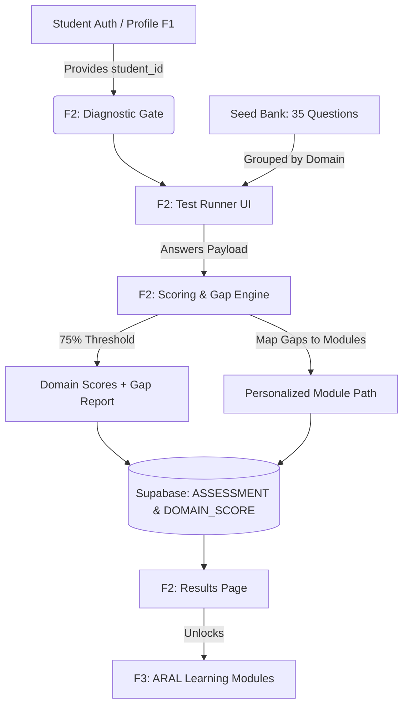

# F2 — Mathematics Diagnostic Assessment: Modular Slicing Implementation Plan

> **Feature:** F2 — Mathematics Diagnostic Assessment  
> **Framework:** DepEd Grade 7 Mathematics · ARAL Framework  
> **Execution Strategy:** Thin Vertical & Modular Slicing (Designed for iterative agentic / developer execution)  
> **Status:** APPROVED · Ready for Sliced Implementation  

---

## 1. Executive Summary & Objective

**F2 (Mathematics Diagnostic Assessment)** is the pedagogical entry gate of MathSmart. It diagnoses a learner's pre-existing Mathematics skills across **5 core domains** (Number Sense, Algebra, Geometry, Measurement, Statistics) via a timed 30–40 question assessment.

### Core Responsibilities:
1. Deliver a timed question set grouped by domain (stripping correct answers).
2. Calculate raw and percentage scores per domain.
3. Apply the **75% mastery threshold**:
   - `< 75%` → Tagged as `WEAK GAP` (`gap_identified: true`)
   - `≥ 75%` → Tagged as `PROFICIENT` (`gap_identified: false`)
4. Synthesize a personalized, prioritized **`module_path`** (ordered list of ARAL module IDs) to remediate the identified gaps in Feature F3.
5. Persist learner diagnostics to provide baseline metrics for Student (F5) and Teacher (F6) Dashboards.

---

## 2. Architectural Dependencies & Mocking Strategy



### Decoupled Execution (How to build F2 without waiting for F1):
To enable immediate, isolated implementation and testing without being blocked by full auth or database setup:
- **Student ID:** Use a mock student UUID (e.g. `mock-student-uuid-001`) or development bypass header in early slices.
- **Database Fallback:** The backend services will support an in-memory/JSON mock adapter so logic and endpoints can be tested locally before Supabase migrations run.

---

## 3. Modular Slicing Roadmap

Rather than building the entire feature in a single monolithic pass, F2 is divided into **5 independently testable slices**:

```
┌────────────────────────────────────────────────────────────────────────┐
│ SLICE 0: Contracts, Data Models & Seed Question Bank                   │
│          Pydantic schemas, constants, 35-question seed file            │
└──────────────────────────────────┬─────────────────────────────────────┘
                                   ▼
┌────────────────────────────────────────────────────────────────────────┐
│ SLICE 1: Pure Scoring & Gap Analysis Engine (FastAPI Service)          │
│          75% threshold logic, domain aggregations, module path builder │
│          Verified with 100% offline pytest suite                       │
└──────────────────────────────────┬─────────────────────────────────────┘
                                   ▼
┌────────────────────────────────────────────────────────────────────────┐
│ SLICE 2: FastAPI Assessment Routers & Persistence Adapter              │
│          GET questions, POST submit, GET result, GET status            │
│          Verified via Swagger / curl                                   │
└──────────────────────────────────┬─────────────────────────────────────┘
                                   ▼
┌────────────────────────────────────────────────────────────────────────┐
│ SLICE 3: Frontend Test Runner UI                                       │
│          QuestionCard, Timer (60m), ProgressBar, local draft storage   │
│          Verified in browser at /diagnostic/take                       │
└──────────────────────────────────┬─────────────────────────────────────┘
                                   ▼
┌────────────────────────────────────────────────────────────────────────┐
│ SLICE 4: Frontend Gate & Results Gap Report (Bookends)                 │
│          /diagnostic gate + /diagnostic/results visual cards           │
│          Verified with mock payload                                    │
└──────────────────────────────────┬─────────────────────────────────────┘
                                   ▼
┌────────────────────────────────────────────────────────────────────────┐
│ SLICE 5: Full End-to-End Integration & Supabase Wiring                 │
│          Real database persistence, route guards, complete user flow   │
└────────────────────────────────────────────────────────────────────────┘
```

---

## 4. Detailed Slice Specifications

### Slice 0: Contracts, Constants & Seed Question Bank
* **Goal:** Define all data structures, constants, and the question repository so backend and frontend have an identical, unambiguous contract.
* **Files to Create:**
  - `backend/models/assessment.py`: Pydantic models for request bodies (`SubmitAssessmentRequest`, `AnswerItem`) and responses (`QuestionSetResponse`, `AssessmentResultResponse`, `DomainScoreItem`).
  - `backend/db/seeds/diagnostic_questions.json`: 35 Grade 7 questions (7 per domain: Number Sense, Algebra, Geometry, Measurement, Statistics) with options, correct answer, order index, and competency tag.
  - `src/constants/assessment.js`: Frontend constants (`MASTERY_THRESHOLD = 75`, `TIME_LIMIT_MINUTES = 60`, `DOMAINS`).
* **Verification:**
  - Pydantic models parse the seed JSON without errors.
  - All 5 domains have valid question counts.

---

### Slice 1: Pure Scoring & Gap Analysis Engine
* **Goal:** Build the deterministic mathematical core of F2 in Python with zero external service dependencies.
* **Files to Create:**
  - `backend/services/scoring.py`:
    - Compares submitted answers against answer key.
    - Computes `score`, `max_score`, and `percentage` per domain.
  - `backend/services/gap_analysis.py`:
    - Evaluates percentage against `75.0%`.
    - Sets `mastery_level`: `< 50%` → `beginner`, `50–74%` → `developing`, `≥ 75%` → `mastered`.
    - Sets `gap_identified = True` if `percentage < 75.0`.
    - Generates `module_path`: ordered list of module IDs mapped to the identified gap domains.
  - `tests/backend/test_scoring.py`: Pytest suite testing:
    - 100% score (all proficient, empty gap report).
    - Mixed score (some weak domains, proper module path order).
    - Unanswered / skipped questions handling.
* **Verification:**
  ```bash
  pytest tests/backend/test_scoring.py -v
  ```

---

### Slice 2: FastAPI Assessment Routers & Persistence
* **Goal:** Expose the 4 REST endpoints matching `API_ROUTES.md` §3.
* **Endpoints:**
  1. `GET /assessment/questions`: Returns 35 questions grouped by domain; **strips `correct_answer`**.
  2. `POST /assessment/submit`: Validates payload, runs Slice 1 scoring, saves results, returns `201 Created` with full gap breakdown.
  3. `GET /assessment/status/{student_id}`: Returns `{ diagnostic_taken: bool, taken_at, assessment_id }`.
  4. `GET /assessment/result/{student_id}`: Returns student's latest assessment and domain scores.
* **Files to Create:**
  - `backend/routers/assessment.py`: FastAPI APIRouter.
  - `backend/db/assessment_repo.py`: Repository layer with dual-mode (in-memory dict for dev, Supabase client for production).
* **Verification:**
  ```bash
  # Test fetching questions (sanitized without correct answers)
  curl http://localhost:8000/assessment/questions
  # Test submission
  curl -X POST http://localhost:8000/assessment/submit -H "Content-Type: application/json" -d @sample_submit.json
  ```

---

### Slice 3: Frontend Test Runner UI (`/diagnostic/take`)
* **Goal:** Deliver an interactive, accessible test-taking experience for Grade 7 learners.
* **Files to Create:**
  - `src/components/diagnostic/QuestionCard.jsx`: Displays question prompt, domain badge, radio options with accessible keyboard navigation, selected indicator.
  - `src/components/diagnostic/Timer.jsx`: 60-minute countdown, color shift to warning at 5 minutes, triggers auto-submit on `00:00`.
  - `src/components/diagnostic/ProgressBar.jsx`: Progress bar tracking answered questions (`X of 35 answered`) + clickable domain stepper.
  - `src/app/(student)/diagnostic/take/page.jsx`:
    - Manages state: `answers` map `{ [question_id]: selected_answer }`, `currentIndex`, `isSubmitting`.
    - Autosaves draft to `localStorage` (prevents loss if browser reloads).
    - Confirmation dialog on early submission.
* **Verification:**
  - Start Next.js (`npm run dev`), open `/diagnostic/take`.
  - Test selecting answers, jumping between questions, and timer countdown.

---

### Slice 4: Frontend Gate & Results Gap Report
* **Goal:** Implement the entry landing gate and the post-test diagnostic report.
* **Files to Create:**
  - `src/app/(student)/diagnostic/page.jsx` (Gate):
    - Fetches `/assessment/status/{student_id}`.
    - If already taken → shows "Assessment Completed" with link to results.
    - If not taken → shows instructions, time limit notice, "Start Diagnostic Assessment" CTA.
  - `src/components/diagnostic/DomainScoreCard.jsx`:
    - Visual card for each domain displaying: Domain Name, Score (e.g. `6/10 (60%)`), Status Badge (`WEAK GAP` in amber/red vs `PROFICIENT` in green), Mastery Level.
  - `src/app/(student)/diagnostic/results/page.jsx`:
    - Displays overall score percentage and completion timestamp.
    - Grid of `DomainScoreCard` components.
    - **Personalized Learning Path section:** Displays the recommended ARAL modules with "Begin First Module" CTA.
* **Verification:**
  - Direct visual testing of `/diagnostic` and `/diagnostic/results` using mock result states.

---

### Slice 5: Full End-to-End Integration & Supabase Wiring
* **Goal:** Connect frontend service to live backend, wire to Supabase tables, and test the complete loop.
* **Tasks:**
  - Create Supabase tables: `COMPETENCY`, `DIAGNOSTIC_QUESTION`, `ASSESSMENT`, `ASSESSMENT_DOMAIN_SCORE`.
  - Populate reference data using `backend/db/seeds/diagnostic_questions.json`.
  - Create `src/services/assessment.js` with authenticated `fetch` calls.
  - Wire route redirection: Registration/Login → `/diagnostic` → `/diagnostic/take` → `/diagnostic/results` → `/modules`.
* **Verification:**
  - Run full flow from a clean student account.
  - Confirm rows are properly inserted in Supabase `ASSESSMENT` and `ASSESSMENT_DOMAIN_SCORE`.

---

## 5. Definition of Done (DoD) for F2

- [ ] All 4 endpoints return schema-compliant JSON matching `API_ROUTES.md` §3.
- [ ] Correct answers are never exposed in `GET /assessment/questions`.
- [ ] Mastery threshold is strictly enforced at 75% (`score < 75%` triggers `gap_identified = true`).
- [ ] Module path accurately maps each weak domain to corresponding ARAL modules.
- [ ] Timer auto-submits on expiration.
- [ ] Results and domain breakdowns persist and display accurately on the results page.
