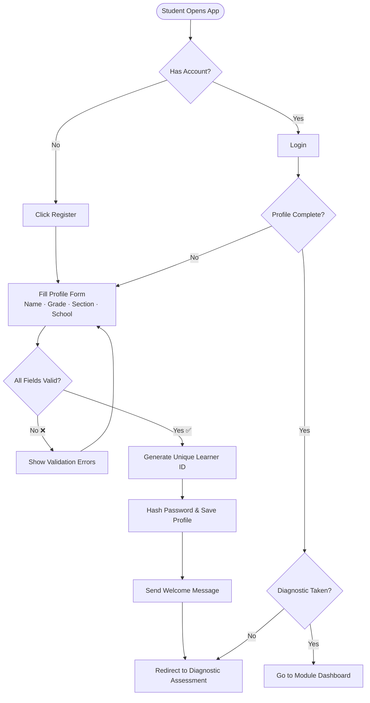
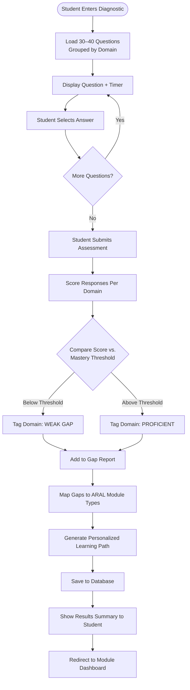
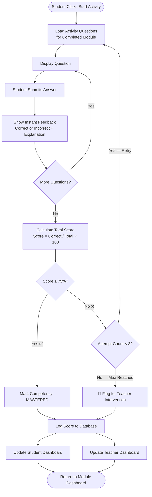
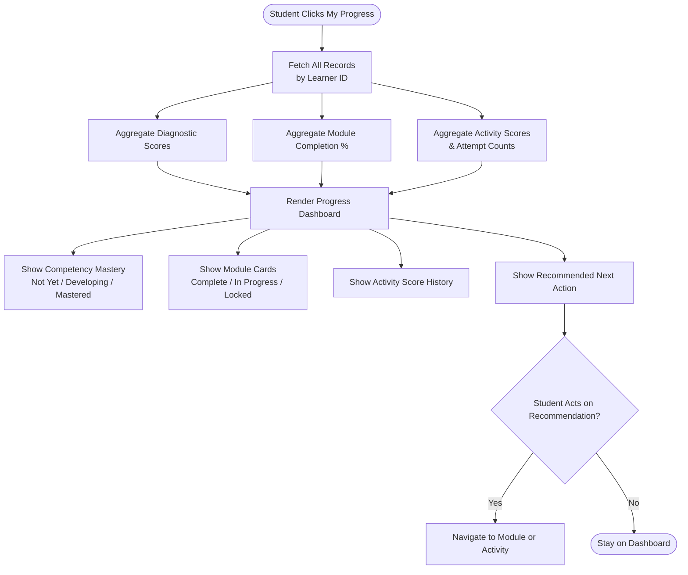
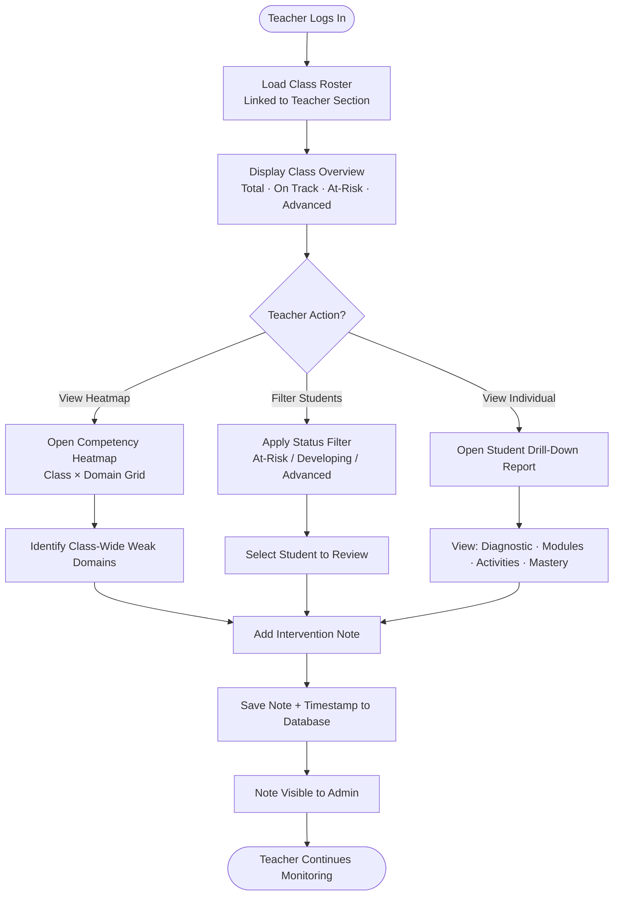
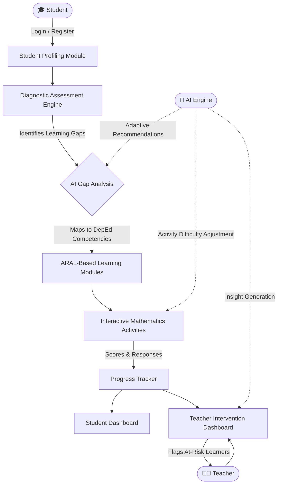
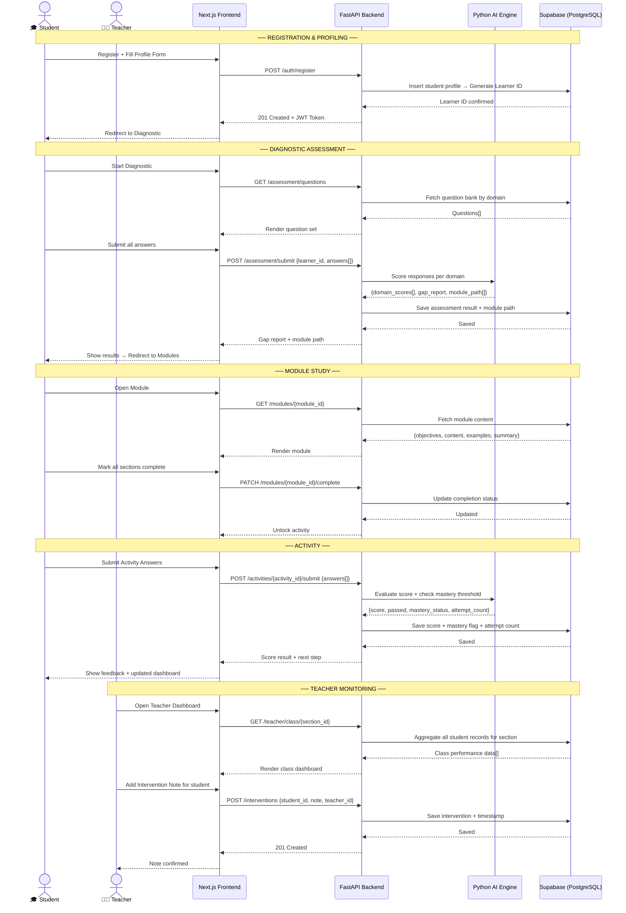
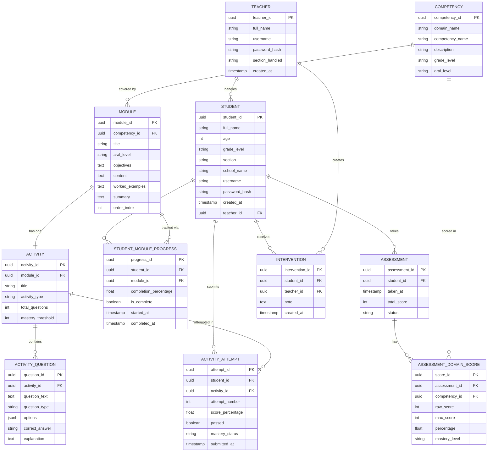
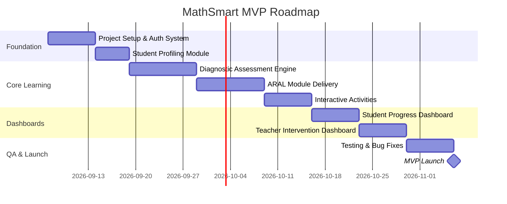

# MathSmart: AI-Powered Interactive Learning System
## Source of Truth

> **Version:** 1.0  
> **Last Updated:** September 6, 2026  
> **Type:** Web-Based Adaptive Learning Platform  
> **Target Users:** Grade 7 Elementary Learners · Mathematics Teachers · School Admins  
> **Framework:** ARAL (Assist, Remediate, Accelerate, Learn)

---

## Table of Contents

1. [System Identity & Purpose](#1-system-identity--purpose)
2. [Core Features](#2-core-features)
   - [F1 — Student Profiling](#f1--student-profiling)
   - [F2 — Mathematics Diagnostic Assessment](#f2--mathematics-diagnostic-assessment)
   - [F3 — ARAL-Based Learning Modules](#f3--aral-based-learning-modules)
   - [F4 — Interactive Mathematics Activities](#f4--interactive-mathematics-activities)
   - [F5 — Progress Monitoring Dashboard](#f5--progress-monitoring-dashboard)
   - [F6 — Teacher Intervention Dashboard](#f6--teacher-intervention-dashboard)
3. [System Architecture & Learning Cycle](#3-system-architecture--learning-cycle)
   - [High-Level System Workflow](#high-level-system-workflow)
   - [Layered Architecture](#layered-architecture)
   - [Full Stack Overview](#full-stack-overview)
   - [System Sequence Diagram](#system-sequence-diagram)
4. [Technology Stack](#4-technology-stack)
5. [User Roles & Access Control](#5-user-roles--access-control)
   - [Role Definitions](#role-definitions)
   - [Role Access Matrix](#role-access-matrix)
6. [Database Schema](#6-database-schema)
   - [Entity Relationship Diagram](#entity-relationship-diagram)
   - [Entity Definitions](#entity-definitions)
   - [Relationships Summary](#relationships-summary)
7. [API Surface](#7-api-surface)
   - [Authentication](#authentication)
   - [Student Profile](#student-profile)
   - [Diagnostic Assessment](#diagnostic-assessment)
   - [Competencies](#competencies)
   - [ARAL Modules](#aral-modules)
   - [Activities](#activities)
   - [Progress Dashboard](#progress-dashboard)
   - [Teacher Intervention Dashboard](#teacher-intervention-dashboard-1)
   - [Admin](#admin)
   - [HTTP Status Codes](#http-status-codes)
8. [MVP Scope & Success Criteria](#8-mvp-scope--success-criteria)
   - [MVP Included](#-mvp-scope--included)
   - [MVP Excluded](#-mvp-scope--excluded-post-mvp)
   - [MVP Success Criteria](#mvp-success-criteria)
   - [MVP Timeline](#estimated-mvp-timeline)
9. [Post-MVP Roadmap](#9-post-mvp-roadmap)
10. [Project Documents Index](#10-project-documents-index)
11. [Folder Structure](#11-folder-structure)

---

## 1. System Identity & Purpose

**MathSmart** is an AI-powered, web-based interactive learning system built to enhance Mathematics skills among elementary learners. The system follows a **Diagnose → Remediate → Practice → Monitor** cycle, powered by the **ARAL (Assist, Remediate, Accelerate, Learn)** framework fully aligned with DepEd Grade 7 Mathematics competencies.

### Learning Cycle

```
┌─────────────┐     ┌─────────────┐     ┌─────────────┐     ┌─────────────┐
│  DIAGNOSE   │ ──▸ │  REMEDIATE  │ ──▸ │  PRACTICE   │ ──▸ │   MONITOR   │
│             │     │             │     │             │     │             │
│ Diagnostic  │     │ ARAL-Based  │     │ Interactive │     │ Progress &  │
│ Assessment  │     │ Modules     │     │ Activities  │     │ Teacher     │
│             │     │             │     │             │     │ Dashboards  │
└─────────────┘     └─────────────┘     └─────────────┘     └─────────────┘
```

### Target Audience

| User | Description |
|------|-------------|
| **Students** | Take assessments, go through personalized learning modules, and track their own progress |
| **Teachers** | Monitor class performance and identify learners needing intervention |
| **Admins** | Manage content, users, and system configuration |

---

## 2. Core Features

| # | Feature | Description |
|---|---------|-------------|
| 1 | **Student Profiling** | Records relevant learner information for individualized monitoring |
| 2 | **Mathematics Diagnostic Assessment** | Identifies learners' current Mathematics skills and specific learning gaps |
| 3 | **ARAL-Based Learning Modules** | Provides targeted modules aligned with identified gaps and priority Grade 7 competencies |
| 4 | **Interactive Mathematics Activities** | Provides practice and application activities to reinforce mathematical concepts |
| 5 | **Progress Monitoring Dashboard** | Tracks learner performance, completed modules, assessment results, and competency progress |
| 6 | **Teacher Intervention Dashboard** | Provides teachers with learner performance information to identify areas requiring additional support |

---

### F1 — Student Profiling

> **Records relevant learner information for individualized monitoring.**

**Workflow:**
```
Student registers → Fills profile form (name, grade, section, school)
→ Profile saved → Unique learner ID assigned
→ Redirected to Diagnostic Assessment
```

**Flowchart:**



**Related API Endpoints:**

| Method | Endpoint | Purpose |
|--------|----------|---------|
| `POST` | `/auth/register` | Register new student account with profile data |
| `POST` | `/auth/login` | Login for students, teachers, admins |
| `POST` | `/auth/logout` | Invalidate current session |
| `POST` | `/auth/refresh` | Refresh expiring JWT token |
| `GET` | `/students/me` | Get logged-in student's profile |
| `PATCH` | `/students/me` | Update student's profile |
| `GET` | `/students/{student_id}` | Get specific student profile (Teacher/Admin) |
| `GET` | `/students` | Get all students in teacher's section |

**Related DB Entities:** `STUDENT`, `TEACHER`

---

### F2 — Mathematics Diagnostic Assessment

> **Identifies learners' current Mathematics skills and specific learning gaps.**

**Workflow:**
```
Student takes pre-test (timed, adaptive questions)
→ Responses captured per competency domain
→ AI Engine scores and maps results to DepEd Grade 7 competency matrix
→ Learning Gap Report generated
→ Prioritized remediation path created
```

**Flowchart:**



**Related API Endpoints:**

| Method | Endpoint | Purpose |
|--------|----------|---------|
| `GET` | `/assessment/questions` | Fetch diagnostic question set grouped by domain |
| `POST` | `/assessment/submit` | Submit completed diagnostic for scoring |
| `GET` | `/assessment/result/{student_id}` | Get most recent diagnostic result |
| `GET` | `/assessment/status/{student_id}` | Check if student has taken diagnostic |

**Related DB Entities:** `ASSESSMENT`, `ASSESSMENT_DOMAIN_SCORE`, `COMPETENCY`

---

### F3 — ARAL-Based Learning Modules

> **Provides targeted modules aligned with identified gaps and priority Grade 7 competencies.**

**Workflow:**
```
Gap Report → AI maps gaps to ARAL modules
→ Modules unlocked per learner's identified weak areas
→ Content delivered (readings + worked examples + visuals)
→ Module completion tracked
```

**Flowchart:**


**Related API Endpoints:**

| Method | Endpoint | Purpose |
|--------|----------|---------|
| `GET` | `/modules` | Get all modules unlocked for student |
| `GET` | `/modules/{module_id}` | Get full content of a module |
| `PATCH` | `/modules/{module_id}/progress` | Update section-level progress |
| `PATCH` | `/modules/{module_id}/complete` | Mark module complete, unlock activity |
| `GET` | `/modules/{module_id}/progress/{student_id}` | Get student's module progress (Teacher/Admin) |

**Related DB Entities:** `MODULE`, `STUDENT_MODULE_PROGRESS`, `COMPETENCY`

---

### F4 — Interactive Mathematics Activities

> **Provides practice and application activities to reinforce mathematical concepts.**

**Workflow:**
```
Post-module activity unlocked → Student engages (MCQ, fill-in, step-by-step)
→ Adaptive difficulty adjusts based on performance
→ Score + time-on-task logged
→ Mastery threshold checked → Module marked complete or repeat suggested
```

**Flowchart:**



**Related API Endpoints:**

| Method | Endpoint | Purpose |
|--------|----------|---------|
| `GET` | `/activities/{activity_id}` | Get activity with all questions |
| `POST` | `/activities/{activity_id}/submit` | Submit activity attempt for scoring |
| `GET` | `/activities/{activity_id}/attempts/{student_id}` | Get all attempt history |

**Related DB Entities:** `ACTIVITY`, `ACTIVITY_QUESTION`, `ACTIVITY_ATTEMPT`

---

### F5 — Progress Monitoring Dashboard

> **Tracks learner performance, completed modules, assessment results, and competency progress.**

**Workflow:**
```
Student views:
  - Modules completed / remaining
  - Assessment scores per competency
  - Mastery level indicators (Not Yet / Developing / Mastered)
  - Recommended next steps
```

**Flowchart:**



**Related API Endpoints:**

| Method | Endpoint | Purpose |
|--------|----------|---------|
| `GET` | `/progress/me` | Get full progress summary for logged-in student |
| `GET` | `/progress/{student_id}` | Get student's full progress (Teacher/Admin) |

**Related DB Entities:** `STUDENT`, `ASSESSMENT`, `ASSESSMENT_DOMAIN_SCORE`, `STUDENT_MODULE_PROGRESS`, `ACTIVITY_ATTEMPT`

---

### F6 — Teacher Intervention Dashboard

> **Provides teachers with learner performance information to identify areas requiring additional support.**

**Workflow:**
```
Teacher logs in → Views class-level and individual performance
→ Flags: At-Risk | On Track | Advanced
→ Competency heatmap across class
→ Generates downloadable progress reports
→ Sets custom interventions / notes per student
```

**Flowchart:**



**Related API Endpoints:**

| Method | Endpoint | Purpose |
|--------|----------|---------|
| `GET` | `/teacher/class` | Get class overview for teacher's section |
| `GET` | `/teacher/class/heatmap` | Get class-wide competency mastery heatmap |
| `GET` | `/teacher/students/at-risk` | Get all at-risk students in section |
| `POST` | `/interventions` | Create intervention note for a student |
| `GET` | `/interventions/{student_id}` | Get all intervention notes for a student |
| `DELETE` | `/interventions/{intervention_id}` | Delete a specific intervention note |

**Related DB Entities:** `TEACHER`, `STUDENT`, `INTERVENTION`, `ASSESSMENT_DOMAIN_SCORE`

---

## 3. System Architecture & Learning Cycle

### High-Level System Workflow



---

### Layered Architecture

```mermaid
graph TD
    subgraph Presentation Layer
        UI1[Student Portal]
        UI2[Teacher Dashboard]
        UI3[Admin Panel]
    end

    subgraph Application Layer
        AP1[Auth & Profiling Service]
        AP2[Diagnostic Assessment Service]
        AP3[Module Delivery Engine]
        AP4[Activity Engine]
        AP5[Progress Monitoring Service]
        AP6[AI Recommendation Engine]
        AP7[Teacher Intervention Service]
    end

    subgraph Data Layer
        DB1[(Student Profiles DB)]
        DB2[(Assessment Results DB)]
        DB3[(Module & Content DB)]
        DB4[(Activity Logs DB)]
        DB5[(Competency Mapping DB)]
    end

    Presentation Layer --> Application Layer
    Application Layer --> Data Layer
```

---

### Full Stack Overview

```
┌──────────────────────────────────────────┐
│         Next.js  (Frontend)              │  ← Hosted on Vercel
│         React · Tailwind CSS             │
└─────────────────┬────────────────────────┘
                  │ HTTP / REST
┌─────────────────▼────────────────────────┐
│         FastAPI  (Backend)               │  ← Hosted on Railway / Render
│         Python · NumPy · SymPy           │
│         scikit-learn · Pandas            │
│         Math Logic · Gap Analysis        │
└─────────────────┬────────────────────────┘
                  │
┌─────────────────▼────────────────────────┐
│   Supabase  (Database + Auth + Storage)  │  ← Managed Cloud
│   PostgreSQL · Supabase Auth             │
│   Supabase Storage (module files)        │
└──────────────────────────────────────────┘
                  +
┌──────────────────────────────────────────┐
│       Cloudinary  (Media Assets)         │
│       Module images · Diagrams           │
└──────────────────────────────────────────┘
```

---

### System Sequence Diagram



---

## 4. Technology Stack

| Layer | Technology | Rationale |
|-------|-----------|-----------|
| **Frontend** | Next.js (React) + Tailwind CSS | SSR support, file-based routing, fast DX, production-ready |
| **Backend API** | FastAPI (Python) | Math logic stays in Python; async, fast, auto-generates Swagger API docs |
| **Database** | Supabase (PostgreSQL) | Managed PostgreSQL + built-in auth + file storage + real-time in one platform |
| **Authentication** | Supabase Auth | Free, handles sessions, supports roles (Student / Teacher / Admin) |
| **AI / Math Engine** | Python (NumPy, SymPy, scikit-learn, Pandas) | Diagnostic scoring, gap analysis, mastery evaluation |
| **Frontend Hosting** | Vercel | Free tier, auto CI/CD from GitHub, edge-optimized |
| **Backend Hosting** | Railway / Render | Both support Python natively; free tiers available |
| **Media Assets** | Cloudinary | Images and diagrams for modules; generous free tier |
| **Dashboard Charts** | Chart.js / Recharts | Progress visualization in student and teacher dashboards |

### Python AI / Math Libraries

| Library | Purpose |
|---------|---------|
| **FastAPI** | Exposes Python math logic as REST API endpoints |
| **NumPy** | Numerical computation and array operations |
| **SymPy** | Symbolic math, equation solving and simplification |
| **scikit-learn** | Scoring models, gap analysis, simple ML classification |
| **Pandas** | Data processing for assessment results and analytics |
| **OpenAI API** *(post-MVP)* | Step-by-step hint generation, natural language explanations |

---

## 5. User Roles & Access Control

### Role Definitions

| Role | Access Level | Key Capabilities |
|------|-------------|------------------|
| 🎓 **Student** | Student Portal | Register, take diagnostic, access modules, do activities, view own progress |
| 👩‍🏫 **Teacher** | Teacher Dashboard | View class/individual dashboards, set interventions, download reports |
| ⚙️ **Admin** | Admin Panel | Manage users, upload content, configure competency mappings |

---

### Role Access Matrix

| Endpoint | Student | Teacher | Admin |
|----------|---------|---------|-------|
| `POST /auth/register` | ✅ | ✅ | ✅ |
| `POST /auth/login` | ✅ | ✅ | ✅ |
| `GET /students/me` | ✅ | ❌ | ✅ |
| `GET /students/{id}` | ❌ | ✅ own section | ✅ |
| `GET /students` | ❌ | ✅ own section | ✅ |
| `GET /assessment/questions` | ✅ | ❌ | ✅ |
| `POST /assessment/submit` | ✅ | ❌ | ❌ |
| `GET /assessment/result/{id}` | ✅ own | ✅ | ✅ |
| `GET /competencies` | ✅ | ✅ | ✅ |
| `GET /modules` | ✅ | ✅ | ✅ |
| `PATCH /modules/{id}/complete` | ✅ | ❌ | ❌ |
| `GET /activities/{id}` | ✅ | ✅ | ✅ |
| `POST /activities/{id}/submit` | ✅ | ❌ | ❌ |
| `GET /progress/me` | ✅ | ❌ | ❌ |
| `GET /progress/{id}` | ❌ | ✅ own section | ✅ |
| `GET /teacher/class` | ❌ | ✅ | ✅ |
| `GET /teacher/class/heatmap` | ❌ | ✅ | ✅ |
| `GET /teacher/students/at-risk` | ❌ | ✅ | ✅ |
| `POST /interventions` | ❌ | ✅ | ✅ |
| `GET /interventions/{id}` | ❌ | ✅ | ✅ |
| `GET /admin/users` | ❌ | ❌ | ✅ |
| `POST /admin/modules` | ❌ | ❌ | ✅ |
| `POST /admin/assessment/reset/{id}` | ❌ | ❌ | ✅ |

---

## 6. Database Schema

### Entity Relationship Diagram



---

### Entity Definitions

| Entity | Description |
|--------|-------------|
| **STUDENT** | Core learner profile. Linked to a teacher via `teacher_id`. |
| **TEACHER** | Educator account. Manages a section of students. |
| **ASSESSMENT** | One diagnostic assessment per student. Records overall score and status. |
| **ASSESSMENT_DOMAIN_SCORE** | Per-domain breakdown of a student's diagnostic result. Links to competency. |
| **COMPETENCY** | A specific Grade 7 Math competency (e.g., "Adding Fractions"). Has a domain and ARAL level. |
| **MODULE** | A learning module tied to one competency. Has an ARAL level and ordered content sections. |
| **STUDENT_MODULE_PROGRESS** | Tracks completion percentage and status for each student-module pair. |
| **ACTIVITY** | One activity per module. Has a type (MCQ, fill-in) and mastery threshold. |
| **ACTIVITY_QUESTION** | Individual question in an activity. Stores options and correct answer as JSON. |
| **ACTIVITY_ATTEMPT** | One attempt record per student per activity. Stores score, pass/fail, mastery status. |
| **INTERVENTION** | Teacher's note for a specific student. Timestamped and auditable. |

---

### Relationships Summary

| Relationship | Type | Description |
|-------------|------|-------------|
| Student → Assessment | One-to-Many | A student takes one diagnostic but can have attempt history |
| Assessment → Domain Score | One-to-Many | Each assessment breaks down into multiple domain scores |
| Competency → Module | One-to-Many | A competency can have multiple ARAL modules |
| Module → Activity | One-to-One | Each module has exactly one associated activity |
| Activity → Questions | One-to-Many | An activity contains multiple questions |
| Student → Activity Attempt | One-to-Many | A student can attempt an activity up to 3 times |
| Teacher → Student | One-to-Many | A teacher handles an entire section |
| Teacher → Intervention | One-to-Many | A teacher can log multiple intervention notes |

---

## 7. API Surface

> **Base URL:** `https://api.mathsmart.app/v1`  
> **Auth:** Bearer JWT Token (via Supabase Auth)  
> **Format:** All requests and responses are `application/json`

---

### Authentication

| Method | Endpoint | Auth | Role | Purpose |
|--------|----------|------|------|---------|
| `POST` | `/auth/register` | ❌ | Public | Register a new student account |
| `POST` | `/auth/login` | ❌ | Public | Login for students, teachers, admins |
| `POST` | `/auth/logout` | ✅ | All | Invalidate current session token |
| `POST` | `/auth/refresh` | ✅ | All | Refresh an expiring JWT token |

---

### Student Profile

| Method | Endpoint | Auth | Role | Purpose |
|--------|----------|------|------|---------|
| `GET` | `/students/me` | ✅ | Student | Get logged-in student's profile |
| `PATCH` | `/students/me` | ✅ | Student | Update logged-in student's profile |
| `GET` | `/students/{student_id}` | ✅ | Teacher · Admin | Get a specific student's profile |
| `GET` | `/students` | ✅ | Teacher · Admin | Get all students in teacher's section |

---

### Diagnostic Assessment

| Method | Endpoint | Auth | Role | Purpose |
|--------|----------|------|------|---------|
| `GET` | `/assessment/questions` | ✅ | Student | Fetch diagnostic question set by domain |
| `POST` | `/assessment/submit` | ✅ | Student | Submit diagnostic for scoring |
| `GET` | `/assessment/result/{student_id}` | ✅ | Student (own) · Teacher · Admin | Get most recent diagnostic result |
| `GET` | `/assessment/status/{student_id}` | ✅ | Student · Teacher · Admin | Check if diagnostic has been taken |

---

### Competencies

| Method | Endpoint | Auth | Role | Purpose |
|--------|----------|------|------|---------|
| `GET` | `/competencies` | ✅ | All | List all Grade 7 Math competencies |
| `GET` | `/competencies/{competency_id}` | ✅ | All | Get details of a specific competency |

---

### ARAL Modules

| Method | Endpoint | Auth | Role | Purpose |
|--------|----------|------|------|---------|
| `GET` | `/modules` | ✅ | Student | Get all unlocked modules for student |
| `GET` | `/modules/{module_id}` | ✅ | All | Get full content of a module |
| `PATCH` | `/modules/{module_id}/progress` | ✅ | Student | Update section-level progress |
| `PATCH` | `/modules/{module_id}/complete` | ✅ | Student | Mark module complete, unlock activity |
| `GET` | `/modules/{module_id}/progress/{student_id}` | ✅ | Teacher · Admin | Get student's progress on a module |

---

### Activities

| Method | Endpoint | Auth | Role | Purpose |
|--------|----------|------|------|---------|
| `GET` | `/activities/{activity_id}` | ✅ | Student | Get activity with all questions |
| `POST` | `/activities/{activity_id}/submit` | ✅ | Student | Submit activity attempt for scoring |
| `GET` | `/activities/{activity_id}/attempts/{student_id}` | ✅ | Student (own) · Teacher · Admin | Get all attempt history |

---

### Teacher Intervention Dashboard

| Method | Endpoint | Auth | Role | Purpose |
|--------|----------|------|------|---------|
| `GET` | `/teacher/class` | ✅ | Teacher | Get class overview for teacher's section |
| `GET` | `/teacher/class/heatmap` | ✅ | Teacher · Admin | Get class-wide competency heatmap |
| `GET` | `/teacher/students/at-risk` | ✅ | Teacher · Admin | Get all at-risk students |
| `POST` | `/interventions` | ✅ | Teacher | Create intervention note for a student |
| `GET` | `/interventions/{student_id}` | ✅ | Teacher · Admin | Get all notes for a student |
| `DELETE` | `/interventions/{intervention_id}` | ✅ | Teacher (own) · Admin | Delete an intervention note |

---

### Progress Dashboard

| Method | Endpoint | Auth | Role | Purpose |
|--------|----------|------|------|---------|
| `GET` | `/progress/me` | ✅ | Student | Get full progress summary |
| `GET` | `/progress/{student_id}` | ✅ | Teacher · Admin | Get a student's full progress |

---

### Admin

| Method | Endpoint | Auth | Role | Purpose |
|--------|----------|------|------|---------|
| `GET` | `/admin/users` | ✅ | Admin | Get all users in the system |
| `DELETE` | `/admin/users/{user_id}` | ✅ | Admin | Delete a user account |
| `POST` | `/admin/modules` | ✅ | Admin | Create a new learning module |
| `PATCH` | `/admin/modules/{module_id}` | ✅ | Admin | Update an existing module |
| `DELETE` | `/admin/modules/{module_id}` | ✅ | Admin | Delete a module |
| `POST` | `/admin/assessment/reset/{student_id}` | ✅ | Admin | Reset student's diagnostic assessment |

---

### HTTP Status Codes

| Code | Meaning | When Used |
|------|---------|-----------|
| `200 OK` | Success | GET, PATCH, DELETE success |
| `201 Created` | Resource created | POST (register, submit, create) |
| `400 Bad Request` | Invalid input | Missing fields, validation errors |
| `401 Unauthorized` | No or invalid token | Missing/expired JWT |
| `403 Forbidden` | Access denied | Role doesn't have permission |
| `404 Not Found` | Resource missing | Module, student, activity not found |
| `409 Conflict` | Duplicate entry | Username already taken |
| `422 Unprocessable` | Schema mismatch | Wrong data types in request |
| `429 Too Many Requests` | Rate limited | Too many rapid submissions |
| `500 Internal Server Error` | Server failure | Unexpected backend error |

---

## 8. MVP Scope & Success Criteria

> The **Minimum Viable Product** is the smallest working version of MathSmart that delivers real value to learners and teachers without over-engineering.

---

### ✅ MVP Scope — Included

| # | Feature | MVP Details |
|---|---------|-------------|
| 1 | **Student Profiling** | Registration form, basic profile (name, grade, section, school), login/logout |
| 2 | **Diagnostic Assessment** | Fixed 30–40 item pre-test mapped to Grade 7 competency domains; auto-scoring; gap report generation |
| 3 | **ARAL-Based Modules** | At least 3–5 remediation modules per identified gap domain; text + image content delivery |
| 4 | **Interactive Activities** | MCQ-based and fill-in-the-blank activities per module; scoring and retry logic |
| 5 | **Student Progress Dashboard** | Module completion status, assessment scores, basic competency tracker |
| 6 | **Teacher Dashboard** | Class roster view, per-student progress summary, at-risk flagging |

---

### ❌ MVP Scope — Excluded (Post-MVP)

| Feature | Rationale |
|---------|-----------|
| Adaptive question difficulty (real-time AI) | Requires ML model training; deferred to v2 |
| Gamification (badges, streaks, leaderboards) | Enhancement; not core to learning effectiveness |
| Video-based module content | Infrastructure cost; use text/image first |
| Parent portal | Out of primary user scope for MVP |
| Offline mode / PWA | Adds complexity; assume internet access |
| Report export (PDF) | Nice-to-have; deferred to v1.1 |
| Natural language hint system (AI chatbot) | Complex AI integration; post-MVP |
| Multi-subject expansion | MathSmart is Math-only in MVP |

---

### MVP Success Criteria

- [ ] A student can register, take a diagnostic, and receive a personalized module path
- [ ] A student can complete at least one ARAL module and its activity
- [ ] A teacher can log in and view their class's performance and identify at-risk learners
- [ ] Assessment results are stored and reflected in both student and teacher dashboards
- [ ] System is accessible via browser (desktop-first, mobile-responsive)

---

### Estimated MVP Timeline



> **Total Estimated Duration: ~60 days** (with a small dev team of 2–3 developers)

---

## 9. Post-MVP Roadmap

| Version | Feature Additions |
|---------|-------------------|
| **v1.1** | PDF report export, gamification (badges/streaks) |
| **v2.0** | Adaptive AI difficulty engine, video modules, parent portal |
| **v3.0** | Multi-grade support, NLP-based hint chatbot, analytics export |

---

## 10. Project Documents Index

| Document | File | Purpose |
|----------|------|---------|
| **Source of Truth** | `SOURCE_OF_TRUTH.md` ← *this file* | Single authoritative reference for the entire project |
| **Project Overview** | `PROJECT.md` | Tech stack decisions, rationale, and high-level project description |
| **Implementation Plan** | `IMPLEMENTATION_PLAN.md` | Architecture, MVP scope, timeline, and roadmap |
| **API Routes** | `API_ROUTES.md` | Full REST API documentation with request/response schemas |
| **Diagrams** | `DIAGRAMS.md` | Flowcharts, sequence diagrams, and ERD |

---

## 11. Folder Structure

> **Based on:** [nghiemledo/nextjs-project-structure](https://github.com/nghiemledo/nextjs-project-structure)

```
MathSmart/
├── .env.local                    # Environment variables (local dev)
├── .env.production               # Environment variables (production)
├── .eslintrc.json                # ESLint configuration
├── next.config.mjs               # Next.js configuration
├── package.json                  # Dependencies & scripts
├── README.md                     # Project documentation
│
├── docs/                         # Project documentation files
│   ├── PROJECT.md                # Project overview & tech stack
│   ├── IMPLEMENTATION_PLAN.md    # Architecture & MVP definition
│   ├── SYSTEM_WORKFLOW.md        # Feature workflows
│   ├── DIAGRAMS.md               # Flowcharts, sequence diagram & ERD
│   ├── API_ROUTES.md             # Full REST API reference
│   └── SOURCE_OF_TRUTH.md        # Single authoritative reference
│
├── public/                       # Static files (images, fonts)
│   ├── images/
│   └── fonts/
│
├── src/                          # Frontend source code (Next.js)
│   ├── app/                      # App Router — page routing
│   │   ├── (auth)/               # Auth routes (login, register)
│   │   ├── (student)/            # Student portal routes
│   │   │   ├── dashboard/
│   │   │   ├── diagnostic/
│   │   │   ├── modules/[moduleId]/
│   │   │   ├── activities/[activityId]/
│   │   │   └── progress/
│   │   ├── (teacher)/            # Teacher dashboard routes
│   │   │   ├── class/
│   │   │   ├── heatmap/
│   │   │   ├── students/[studentId]/
│   │   │   └── interventions/
│   │   ├── (admin)/              # Admin panel routes
│   │   │   ├── users/
│   │   │   ├── content/
│   │   │   └── competencies/
│   │   ├── layout.jsx
│   │   ├── page.jsx
│   │   └── globals.css
│   ├── components/               # Reusable UI components
│   │   ├── common/               # Button, Modal, Card
│   │   ├── forms/                # Input, Select, FormField
│   │   ├── charts/               # ProgressRing, Heatmap
│   │   ├── layout/               # Navbar, Sidebar, Footer
│   │   └── modules/              # ModuleCard, ActivityQuestion
│   ├── config/                   # API url, Supabase client, site metadata
│   ├── constants/                # Roles, mastery thresholds, domains
│   ├── enums/                    # MasteryLevel, StudentStatus, ARALLevel
│   ├── hooks/                    # useAuth, useStudent, useModules, useProgress
│   ├── models/                   # Entity models (Student, Teacher, Module, etc.)
│   ├── services/                 # API service layer (one per API domain)
│   ├── styles/                   # CSS variables, component styles
│   ├── resources/                # Static content, illustrations
│   └── utils/                    # Formatters, validators, calculations
│
├── backend/                      # FastAPI Python backend
│   ├── main.py                   # FastAPI entry point
│   ├── requirements.txt          # Python dependencies
│   ├── routers/                  # Route handlers per feature
│   │   ├── auth.py
│   │   ├── students.py
│   │   ├── assessment.py
│   │   ├── modules.py
│   │   ├── activities.py
│   │   ├── progress.py
│   │   ├── teacher.py
│   │   └── admin.py
│   ├── services/                 # Business logic
│   │   ├── gap_analysis.py       # AI gap analysis engine
│   │   ├── scoring.py            # Diagnostic scoring
│   │   └── mastery.py            # Mastery threshold evaluation
│   ├── models/                   # Pydantic schemas
│   ├── db/                       # Supabase client + SQL queries
│   └── middleware/               # JWT auth middleware
│
└── tests/                        # Test files
    ├── frontend/
    └── backend/
```

---

*End of Source of Truth*

---
> 📌 **Document Owner:** MathSmart Development Team  
> 🔄 **Review Cycle:** Per sprint / major feature release  
> 📁 **Authoritative Reference:** This document is the single source of truth for MathSmart. All other documents provide supporting detail.
