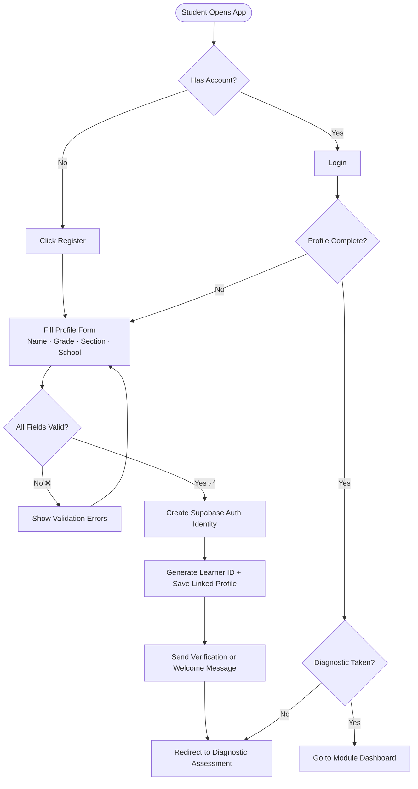
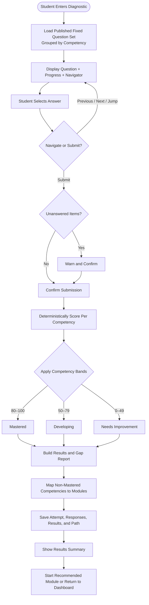
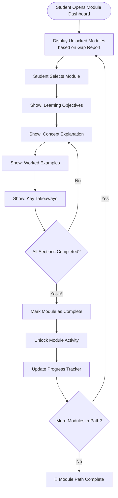
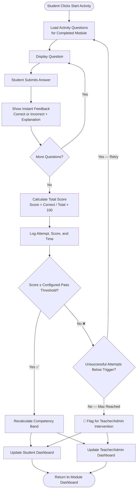
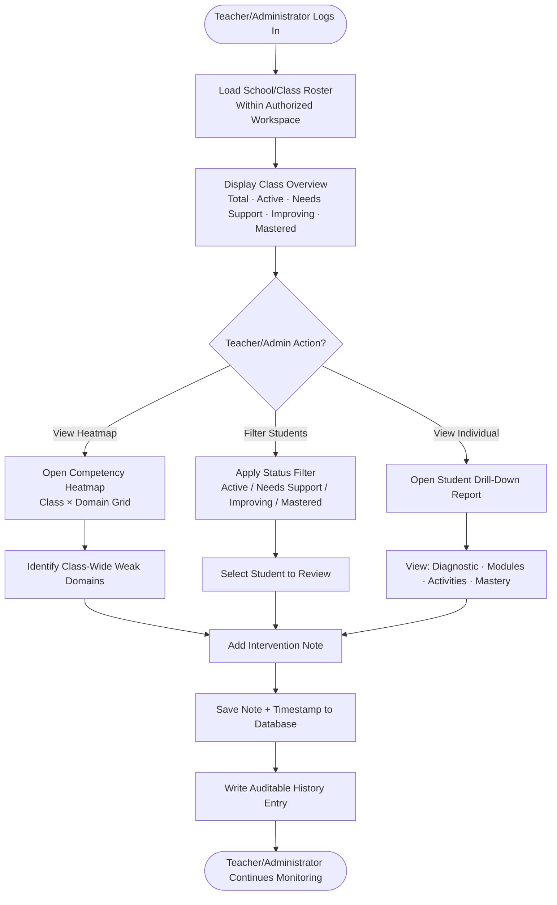
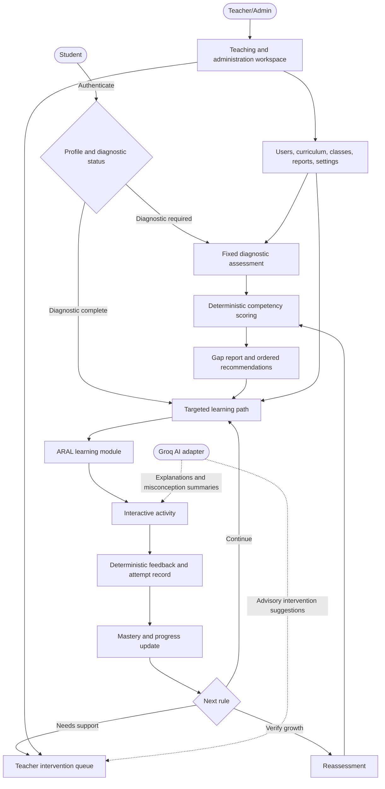
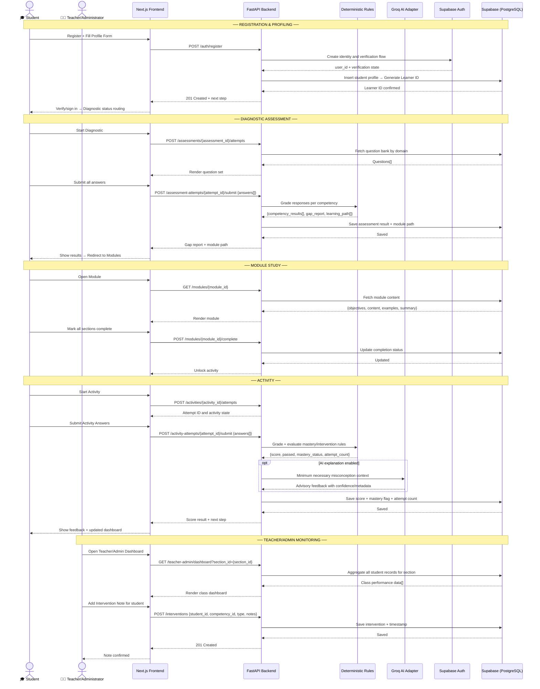
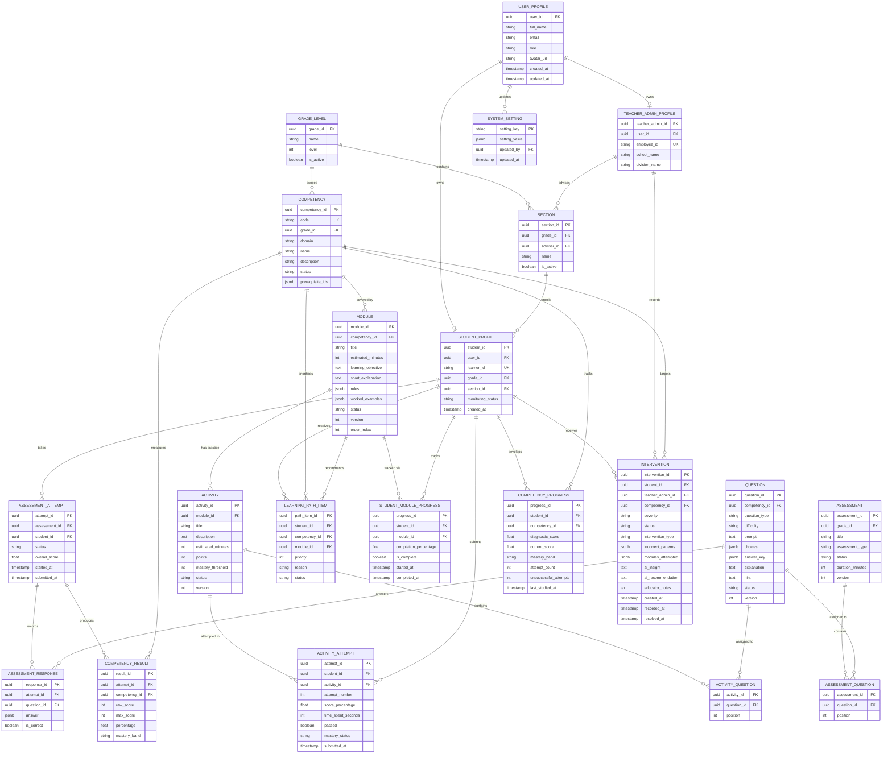
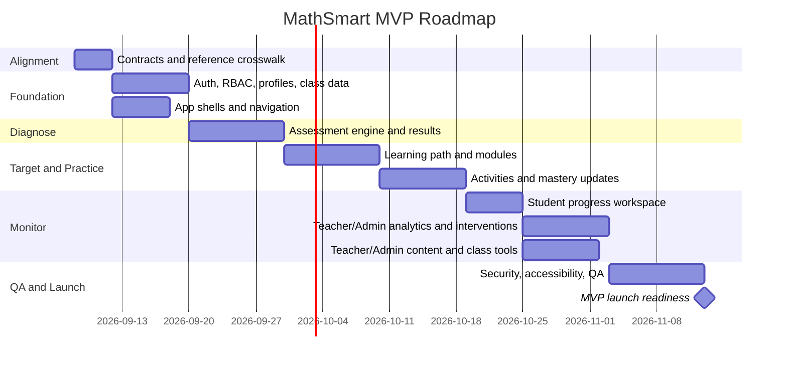

# MathSmart: AI-Powered Interactive Learning System
## Source of Truth

> **Version:** 1.2
> **Last Updated:** September 8, 2026
> **Type:** Web-Based Adaptive Learning Platform  
> **Target Users:** Grade 6 Elementary Learners · Teacher/Administrators
> **Framework:** ARAL (Assist, Remediate, Accelerate, Learn)
> **AI Provider:** Groq; server-side API credential and model are loaded from `.env`
> **UI/UX Workflow Baseline:** `../../ui-ux-workflow-reference/`

---

## Table of Contents

1. [System Identity & Purpose](#1-system-identity--purpose)
2. [Core Features](#2-core-features)
   - [Reference-Derived Experience Contract](#reference-derived-experience-contract)
   - [F1 — Student Profiling](#f1--student-profiling)
   - [F2 — Mathematics Diagnostic Assessment](#f2--mathematics-diagnostic-assessment)
   - [F3 — ARAL-Based Learning Modules](#f3--aral-based-learning-modules)
   - [F4 — Interactive Mathematics Activities](#f4--interactive-mathematics-activities)
   - [F5 — Progress Monitoring Dashboard](#f5--progress-monitoring-dashboard)
   - [F6 — Teacher/Administrator Intervention Dashboard](#f6--teacheradministrator-intervention-dashboard)
3. [System Architecture & Learning Cycle](#3-system-architecture--learning-cycle)
   - [High-Level System Workflow](#high-level-system-workflow)
   - [Layered Architecture](#layered-architecture)
   - [Full Stack Overview](#full-stack-overview)
   - [System Sequence Diagram](#system-sequence-diagram)
4. [Technology Stack](#4-technology-stack)
   - [Deterministic and Groq AI Boundary](#deterministic-and-groq-ai-boundary)
   - [Supabase Security Baseline](#supabase-security-baseline)
5. [User Roles & Access Control](#5-user-roles--access-control)
   - [Role Definitions](#role-definitions)
   - [Role Access Matrix](#role-access-matrix)
6. [Database Schema](#6-database-schema)
   - [Entity Relationship Diagram](#entity-relationship-diagram)
   - [Entity Definitions](#entity-definitions)
   - [Relationships Summary](#relationships-summary)
7. [API Surface](#7-api-surface)
   - [Authentication](#authentication)
   - [Student Profile](#student-profile)
   - [Assessments](#assessments)
   - [Competencies](#competencies)
   - [Learning Path](#learning-path)
   - [ARAL Modules](#aral-modules)
   - [Activities](#activities)
   - [Progress Dashboard](#progress-dashboard)
   - [Teacher/Administrator Dashboard and Analytics](#teacheradministrator-dashboard-and-analytics)
   - [Interventions](#interventions)
   - [Groq AI Assistance](#groq-ai-assistance)
   - [Teacher/Administrator Administration](#teacheradministrator-administration)
   - [HTTP Status Codes](#http-status-codes)
8. [MVP Scope & Success Criteria](#8-mvp-scope--success-criteria)
   - [MVP Included](#-mvp-scope--included)
   - [MVP Excluded](#-mvp-scope--excluded-post-mvp)
   - [MVP Success Criteria](#mvp-success-criteria)
   - [MVP Timeline](#estimated-mvp-timeline)
9. [Post-MVP Roadmap](#9-post-mvp-roadmap)
10. [Project Documents Index](#10-project-documents-index)
11. [Folder Structure](#11-folder-structure-target)

---

## 1. System Identity & Purpose

**MathSmart** is an AI-powered, web-based interactive learning system built to enhance Mathematics skills among elementary learners. The system follows a **Diagnose → Target → Practice → Monitor → Reassess** cycle, powered by the **ARAL (Assist, Remediate, Accelerate, Learn)** framework and aligned with DepEd Grade 6 Mathematics competencies.

### Learning Cycle

```
┌─────────────┐     ┌─────────────┐     ┌─────────────┐     ┌─────────────┐
│  DIAGNOSE   │ ──▸ │   TARGET    │ ──▸ │  PRACTICE   │ ──▸ │   MONITOR   │
│             │     │             │     │             │     │             │
│ Diagnostic  │     │ ARAL-Based  │     │ Interactive │     │ Progress &  │
│ Assessment  │     │ Modules     │     │ Activities  │     │ Teacher/Admin│
│             │     │             │     │             │     │ Dashboards  │
└─────────────┘     └─────────────┘     └─────────────┘     └─────────────┘
```

Monitoring leads to reassessment when a learner is ready to verify growth or when a Teacher/Administrator authorizes a new diagnostic cycle. Reassessment then recalculates competency results and the targeted learning path.

### Target Audience

| User | Description |
|------|-------------|
| **Students** | Take assessments, follow a targeted learning path, complete activities, and track their own progress |
| **Teacher/Administrators** | Monitor learners, manage interventions, administer users and curriculum content, maintain grades/sections, run reports, and configure the system |

---

## 2. Core Features

| # | Feature | Description |
|---|---------|-------------|
| 1 | **Student Profiling** | Records learner identity, enrollment, learning status, and permitted preferences for individualized monitoring |
| 2 | **Mathematics Diagnostic Assessment** | Uses deterministic scoring to identify competency strengths/gaps and produce an ordered learning path |
| 3 | **ARAL-Based Learning Modules** | Provides targeted objectives, concepts, rules, visuals, worked examples, takeaways, and linked practice |
| 4 | **Interactive Mathematics Activities** | Provides deterministic answer checking, immediate feedback, optional hints/explanations, retries, and completion summaries |
| 5 | **Progress Monitoring Dashboard** | Tracks diagnostic baseline, current mastery, growth, modules, activities, assessment history, and recommended next action |
| 6 | **Teacher/Administrator Intervention Dashboard** | Provides class and learner evidence, priorities, Groq-assisted insights, recorded actions, notes, and case status |

---

### Reference-Derived Experience Contract

The sibling `ui-ux-workflow-reference/` application is the approved functional and visual baseline for the working system. It communicates how the system should generally look, function, and flow. It is not production architecture and does not cap design quality.

#### What must be preserved

- The learner journey from authentication and diagnostic status to results, targeted learning, activity feedback, progress, and reassessment.
- Clear state distinctions for completed, current/in-progress, available/recommended, locked/upcoming, and needs-support work.
- A focused assessment experience with progress, question navigation, unanswered-item awareness, back/next controls, and submit confirmation.
- Structured modules containing a learning objective, explanation, rules or formulas, visual support where useful, worked examples, takeaways, and an associated activity.
- Deterministic activity feedback, retry behavior, completion summary, mastery change, and continue-learning action.
- Student-facing dashboard, assessment history, learning path, activity list, progress, and profile surfaces.
- A combined Teacher/Administrator workspace containing the dashboard, roster filtering, student drill-down, analytics, interventions, user management, competencies, learning modules, activities, question bank, assessments, grades/sections, reports, thresholds, integrations, and settings.

#### What may and should improve

- Visual hierarchy, typography, spacing, navigation clarity, layout density, interaction feedback, responsiveness, accessibility, perceived performance, and content wording.
- Loading, empty, error, offline/interrupted, validation, permission-denied, success, and recovery states that are incomplete in the prototype.
- Clear module boundaries inside the combined Teacher/Administrator workspace so teaching, content, reporting, and settings work can be developed independently.
- Secure server/client boundaries, route-based navigation, persistence, auditability, and API-backed state.

#### Prototype-only behavior that is not a production requirement

- Demo role switching and demo learner-persona selection.
- Hardcoded accounts, fixed dates, mock records, synthetic charts, generated CSV data, and simulated network or AI latency.
- Browser-resident grading answer keys or privileged configuration.
- A globally visible technical AI architecture banner; production may replace it with contextual help or a Teacher/Administrator-only status surface.
- Vite, TypeScript-only component structure, and `AppContext` as a single global data store. The working application remains a Next.js App Router project and follows its current JavaScript/JSX conventions until deliberately migrated.

#### Canonical production screen inventory

| Audience | Screens/surfaces |
|---|---|
| **Student** | Login/register, dashboard, assessments/history, diagnostic player, diagnostic results, My Learning, module viewer, activities, activity player, activity completion, progress, profile/preferences |
| **Teacher/Administrator** | Dashboard, students/roster, learner drill-down, interventions, assessments, competencies, learning modules, activities, question bank, grades/sections, reports/analytics, settings, account administration, Groq feature flags, and audit views. Credentials and model selection remain server-side `.env` configuration |

#### Canonical status vocabulary

| Concept | Values/rules |
|---|---|
| **Diagnostic attempt** | `not_started`, `in_progress`, `completed` |
| **Content publication** | `draft`, `published`, `archived` |
| **Learning-path item** | `locked`, `available`, `in_progress`, `completed` |
| **Competency display band** | `Mastered` at 80–100; `Developing` at 50–79; `Needs Improvement` at 0–49 |
| **Activity pass** | Configurable; default 75%. Passing an activity does not automatically change the display band unless the resulting competency score reaches that band's threshold. |
| **Learner monitoring status** | `active`, `needs_intervention`, `improving`, `mastered`, `inactive` |
| **Intervention severity** | `HIGH`, `MEDIUM`, `LOW` |
| **Intervention lifecycle** | `Needs Intervention`, `In Progress`, `Resolved` |
| **Default automatic intervention trigger** | Two unsuccessful activity attempts for the same competency; Teacher/Administrator-configurable from 1–5 with changes audited |

The MVP supports `multiple_choice`, `number_input`, and `fill_blank` questions. The data contract may reserve `true_false`, `matching`, and `ordering` for later activation after accessible interaction and grading support are complete.

---

### F1 — Student Profiling

> **Records relevant learner information for individualized monitoring.**

**Workflow:**
```
Student registers → Fills profile form (name, grade, section, school)
→ Profile saved → Unique learner ID assigned
→ Diagnostic status checked → Redirected to Diagnostic or Dashboard
```

**Flowchart:**



**Related API Endpoints:**

| Method | Endpoint | Purpose |
|--------|----------|---------|
| `POST` | `/auth/register` | Register new student account with profile data |
| `POST` | `/auth/login` | Login for Students and Teacher/Administrators |
| `POST` | `/auth/logout` | Invalidate current session |
| `POST` | `/auth/refresh` | Refresh expiring JWT token |
| `GET` | `/students/me` | Get logged-in student's profile |
| `PATCH` | `/students/me` | Update student's profile |
| `GET` | `/students/{student_id}` | Get a specific student profile (Teacher/Administrator) |
| `GET` | `/students` | Search and filter students (Teacher/Administrator) |

**Related DB Entities:** `USER_PROFILE`, `STUDENT_PROFILE`, `TEACHER_ADMIN_PROFILE`, `GRADE_LEVEL`, `SECTION`

---

### F2 — Mathematics Diagnostic Assessment

> **Identifies learners' current Mathematics skills and specific learning gaps.**

**Workflow:**
```
Student takes fixed MVP pre-test with progress and question navigation
→ Answers are preserved and unanswered items are identified before confirmation
→ Deterministic grading maps results to DepEd Grade 6 competencies
→ Competency bands and Learning Gap Report generated
→ Prioritized remediation path created from non-mastered competencies
```

**Flowchart:**



**Related API Endpoints:**

| Method | Endpoint | Purpose |
|--------|----------|---------|
| `POST` | `/assessments/{assessment_id}/attempts` | Start or resume an attempt and fetch questions without answer keys |
| `PATCH` | `/assessment-attempts/{attempt_id}` | Autosave in-progress answers |
| `POST` | `/assessment-attempts/{attempt_id}/submit` | Finalize and deterministically score an attempt |
| `GET` | `/assessment-attempts/{attempt_id}` | Get status and submitted result |
| `GET` | `/students/{student_id}/assessment-attempts` | Get assessment history |
| `GET` | `/students/{student_id}/diagnostic-status` | Check diagnostic and reassessment eligibility |

**Related DB Entities:** `ASSESSMENT`, `ASSESSMENT_QUESTION`, `ASSESSMENT_ATTEMPT`, `ASSESSMENT_RESPONSE`, `COMPETENCY_RESULT`, `LEARNING_PATH_ITEM`, `COMPETENCY`

---

### F3 — ARAL-Based Learning Modules

> **Provides targeted modules aligned with identified gaps and priority Grade 6 competencies.**

**Workflow:**
```
Gap Report → Deterministic recommendation rules map gaps to ARAL modules
→ Modules unlocked per learner's identified weak areas
→ Objectives, explanations, rules, worked examples, and visuals delivered
→ Module completion tracked → Associated activity becomes available
```

**Flowchart:**



**Related API Endpoints:**

| Method | Endpoint | Purpose |
|--------|----------|---------|
| `GET` | `/modules` | Get all modules unlocked for student |
| `GET` | `/modules/{module_id}` | Get full content of a module |
| `PATCH` | `/modules/{module_id}/progress` | Update section-level progress |
| `POST` | `/modules/{module_id}/complete` | Mark module complete, evaluate activity availability |
| `GET` | `/modules/{module_id}/progress/{student_id}` | Get student's module progress (Teacher/Administrator) |

**Related DB Entities:** `MODULE`, `STUDENT_MODULE_PROGRESS`, `COMPETENCY`

---

### F4 — Interactive Mathematics Activities

> **Provides practice and application activities to reinforce mathematical concepts.**

**Workflow:**
```
Post-module activity unlocked → Student engages with supported question types
→ Deterministic grading returns immediate feedback and an explanation
→ Groq feedback is advisory and has a deterministic fallback
→ Score + time-on-task + attempts logged
→ Mastery/intervention rules checked → Continue, retry, or escalate
```

**Flowchart:**



**Related API Endpoints:**

| Method | Endpoint | Purpose |
|--------|----------|---------|
| `GET` | `/activities/{activity_id}` | Get activity with all questions |
| `POST` | `/activities/{activity_id}/attempts` | Start or resume an activity attempt |
| `POST` | `/activity-attempts/{attempt_id}/answer-checks` | Check one answer and return deterministic feedback |
| `POST` | `/activity-attempts/{attempt_id}/submit` | Finalize an activity attempt for deterministic scoring |
| `GET` | `/students/{student_id}/activity-attempts` | Get activity history |

**Related DB Entities:** `ACTIVITY`, `ACTIVITY_QUESTION`, `QUESTION`, `ACTIVITY_ATTEMPT`, `COMPETENCY_PROGRESS`

---

### F5 — Progress Monitoring Dashboard

> **Tracks learner performance, completed modules, assessment results, and competency progress.**

**Workflow:**
```
Student views:
  - Diagnostic baseline and current score per competency
  - Growth and score trajectory
  - Mastery bands with text and visual indicators
  - Modules completed / current / locked
  - Activity and assessment history
  - One recommended next action
```

**Flowchart:**


**Related API Endpoints:**

| Method | Endpoint | Purpose |
|--------|----------|---------|
| `GET` | `/progress/me` | Get full progress summary for logged-in student |
| `GET` | `/progress/{student_id}` | Get student's full progress (Teacher/Administrator) |

**Related DB Entities:** `STUDENT_PROFILE`, `ASSESSMENT_ATTEMPT`, `COMPETENCY_RESULT`, `LEARNING_PATH_ITEM`, `STUDENT_MODULE_PROGRESS`, `ACTIVITY_ATTEMPT`, `COMPETENCY_PROGRESS`

---

### F6 — Teacher/Administrator Intervention Dashboard

> **Provides Teacher/Administrators with learner performance information to identify areas requiring additional support.**

**Workflow:**
```
Teacher/Administrator logs in → Views school-wide, class-level, and individual performance
→ Filters roster/cases by class, severity, status, and competency
→ Reviews diagnostic/current scores, attempts, patterns, and modules
→ Reviews Groq-assisted insight and suggested intervention
→ Records intervention type + educator notes
→ Tracks case from Needs Intervention to In Progress to Resolved
```

**Flowchart:**



**Related API Endpoints:**

| Method | Endpoint | Purpose |
|--------|----------|---------|
| `GET` | `/teacher-admin/dashboard` | Get the school-wide overview and priority learners |
| `GET` | `/teacher-admin/classes/{section_id}/heatmap` | Get class-wide competency mastery heatmap |
| `GET` | `/teacher-admin/students/at-risk` | Get all at-risk students |
| `GET` | `/interventions` | Filter the permitted intervention queue |
| `POST` | `/interventions` | Create/record a typed intervention action |
| `GET` | `/interventions/{intervention_id}` | Get evidence and intervention history |
| `PATCH` | `/interventions/{intervention_id}` | Update notes, action, severity, or status |

**Related DB Entities:** `TEACHER_ADMIN_PROFILE`, `STUDENT_PROFILE`, `SECTION`, `INTERVENTION`, `COMPETENCY_RESULT`, `COMPETENCY_PROGRESS`

---

## 3. System Architecture & Learning Cycle

### High-Level System Workflow



---

### Layered Architecture

```mermaid
graph TD
    subgraph Presentation Layer
        UI1[Student Portal]
        UI2[Teacher/Admin Workspace]
    end

    subgraph Application Layer
        AP1[Auth & Profiling Service]
        AP2[Diagnostic Assessment Service]
        AP3[Module Delivery Engine]
        AP4[Activity Engine]
        AP5[Progress Monitoring Service]
        AP6[Deterministic Scoring and Rules]
        AP7[Teacher Intervention Service]
        AP8[Content and Class Administration]
        AP9[Reporting Service]
        AP10[Groq AI Adapter]
    end

    subgraph Data Layer
        DB1[(Student Profiles DB)]
        DB2[(Assessment Results DB)]
        DB3[(Module & Content DB)]
        DB4[(Activity Logs DB)]
        DB5[(Competency Mapping DB)]
        DB6[(Classes, Settings and Audit DB)]
    end

    Presentation Layer --> Application Layer
    Application Layer --> Data Layer
```

---

### Full Stack Overview

```
┌──────────────────────────────────────────┐
│         Next.js  (Frontend)              │  ← Hosted on Vercel
│         React · Tailwind CSS             │
└─────────────────┬────────────────────────┘
                  │ HTTP / REST
┌─────────────────▼────────────────────────┐
│         FastAPI  (Backend)               │  ← Hosted on Railway / Render
│         Python · NumPy · SymPy           │
│         scikit-learn · Pandas            │
│         Math Logic · Gap Analysis        │
└─────────────────┬────────────────────────┘
                  │
┌─────────────────▼────────────────────────┐
│   Supabase  (Database + Auth + Storage)  │  ← Managed Cloud
│   PostgreSQL · Supabase Auth             │
│   Supabase Storage (module files)        │
└──────────────────────────────────────────┘
                  +
┌──────────────────────────────────────────┐
│  Supabase Storage / Cloudinary (Media)   │
│       Module images · Diagrams           │
└──────────────────────────────────────────┘
                  + optional server-side
┌──────────────────────────────────────────┐
│  Groq AI Adapter · Model from .env       │
│  Misconception summaries · Suggestions   │
└──────────────────────────────────────────┘
```

---

### System Sequence Diagram



---

## 4. Technology Stack

| Layer | Technology | Rationale |
|-------|-----------|-----------|
| **Frontend** | Next.js (React) + Tailwind CSS | SSR support, file-based routing, fast DX, production-ready |
| **Backend API** | FastAPI (Python) | Math logic stays in Python; async, fast, auto-generates Swagger API docs |
| **Database** | Supabase (PostgreSQL) | Managed PostgreSQL + built-in auth + file storage + real-time in one platform |
| **Authentication** | Supabase Auth | Managed identities and sessions; application metadata and policies enforce `student` and `teacher_admin` roles |
| **Deterministic Math Engine** | Python (NumPy, SymPy, scikit-learn, Pandas as justified) | Objective grading, scoring, gap rules, mastery evaluation, and analytics |
| **Generative AI** | Groq through a server-side adapter; API credential and selected model come from `.env` | Misconception summaries, learner-friendly feedback, and advisory teacher recommendations |
| **Frontend Hosting** | Vercel | Managed Next.js deployment with Git-based CI/CD; confirm the current plan and limits before launch |
| **Backend Hosting** | Railway / Render | Both support Python deployments; final choice depends on operational requirements and current plans |
| **Media Assets** | Cloudinary or Supabase Storage | Images and diagrams for modules; choose based on access control, delivery, and current pricing |
| **Dashboard Charts** | Chart.js / Recharts | Progress visualization in Student and Teacher/Administrator dashboards |

### Python AI / Math Libraries

| Library | Purpose |
|---------|---------|
| **FastAPI** | Exposes Python math logic as REST API endpoints |
| **NumPy** | Numerical computation and array operations |
| **SymPy** | Symbolic math, equation solving and simplification |
| **scikit-learn** | Scoring models, gap analysis, simple ML classification |
| **Pandas** | Data processing for assessment results and analytics |
| **Groq SDK behind adapter** | Bounded explanations and pedagogical suggestions without coupling deterministic domain rules to the AI client |

### Deterministic and Groq AI Boundary

| Deterministic application responsibility | Groq AI responsibility |
|---|---|
| Correct/incorrect evaluation | Rephrase feedback in supportive learner-appropriate language |
| Raw and percentage scores | Explain likely misconceptions using submitted evidence |
| Attempt counts and time-on-task | Summarize incorrect-answer patterns |
| Competency bands and progress trajectories | Suggest possible remediation strategies to a teacher |
| Module/activity unlock rules | Recommend scaffolding language or visual metaphors |
| Intervention trigger and severity rules | Draft an advisory teacher insight |
| Authorization and role decisions | No role or authorization decision |

Groq output is advisory, labeled, and non-authoritative. It must be invoked server-side, receive the minimum required learner context, exclude secrets and unnecessary personally identifiable information, use timeouts/rate limits, and fall back gracefully to deterministic content. Groq failure must not prevent grading, progress updates, or intervention recording. The API credential and model selection are deployment-only values loaded from the working application's existing `.env`; they are not stored in `SYSTEM_SETTING`, accepted from API requests, or editable in Student or Teacher/Administrator UI.

### Supabase Security Baseline

- Supabase Auth owns credentials and issues access tokens; application profile tables do not store password hashes.
- FastAPI verifies the token signature, issuer, expiry, and subject, then applies application authorization. Prefer asymmetric signing keys and the project's JWKS discovery endpoint.
- Store role/authorization claims in trusted `app_metadata` or authoritative database relationships, never user-editable `user_metadata`. Refresh sessions when authorization changes must take effect immediately.
- Never expose secret/service-role keys in browser code or `NEXT_PUBLIC_*` variables. Browser code uses only the project URL and publishable key.
- Explicitly grant access to intended Data API objects and enable Row Level Security on every table/view in an exposed schema. Authentication alone is insufficient: policies must enforce Student ownership or the `teacher_admin` role.
- If all application data flows through FastAPI, prefer disabling direct Data API access or exposing a minimal dedicated API schema. Treat RLS as defense in depth rather than replacing FastAPI authorization.
- Exposed views use security-invoker behavior where supported. Privileged functions are kept out of exposed schemas, receive narrow execute grants, and avoid `SECURITY DEFINER` unless a reviewed use case requires it.

---

## 5. User Roles & Access Control

### Role Definitions

| Role | Access Level | Key Capabilities |
|------|-------------|------------------|
| 🎓 **Student** | Own learner workspace | Authenticate, manage permitted profile fields, take assessments, follow targeted modules, complete activities, and view own progress/history |
| 👩‍🏫 **Teacher/Administrator** (`teacher_admin`) | School-wide teaching and administration workspace | View learner evidence and analytics, manage students/interventions, administer users and Grade 6 curriculum content, maintain grades/sections, export reports, and configure thresholds/integrations/Groq feature flags; deployment controls credentials/model through `.env` |

Production has exactly two authorization claims: `student` and `teacher_admin`. The reference prototype's `TEACHER_ADMIN` concept maps to the canonical lowercase `teacher_admin` claim. FastAPI authorization and Supabase policies enforce the distinction between learners and Teacher/Administrators.

---

### Role Access Matrix

| Capability | Student | Teacher/Administrator |
|---|---|---|
| Authenticate and view own identity | ✅ own | ✅ own |
| Edit learner-owned profile/preferences | ✅ permitted fields | ✅ school-wide management |
| View/update learner records | ✅ own/read | ✅ school-wide |
| Take and autosave assessments | ✅ own | ❌ |
| View assessment history/results | ✅ own | ✅ school-wide |
| Read published competencies, modules, and activities | ✅ authorized path | ✅ all states |
| Update module progress or submit activity attempts | ✅ own | ❌ |
| View progress dashboards | ✅ own | ✅ school-wide |
| View dashboards, heatmaps, and analytics | ❌ | ✅ school-wide |
| Create/update/archive interventions | ❌ | ✅ school-wide |
| Export learner/cohort reports | ❌ | ✅ school-wide |
| Manage users, curriculum, assessments, grades, and sections | ❌ | ✅ |
| Change global thresholds, Groq feature flags, and integrations | ❌ | ✅ |
| Request bounded Groq assistance | ✅ post-answer feedback | ✅ school-wide learner evidence |

---

## 6. Database Schema

### Entity Relationship Diagram



---

### Entity Definitions

| Entity | Description |
|--------|-------------|
| **USER_PROFILE** | Application profile linked to a Supabase Auth user. Stores identity and role, never password hashes. |
| **STUDENT_PROFILE** | Learner-specific record containing learner ID, enrollment, and monitoring status. |
| **TEACHER_ADMIN_PROFILE** | Combined educator/administrator record containing employee and institution context. |
| **GRADE_LEVEL / SECTION** | School organization and adviser assignment. The schema is extensible; MVP content and workflows are Grade 6-first. |
| **COMPETENCY** | A versionable curriculum competency with a unique code, domain, publication status, and optional prerequisites. |
| **MODULE** | Structured learning content tied to a competency, including rules/examples and draft/published state. |
| **QUESTION** | Reusable question-bank item. The answer key is server-only and must not appear in pre-submission client responses. |
| **ASSESSMENT / ASSESSMENT_QUESTION** | Published assessment definition and ordered question membership. |
| **ASSESSMENT_ATTEMPT / ASSESSMENT_RESPONSE** | A learner's resumable assessment session and submitted answers. |
| **COMPETENCY_RESULT** | Deterministic per-competency result from an assessment attempt. |
| **LEARNING_PATH_ITEM** | Ordered recommendation linking a learner and competency to a module, reason, and availability state. |
| **STUDENT_MODULE_PROGRESS** | Tracks completion percentage and status for each student-module pair. |
| **ACTIVITY / ACTIVITY_QUESTION** | Practice definition and ordered membership of reusable questions. A module may have one or more activities. |
| **ACTIVITY_ATTEMPT** | Attempt number, timing, deterministic score/pass result, and resulting mastery state. |
| **COMPETENCY_PROGRESS** | Current learner score, diagnostic baseline, band, attempts, and last-study data for dashboards and rules. |
| **INTERVENTION** | Auditable case with learner, target competency, severity, lifecycle status, evidence, optional Groq advice, authorized educator action, and timestamps. |
| **SYSTEM_SETTING** | Teacher/Administrator-controlled, auditable configuration such as pass thresholds, intervention triggers, notifications, and Groq feature flags. |

---

### Relationships Summary

| Relationship | Type | Description |
|-------------|------|-------------|
| Auth User → Role Profile | One-to-Zero-or-One per profile type | Supabase Auth owns credentials; application tables own Student or Teacher/Administrator data |
| Grade → Section | One-to-Many | A grade contains sections; a section may have an adviser |
| Section → Student | One-to-Many | A learner belongs to one current section in the MVP |
| Student → Assessment Attempt | One-to-Many | A learner may have diagnostic, reassessment, and quiz history |
| Assessment → Question | Many-to-Many | Ordered assessment-question membership supports question reuse |
| Assessment Attempt → Competency Result | One-to-Many | Each submitted attempt produces deterministic competency results |
| Competency → Module | One-to-Many | A competency can have multiple ARAL modules |
| Student → Learning Path Item | One-to-Many | A learner receives ordered module recommendations with explicit states |
| Module → Activity | One-to-Many | A module can have one or more associated practice activities |
| Activity → Question | Many-to-Many | Ordered activity-question membership supports question reuse |
| Student → Activity Attempt | One-to-Many | Attempts are retained; the automatic escalation trigger is configurable rather than a hard storage limit |
| Student + Competency → Progress | One-to-One pair | Stores the current aggregate used by dashboards and intervention rules |
| Teacher/Administrator → Intervention | One-to-Many | A Teacher/Administrator records and resolves auditable intervention cases |

---

## 7. API Surface

> **Base URL:** `/api/v1` (local example: `http://localhost:8000/api/v1`)
> **Auth:** Bearer JWT Token (via Supabase Auth)  
> **Format:** All requests and responses are `application/json`

Collection endpoints use pagination and explicit filters. Student-scoped endpoints infer the current learner from the token when possible. The `teacher_admin` role has the documented school-wide teaching and administration scope. All role and ownership checks occur server-side.

---

### Authentication

| Method | Endpoint | Auth | Role | Purpose |
|--------|----------|------|------|---------|
| `POST` | `/auth/register` | ❌ | Public | Register a new student account |
| `POST` | `/auth/login` | ❌ | Public | Login for Students and Teacher/Administrators |
| `POST` | `/auth/logout` | ✅ | All | Invalidate current session token |
| `POST` | `/auth/refresh` | ✅ | All | Refresh an expiring JWT token |
| `GET` | `/auth/me` | ✅ | All | Get verified identity, role, permissions, and profile summary |

---

### Student Profile

| Method | Endpoint | Auth | Role | Purpose |
|--------|----------|------|------|---------|
| `GET` | `/students/me` | ✅ | Student | Get logged-in student's profile |
| `PATCH` | `/students/me` | ✅ | Student | Update logged-in student's profile |
| `GET` | `/students` | ✅ | Teacher/Administrator | Search/filter learners |
| `POST` | `/students` | ✅ | Teacher/Administrator | Enroll a learner |
| `GET` | `/students/{student_id}` | ✅ | Student own · Teacher/Administrator | Get a learner profile and summary |
| `PATCH` | `/students/{student_id}` | ✅ | Teacher/Administrator | Update permitted enrollment/monitoring fields |

---

### Assessments

| Method | Endpoint | Auth | Role | Purpose |
|--------|----------|------|------|---------|
| `GET` | `/assessments` | ✅ | Student · Teacher/Administrator | List available/visible assessment definitions |
| `GET` | `/assessments/{assessment_id}` | ✅ | All | Get assessment metadata without answer keys |
| `POST` | `/assessments/{assessment_id}/attempts` | ✅ | Student | Start/resume an attempt and fetch questions without answer keys |
| `PATCH` | `/assessment-attempts/{attempt_id}` | ✅ | Student own | Autosave answers before final submission |
| `POST` | `/assessment-attempts/{attempt_id}/submit` | ✅ | Student own | Finalize and deterministically score an attempt |
| `GET` | `/assessment-attempts/{attempt_id}` | ✅ | Student own · Teacher/Administrator | Get attempt status/result within permitted scope |
| `GET` | `/students/{student_id}/assessment-attempts` | ✅ | Student own · Teacher/Administrator | Get assessment history |
| `GET` | `/students/{student_id}/diagnostic-status` | ✅ | Student own · Teacher/Administrator | Get diagnostic/reassessment eligibility and status |
| `POST` | `/students/{student_id}/reassessment-authorizations` | ✅ | Teacher/Administrator | Authorize reassessment with an audited reason |

---

### Competencies

| Method | Endpoint | Auth | Role | Purpose |
|--------|----------|------|------|---------|
| `GET` | `/competencies` | ✅ | All | List all Grade 6 Math competencies |
| `GET` | `/competencies/{competency_id}` | ✅ | All | Get details of a specific competency |

### Learning Path

| Method | Endpoint | Auth | Role | Purpose |
|--------|----------|------|------|---------|
| `GET` | `/learning-path/me` | ✅ | Student | Get the current learner's ordered targeted path |
| `GET` | `/learning-path/{student_id}` | ✅ | Teacher/Administrator | Get a learner's ordered path |

---

### ARAL Modules

| Method | Endpoint | Auth | Role | Purpose |
|--------|----------|------|------|---------|
| `GET` | `/modules` | ✅ | All | List modules visible to the caller; students receive only published/authorized items |
| `GET` | `/modules/{module_id}` | ✅ | All | Get full content of a module |
| `PATCH` | `/modules/{module_id}/progress` | ✅ | Student | Update section-level progress |
| `POST` | `/modules/{module_id}/complete` | ✅ | Student | Mark module complete and evaluate linked activity availability |
| `GET` | `/modules/{module_id}/progress/{student_id}` | ✅ | Teacher/Administrator | Get student's progress on a module |

---

### Activities

| Method | Endpoint | Auth | Role | Purpose |
|--------|----------|------|------|---------|
| `GET` | `/activities` | ✅ | All | List visible activities with filters |
| `GET` | `/activities/{activity_id}` | ✅ | Student · Teacher/Administrator | Get activity and questions without answer keys |
| `POST` | `/activities/{activity_id}/attempts` | ✅ | Student | Start or resume an activity attempt |
| `POST` | `/activity-attempts/{attempt_id}/answer-checks` | ✅ | Student own | Return immediate deterministic feedback for one answer |
| `POST` | `/activity-attempts/{attempt_id}/submit` | ✅ | Student own | Finalize an attempt for deterministic scoring and optional explanatory feedback |
| `GET` | `/students/{student_id}/activity-attempts` | ✅ | Student own · Teacher/Administrator | Get activity history within permitted scope |
| `POST` | `/activity-attempts/{attempt_id}/hints` | ✅ | Student own | Return an authored hint with optional Groq-enhanced wording |

---

### Teacher/Administrator Dashboard and Analytics

| Method | Endpoint | Auth | Role | Purpose |
|--------|----------|------|------|---------|
| `GET` | `/teacher-admin/dashboard` | ✅ | Teacher/Administrator | Get summary metrics, priority learners, and recent activity |
| `GET` | `/teacher-admin/classes` | ✅ | Teacher/Administrator | List classes/sections |
| `GET` | `/teacher-admin/classes/{section_id}/students` | ✅ | Teacher/Administrator | Get roster and learner summary rows |
| `GET` | `/teacher-admin/classes/{section_id}/heatmap` | ✅ | Teacher/Administrator | Get class-wide competency heatmap |
| `GET` | `/teacher-admin/students/at-risk` | ✅ | Teacher/Administrator | Get all at-risk students |
| `GET` | `/teacher-admin/analytics` | ✅ | Teacher/Administrator | Get cohort mastery, growth, and misconception aggregates |
| `GET` | `/teacher-admin/reports/progress.csv` | ✅ | Teacher/Administrator | Export an authorized cohort CSV with audit logging |

### Interventions

| Method | Endpoint | Auth | Role | Purpose |
|--------|----------|------|------|---------|
| `GET` | `/interventions` | ✅ | Teacher/Administrator | Filter cases by section, severity, status, competency, or learner |
| `POST` | `/interventions` | ✅ | Teacher/Administrator | Create or record a typed intervention action |
| `GET` | `/interventions/{intervention_id}` | ✅ | Teacher/Administrator | Get evidence, history, notes, and advisory insight |
| `PATCH` | `/interventions/{intervention_id}` | ✅ | Teacher/Administrator | Update type, notes, severity, or lifecycle status |
| `DELETE` | `/interventions/{intervention_id}` | ✅ | Teacher/Administrator | Soft-delete/archive a case with an audit record |

---

### Progress Dashboard

| Method | Endpoint | Auth | Role | Purpose |
|--------|----------|------|------|---------|
| `GET` | `/progress/me` | ✅ | Student | Get full progress summary |
| `GET` | `/progress/{student_id}` | ✅ | Teacher/Administrator | Get a student's full progress |

### Groq AI Assistance

| Method | Endpoint | Auth | Role | Purpose |
|--------|----------|------|------|---------|
| `POST` | `/ai/pattern-analysis` | ✅ | Teacher/Administrator · service | Summarize incorrect-answer patterns |
| `POST` | `/ai/student-feedback` | ✅ | Student · service | Generate bounded supportive wording after deterministic grading |
| `POST` | `/ai/incorrect-answer-explanation` | ✅ | Student · service | Explain a submitted error without changing its score |
| `POST` | `/ai/teacher-insight` | ✅ | Teacher/Administrator | Draft an advisory learner insight and possible actions |
| `POST` | `/ai/remediation-support` | ✅ | Teacher/Administrator · service | Suggest scaffolding for a competency gap |

All `/ai/*` endpoints call Groq through the server-side adapter and are feature-flagged, rate-limited, redacted, and non-authoritative. The adapter loads its API credential and model from `.env`; request payloads cannot override them. Endpoints must return a safe fallback or `503` without blocking the deterministic transaction.

---

### Teacher/Administrator Administration

| Method | Endpoint | Auth | Role | Purpose |
|--------|----------|------|------|---------|
| `GET` | `/teacher-admin/users` | ✅ | Teacher/Administrator | List users by role, status, or search |
| `GET` | `/teacher-admin/users/{user_id}` | ✅ | Teacher/Administrator | Get account and application-profile summary |
| `PATCH` | `/teacher-admin/users/{user_id}` | ✅ | Teacher/Administrator | Update role/status within policy |
| `DELETE` | `/teacher-admin/users/{user_id}` | ✅ | Teacher/Administrator | Revoke sessions, then archive/delete under retention policy |
| `GET`, `POST` | `/teacher-admin/competencies` | ✅ | Teacher/Administrator | List or create competency drafts |
| `GET`, `PATCH`, `DELETE` | `/teacher-admin/competencies/{competency_id}` | ✅ | Teacher/Administrator | Read, update, or archive a competency |
| `GET`, `POST` | `/teacher-admin/modules` | ✅ | Teacher/Administrator | List or create learning-module drafts |
| `GET`, `PATCH`, `DELETE` | `/teacher-admin/modules/{module_id}` | ✅ | Teacher/Administrator | Read, update, or archive a learning module |
| `GET`, `POST` | `/teacher-admin/activities` | ✅ | Teacher/Administrator | List or create activity drafts |
| `GET`, `PATCH`, `DELETE` | `/teacher-admin/activities/{activity_id}` | ✅ | Teacher/Administrator | Read, update, or archive an activity |
| `GET`, `POST` | `/teacher-admin/questions` | ✅ | Teacher/Administrator | List or create question drafts |
| `GET`, `PATCH`, `DELETE` | `/teacher-admin/questions/{question_id}` | ✅ | Teacher/Administrator | Read, update, or archive a question |
| `GET`, `POST` | `/teacher-admin/assessments` | ✅ | Teacher/Administrator | List or create assessment drafts |
| `GET`, `PATCH`, `DELETE` | `/teacher-admin/assessments/{assessment_id}` | ✅ | Teacher/Administrator | Read, update, or archive an assessment |
| `PUT` | `/teacher-admin/assessments/{assessment_id}/questions` | ✅ | Teacher/Administrator | Replace ordered assessment question membership atomically |
| `POST` | `/teacher-admin/assessments/{assessment_id}/publish` | ✅ | Teacher/Administrator | Validate and publish an assessment version |
| `GET`, `POST` | `/teacher-admin/grades` | ✅ | Teacher/Administrator | List or create grade levels |
| `GET`, `PATCH`, `DELETE` | `/teacher-admin/grades/{grade_id}` | ✅ | Teacher/Administrator | Read, update, or archive a grade level |
| `GET`, `POST` | `/teacher-admin/sections` | ✅ | Teacher/Administrator | List or create sections |
| `GET`, `PATCH`, `DELETE` | `/teacher-admin/sections/{section_id}` | ✅ | Teacher/Administrator | Read, update, archive, or assign an adviser |
| `GET` | `/teacher-admin/settings` | ✅ | Teacher/Administrator | Read thresholds, notifications, integrations, Groq feature flags, and a sanitized read-only model identifier; never return credentials or editable model configuration |
| `PATCH` | `/teacher-admin/settings` | ✅ | Teacher/Administrator | Update validated global configuration |
| `GET` | `/teacher-admin/audit-events` | ✅ | Teacher/Administrator | Search authorized audit history |
| `POST` | `/teacher-admin/students/{student_id}/diagnostic-reset` | ✅ | Teacher/Administrator | Authorize a new diagnostic attempt and audit the reason |

---

### HTTP Status Codes

| Code | Meaning | When Used |
|------|---------|-----------|
| `200 OK` | Success | GET, PATCH, DELETE success |
| `201 Created` | Resource created | POST (register, start attempt, create) |
| `204 No Content` | Success without a response body | Logout or archive/delete operations where no body is needed |
| `400 Bad Request` | Invalid input | Missing fields, validation errors |
| `401 Unauthorized` | No or invalid token | Missing/expired JWT |
| `403 Forbidden` | Access denied | Role doesn't have permission |
| `404 Not Found` | Resource missing | Module, student, activity not found |
| `409 Conflict` | Duplicate entry | Username already taken |
| `412 Precondition Failed` | Workflow rule not met | Locked content, invalid state transition, or reassessment not authorized |
| `422 Unprocessable` | Schema mismatch | Wrong data types in request |
| `429 Too Many Requests` | Rate limited | Too many rapid submissions |
| `500 Internal Server Error` | Server failure | Unexpected backend error |
| `503 Service Unavailable` | Groq or another dependency unavailable | Deterministic operations remain usable when Groq assistance is unavailable |

---

## 8. MVP Scope & Success Criteria

> The **Minimum Viable Product** is the smallest working version of MathSmart that delivers real value to learners and Teacher/Administrators without over-engineering.

---

### ✅ MVP Scope — Included

| # | Feature | MVP Details |
|---|---------|-------------|
| 1 | **Identity and profiles** | Real authentication, role guards, learner identity/enrollment, login/logout, and permitted profile updates |
| 2 | **Diagnostic and results** | Fixed 30–40 item assessment, autosave, deterministic grading, competency results, history, gap report, and targeted path |
| 3 | **ARAL learning path** | At least 3–5 remediation modules per covered gap area with objectives, explanations, rules, examples, visuals, completion, and linked activities |
| 4 | **Interactive activities** | Multiple-choice, numeric-input, and fill-blank questions with deterministic feedback, hints, retries, timing, scoring, and completion summary |
| 5 | **Student workspace** | Dashboard, My Learning, activities, assessments/history, progress, and profile surfaces backed by persisted data |
| 6 | **Teacher/Administrator workspace** | Dashboard, roster filters, learner drill-down, heatmap/analytics, at-risk detection, intervention lifecycle, and administrative navigation |
| 7 | **Curriculum and school administration** | Minimum viable management for competencies, learning modules, activities, question bank, assessments, grades/sections, settings, and enrollment |
| 8 | **Reporting and quality** | Safe CSV export, responsive layouts, keyboard-accessible core flows, and explicit loading/empty/error states |

---

### ❌ MVP Scope — Excluded (Post-MVP)

| Feature | Rationale |
|---------|-----------|
| Adaptive question difficulty (real-time AI) | Requires ML model training; deferred to v2 |
| Persistent gamification economy (XP, badges, streaks, leaderboards) | Prototype badges are examples; durable gamification is not core to learning effectiveness |
| Video-based module content | Infrastructure cost; use text/image first |
| Parent portal | Out of primary user scope for MVP |
| Offline mode / PWA | Adds complexity; assume internet access |
| Report export (PDF) | Nice-to-have; deferred to v1.1 |
| Open-ended AI chatbot | Bounded, feature-flagged explanations and insights may be used; unrestricted chat is post-MVP |
| Multi-subject expansion | MathSmart is Math-only in MVP |

---

### MVP Success Criteria

- [ ] A student can register, take a diagnostic, and receive a personalized module path
- [ ] A student can complete at least one ARAL module and its activity
- [ ] A Teacher/Administrator can log in, view learner performance, and identify at-risk learners
- [ ] A Teacher/Administrator can record an intervention type and notes, then advance the case status
- [ ] A Teacher/Administrator can publish the minimum content needed for the diagnostic-to-activity journey
- [ ] Assessment results are stored and reflected in both Student and Teacher/Administrator dashboards
- [ ] Scores, mastery, unlocks, and interventions remain correct when Groq is disabled by feature policy or temporarily unavailable
- [ ] Core flows work on desktop and mobile and are keyboard operable with explicit non-color status labels

---

### Estimated MVP Timeline



> **Planning estimate:** approximately 12–14 weeks for a small team of 2–3 developers. See `IMPLEMENTATION_PLAN.md` for phase detail and quality gates.

---

## 9. Post-MVP Roadmap

| Version | Feature Additions |
|---------|-------------------|
| **v1.1** | PDF report export, richer audit/history views, notification delivery, and optional lightweight recognition badges |
| **v2.0** | Evidence-validated adaptive sequencing, video modules, parent portal, and expanded question types such as matching and ordering |
| **v3.0** | Multi-grade rollout, carefully bounded conversational tutoring, advanced longitudinal analytics, and external data exports |

---

## 10. Project Documents Index

| Document | File | Purpose |
|----------|------|---------|
| **Source of Truth** | `SOURCE_OF_TRUTH.md` ← *this file* | Single authoritative reference for the entire project |
| **Project Overview** | `PROJECT.md` | Tech stack decisions, rationale, and high-level project description |
| **Implementation Plan** | `IMPLEMENTATION_PLAN.md` | Architecture, MVP scope, timeline, and roadmap |
| **API Routes** | `API_ROUTES.md` | Full REST API documentation with request/response schemas |
| **Diagrams** | `DIAGRAMS.md` | Flowcharts, sequence diagrams, and ERD |
| **UI/UX Workflow Guide** | `../../ui-ux-workflow-reference/guide.md` | Rules for using and improving the reference prototype |

---

## 11. Folder Structure (Target)

> **Based on:** [nghiemledo/nextjs-project-structure](https://github.com/nghiemledo/nextjs-project-structure)

This is the approved module-first architecture. Its route, frontend-module, backend-module, and test boundaries were scaffolded on September 8, 2026. Next.js route files stay thin; feature UI, state, services, schemas, and unit tests live in independently owned modules. Most feature directories currently contain tracked placeholders rather than implementations. Existing code and configuration remain authoritative for what currently runs.

```
MathSmart/
├── .env.example                  # Environment variable names only; no secrets
├── .env                          # Server-only secrets + Groq model; never print or commit
├── eslint.config.mjs             # ESLint configuration
├── next.config.mjs               # Next.js configuration
├── package.json                  # Dependencies & scripts
├── README.md                     # Project documentation
│
├── docs/                         # Project documentation files
│   ├── PROJECT.md                # Project overview & tech stack
│   ├── IMPLEMENTATION_PLAN.md    # Architecture & MVP definition
│   ├── DIAGRAMS.md               # Flowcharts, sequence diagram & ERD
│   ├── API_ROUTES.md             # Full REST API reference
│   └── SOURCE_OF_TRUTH.md        # Single authoritative reference
│
├── public/                       # Static files (images, fonts)
│   ├── images/
│   └── fonts/
│
├── src/                          # Next.js frontend
│   ├── app/                      # Thin route composition only
│   │   ├── (auth)/
│   │   │   ├── login/page.jsx
│   │   │   └── register/page.jsx
│   │   ├── (student)/student/
│   │   │   ├── layout.jsx
│   │   │   ├── dashboard/page.jsx
│   │   │   ├── my-learning/page.jsx
│   │   │   ├── my-learning/[moduleId]/page.jsx
│   │   │   ├── activities/page.jsx
│   │   │   ├── activities/[activityId]/page.jsx
│   │   │   ├── assessments/page.jsx
│   │   │   ├── assessments/[assessmentId]/page.jsx
│   │   │   ├── progress/page.jsx
│   │   │   └── profile/page.jsx
│   │   ├── (teacher-admin)/teacher/
│   │   │   ├── layout.jsx
│   │   │   ├── dashboard/page.jsx
│   │   │   ├── students/page.jsx
│   │   │   ├── students/[studentId]/page.jsx
│   │   │   ├── interventions/page.jsx
│   │   │   ├── assessments/page.jsx
│   │   │   ├── competencies/page.jsx
│   │   │   ├── learning-modules/page.jsx
│   │   │   ├── activities/page.jsx
│   │   │   ├── question-bank/page.jsx
│   │   │   ├── grades-sections/page.jsx
│   │   │   ├── reports-analytics/page.jsx
│   │   │   └── settings/page.jsx
│   │   ├── layout.jsx
│   │   ├── page.jsx
│   │   └── globals.css
│   ├── modules/                  # Independently owned vertical feature modules
│   │   ├── auth/
│   │   ├── student/
│   │   │   ├── dashboard/
│   │   │   ├── my-learning/
│   │   │   ├── activities/
│   │   │   ├── assessments/
│   │   │   ├── progress/
│   │   │   └── profile/
│   │   ├── teacher-admin/
│   │   │   ├── dashboard/
│   │   │   ├── students/
│   │   │   ├── interventions/
│   │   │   ├── assessments/
│   │   │   ├── competencies/
│   │   │   ├── learning-modules/
│   │   │   ├── activities/
│   │   │   ├── question-bank/
│   │   │   ├── grades-sections/
│   │   │   ├── reports-analytics/
│   │   │   └── settings/
│   │   └── shared/               # Reuse by two or more feature modules only
│   │       ├── components/
│   │       ├── hooks/
│   │       ├── services/
│   │       ├── schemas/
│   │       ├── constants/
│   │       └── utils/
│   ├── components/ui/            # shadcn/Radix primitives; no feature logic
│   ├── lib/                      # Infrastructure clients and framework helpers
│   ├── styles/                   # Additional global design tokens/styles
│   └── resources/                # Shared static content and illustrations
│
├── backend/                      # FastAPI backend, split by business module
│   ├── app/
│   │   ├── main.py               # FastAPI entry point
│   │   ├── config.py             # Validated server environment settings
│   │   └── dependencies.py       # Shared request dependencies
│   ├── requirements.txt          # Python dependencies
│   ├── modules/
│   │   ├── auth/
│   │   ├── students/
│   │   ├── assessments/
│   │   ├── competencies/
│   │   ├── learning_modules/
│   │   ├── activities/
│   │   ├── progress/
│   │   ├── interventions/
│   │   ├── teacher_admin/
│   │   ├── reports/
│   │   ├── settings/
│   │   └── shared/               # Database/Groq helpers without domain policy
│   └── middleware/               # JWT, request ID, and error middleware
│
└── tests/                        # Cross-module integration and end-to-end tests
    ├── integration/
    └── e2e/
        ├── student/
        └── teacher-admin/
```

Each frontend feature directory owns `components/`, `hooks/`, `services/`, `schemas/`, `utils/`, `__tests__/`, and `index.js` when those concerns are needed. Each backend business directory owns `router.py`, `schemas.py`, `service.py`, `repository.py`, and `tests/`. Empty folders are not created speculatively. A module exposes its supported surface through its `index.js` or router/service contract; other modules must not deep-import its private files.

---

*End of Source of Truth*

---
> 📌 **Document Owner:** MathSmart Development Team  
> 🔄 **Review Cycle:** Per sprint / major feature release  
> 📁 **Authoritative Reference:** This document is the single source of truth for MathSmart. All other documents provide supporting detail.
